# 多情形下无人机烟幕遮蔽策略的建模与优化研究

> 状态：扫描版 OCR 精读稿。原论文为中文，因此每个 `中文` 块是去除 OCR 字间空格后的校订稿，不是重复翻译；公式和下标需回看原 PDF。

- 来源：`C:\Users\28962\Desktop\数模\高教社杯全国大学生数学建模竞赛优秀论文\2025年高教社杯全国大学生数学建模竞赛优秀论文\A196.pdf`
- 类型：2025 年高教社杯全国大学生数学建模竞赛优秀论文
- 页数：34
- 论文类型：数学建模竞赛方案 / 动态几何与黑箱优化

## 页面索引

[p.1](#page-1) · [p.2](#page-2) · [p.3](#page-3) · [p.4](#page-4) · [p.5](#page-5) · [p.6](#page-6) · [p.7](#page-7) · [p.8](#page-8) · [p.9](#page-9) · [p.10](#page-10) · [p.11](#page-11) · [p.12](#page-12) · [p.13](#page-13) · [p.14](#page-14) · [p.15](#page-15) · [p.16](#page-16) · [p.17](#page-17) · [p.18](#page-18) · [p.19](#page-19) · [p.20](#page-20) · [p.21](#page-21) · [p.22](#page-22) · [p.23](#page-23) · [p.24](#page-24) · [p.25](#page-25) · [p.26](#page-26) · [p.27](#page-27) · [p.28](#page-28) · [p.29](#page-29) · [p.30](#page-30) · [p.31](#page-31) · [p.32](#page-32) · [p.33](#page-33) · [p.34](#page-34)

## 术语表

| 规范术语 | 定义/英文 | 使用说明 |
|---|---|---|
| 有效遮蔽状态 Bool(t) | 满足完整视线遮挡时取 1，否则取 0 | 将几何判定转为可积分的指示函数 |
| 视线线段 | 观察点/导弹位置到目标表面点的线段 | 与球形遮挡体求交 |
| 多起点变步长搜索 | Multi-start variable-step coordinate search | 低维无梯度黑箱优化 |
| 粒子群优化（PSO） | Particle Swarm Optimization | 独立复核单机单弹解 |
| 差分进化（DE） | Differential Evolution | 高维连续黑箱优化 |
| 预测拦截点 | Predicted interception point | 物理启发的降维与初值构造 |
| 分层优化 | Hierarchical optimization | 先离散任务分配，再连续参数优化 |
| 分支定界法 | Branch-and-bound | 整数线性任务分配求解 |

---

## 第 1 页

**Source:** p.1 S001

**Original:** 多 情 形 下 无 人 机 烟 幕 遮 蔽 策 略 的 建 模 与 优 化 研 究 摘 要

**中文:** 多情形下无人机烟幕遮蔽策略的建模与优化研究摘要

**Source:** p.1 S002

**Original:** 烟 幕 于 扰 弹 能 给 导 弹 打 击 的 目 标 提 供 有 效 遮 薇 , 减 少 损 失 , 由 于 低 成 本 、 效 用 高 的 特 点 , 其 在 军 事 上 得 到 了 广 泛 的 应 用 。 本 文 针 对 无 人 机 投 放 烟 幕 弹 最 优 策 略 的 研 究 , 首 先 绘 出 了 导 弹 、 烟 幕 弹 等 物 体 的 位 置 函 数 , 同 时 对 有 效 遮 挡 的 判 别 式 进 行 了 详 细 的 误 明 。 办 外 , 本 文 引 人 了 布 尔 函 数 来 判 断 遮 挡 是 否 有 效 , 使 得 表 达 更 加 简 洁 易 懂 .

**中文:** 烟幕于扰弹能给导弹打击的目标提供有效遮薇 , 减少损失 , 由于低成本 、 效用高的特点 , 其在军事上得到了广泛的应用 。 本文针对无人机投放烟幕弹最优策略的研究 , 首先绘出了导弹 、 烟幕弹等物体的位置函数 , 同时对有效遮挡的判别式进行了详细的误明 。 办外 , 本文引人了布尔函数来判断遮挡是否有效 , 使得表达更加简洁易懂 .

**Source:** p.1 S003

**Original:** 针 对 问 题 一 : 本 问 已 经 给 定 导 弹 、 无 人 机 与 烟 幕 弹 的 初 始 参 数 , 代 人 模 型 准 备 时 求 得 的 运 动 学 模 型 结 合 遣 挡 判 定 模 型 , 对 布 尔 函 数 在 [0,co| 进 行 积 分 即 可 求 得 有 效 遮 挡 时 长 。 在 求 解 前 , 本 文 首 先 证 明 了 有 效 遮 蔽 时 间 区 间 是 一 段 连 绪 的 区 间 及 只 霁 判 晤 圆 柱 体 上 下 两 个 底 面 圆 周 是 否 被 完 全 遮 蔽 , 即 可 判 定 整 个 圆 柱 体 是 否 被 完 全 遨 蔽 这 两 个 结 论 , 大 大 增 加 了 求 解 效 辞 。 之 后 通 过 二 分 查 找 法 进 行 求 解 求 得 烟 幕 弹 对 M1 的 有 效 谴 蒲 时 长 为 1.391643s。 此 外 , 本 文 通 过 在 圆 周 上 取 不 同 数 量 离 散 点 进 行 敏 感 度 分 析 , 发 现 当 取 300 个 点 时 , 能 够 兼 顾 求 解 的 准 骏 性 和 效 率 。

**中文:** 针对问题一 : 本问已经给定导弹 、 无人机与烟幕弹的初始参数 , 代人模型准备时求得的运动学模型结合遣挡判定模型 , 对布尔函数在 [0,co| 进行积分即可求得有效遮挡时长 。 在求解前 , 本文首先证明了有效遮蔽时间区间是一段连绪的区间及只霁判晤圆柱体上下两个底面圆周是否被完全遮蔽 , 即可判定整个圆柱体是否被完全遨蔽这两个结论 , 大大增加了求解效辞 。 之后通过二分查找法进行求解求得烟幕弹对 M1 的有效谴蒲时长为 1.391643s。 此外 , 本文通过在圆周上取不同数量离散点进行敏感度分析 , 发现当取 300 个点时 , 能够兼顾求解的准骏性和效率 。

**Source:** p.1 S004

**Original:** 针 对 问 题 二 : 在 无 人 机 以 及 烟 幕 弹 参 数 不 知 道 的 情 况 下 , 本 问 基 于 问 题 一 的 分 析 , 建 立 了 以 无 人 机 航 向 、 速 度 , 烟 幕 弹 投 放 、 爆 炼 时 间 四 个 参 数 为 决 策 变 量 , 最 大 化 有 效 速 挡 时 间 的 单 机 单 弹 情 况 下 的 优 化 模 型 。 通 过 多 起 点 变 步 长 搜 索 算 法 求 出 了 FY1 干 扰 M1 的 最 优 投 放 策 略 , 即 FY1 以 136 3663m /s 向 5.168° 方 向 匀 速 飞 行 , 在 受 领 任 务 0.8977s 后 投 放 一 枚 烟 幕 弹 , 间 隔 0.0497s 后 起 爆 , 此 方 案 下 有 效 遮 蒲 时 长 为 4.5873s。 此 外 , 本 问 用 粒 子 群 算 法 重 新 求 解 模 型 进 行 验 证 , 发 现 两 个 算 法 的 相 对 误 差 仅 为 0.01%, 说 明 我 们 的 算 法 能 有 效 求 解 本 问 的 优 化 模 型

**中文:** 针对问题二 : 在无人机以及烟幕弹参数不知道的情况下 , 本问基于问题一的分析 , 建立了以无人机航向 、 速度 , 烟幕弹投放 、 爆炼时间四个参数为决策变量 , 最大化有效速挡时间的单机单弹情况下的优化模型 。 通过多起点变步长搜索算法求出了 FY1 干扰 M1 的最优投放策略 , 即 FY1 以 136 3663m /s 向 5.168° 方向匀速飞行 , 在受领任务 0.8977s 后投放一枚烟幕弹 , 间隔 0.0497s 后起爆 , 此方案下有效遮蒲时长为 4.5873s。 此外 , 本问用粒子群算法重新求解模型进行验证 , 发现两个算法的相对误差仅为 0.01%, 说明我们的算法能有效求解本问的优化模型

**Source:** p.1 S005

**Original:** 针 对 问 题 三 : 本 问 拓 展 至 单 无 人 机 多 于 扰 弹 情 形 , 建 立 了 优 化 模 型 。 用 差 分 进 化 算 法 对 三 枚 烟 幕 弹 的 投 放 与 老 爆 点 进 行 了 优 化 , 求 解 出 最 大 有 效 遮 挡 时 间 是 6.93586s, 该 多寅】'浠!}下[!(j妻眶妻豆吏妻鏖金【薹蛙见I羞丨薯If′壹譬 resultl.xlsx.

**中文:** 针对问题三 : 本问拓展至单无人机多于扰弹情形 , 建立了优化模型 。 用差分进化算法对三枚烟幕弹的投放与老爆点进行了优化 , 求解出最大有效遮挡时间是 6.93586s, 该多寅】'浠!}下[!(j妻眶妻豆吏妻鏖金【薹蛙见I羞丨薯If′壹譬 resultl.xlsx.

**Source:** p.1 S006

**Original:** 针 对 问 题 四 : 不 同 于 十 无 人 机 多 于 扰 弹 , 多 无 人 机 单 干 扰 弹 不 需 要 考 虑 投 弹 之 间 的 时 间 间 隔 , 但 需 要 考 虑 三 枚 导 弹 在 时 空 上 的 协 同 , 同 样 建 立 了 以 最 大 化 有 效 遮 挡 时 长 为 目 标 的 优 化 模 型 , 计 算 时 通 过 分 析 导 弹 和 目 标 视 线 的 儿 何 关 系 , 提 出 了 基 于 预 测 拦 截 点 的 协 同 优 化 算 法 , 将 12 维 决 策 空 间 降 维 处 理 , 显 著 提 升 求 解 效 率 , 并 通 过 局 部 网 格 搜 索 进 行 精 细 优 化 。 最 纸 求 出 最 大 有 效 遮 挡 时 间 为 11.125936s,、 其 余 数 据 见 附 件 result2.xlsx。 最 后 , 利 用 差 分 进 化 算 法 进 行 验 证 求 解 得 到 总 最 大 有 效 遮 蒲 时 间 是 11.645260s, 两 者 差 距 不 大 。

**中文:** 针对问题四 : 不同于十无人机多于扰弹 , 多无人机单干扰弹不需要考虑投弹之间的时间间隔 , 但需要考虑三枚导弹在时空上的协同 , 同样建立了以最大化有效遮挡时长为目标的优化模型 , 计算时通过分析导弹和目标视线的儿何关系 , 提出了基于预测拦截点的协同优化算法 , 将 12 维决策空间降维处理 , 显著提升求解效率 , 并通过局部网格搜索进行精细优化 。 最纸求出最大有效遮挡时间为 11.125936s,、 其余数据见附件 result2.xlsx。 最后 , 利用差分进化算法进行验证求解得到总最大有效遮蒲时间是 11.645260s, 两者差距不大 。

**Source:** p.1 S007

**Original:** 针 对 问 题 五 : 首 先 建 立 了 多 无 人 机 多 于 扰 弹 多 来 袱 导 弹 情 形 下 的 优 化 模 型 , 但 决 策 变 量 维 度 太 大 , 不 能 直 接 求 解 。 观 察 初 始 状 态 下 无 人 机 和 导 弹 的 位 置 分 布 , 产 生 了 进 行 分 层 次 优 化 的 想 法 , 即 先 分 配 任 务 再 优 化 参 数 , 求 解 时 , 先 对 任 务 分 配 进 行 了 说 明 , 之 后 把 问 题 分 成 了 三 个 子 问 题 : 分 别 对 导 弹 Ml,M2,M3 的 最 长 有 效 遣 蔽 时 间 进 行 求 解 , 然 后 再 对 这 三 个 子 问 题 得 到 的 三 个 有 效 遮 葭 时 间 区 间 取 交 集 , 最 终 求 得 的 总 最 大 有 效 遨 蔽 l薯if'′ti】〉壑〕 21.0770s, 莫寞ft庸』爵l蕾]鑫蜃曼【薹媛甄1】P【「蠢蕉凸譬 result3.xlsx.

**中文:** 针对问题五 : 首先建立了多无人机多于扰弹多来袱导弹情形下的优化模型 , 但决策变量维度太大 , 不能直接求解 。 观察初始状态下无人机和导弹的位置分布 , 产生了进行分层次优化的想法 , 即先分配任务再优化参数 , 求解时 , 先对任务分配进行了说明 , 之后把问题分成了三个子问题 : 分别对导弹 Ml,M2,M3 的最长有效遣蔽时间进行求解 , 然后再对这三个子问题得到的三个有效遮葭时间区间取交集 , 最终求得的总最大有效遨蔽 l薯if'′ti】〉壑〕 21.0770s, 莫寞ft庸』爵l蕾]鑫蜃曼【薹媛甄1】P【「蠢蕉凸譬 result3.xlsx.

**Source:** p.1 S008

**Original:** 关 键 词 : 烟 幕 遮 蔽 “ 二 分 查 找 法 “ 多 起 点 变 步 长 揉 索 “ 荣 分 进 化 算 法 “ 分 层 次 优 化

**中文:** 关键词 : 烟幕遮蔽 “ 二分查找法 “ 多起点变步长揉索 “ 荣分进化算法 “ 分层次优化

## 第 2 页

**Source:** p.2 S009

**Original:** 一 、 问 题 重 述

**中文:** 一 、 问题重述

**Source:** p.2 S010

**Original:** L1 问 题 背 景

**中文:** L1 问题背景

**Source:** p.2 S011

**Original:** 烟 幕 干 扰 弹 通 过 化 学 燃 烧 或 者 爆 炸 产 生 气 溶 胶 云 团 , 这 片 云 团 能 够 有 效 照 收 、 散 射 或 反 射 如 红 外 线 、 雷 达 液 等 电 磷 波 , 从 而 谨 蔽 后 方 目 标 , 干 扰 政 方 侦 察 、 观 瞄 和 制 导 系 统 , 使 其 无 法 精 硫 镁 定 和 攻 击 真 实 目 标 , 降 低 敌 对 导 弹 打 击 的 损 失 。 同 时 由 于 烟 幕 弹 具 有 成 本 低 、 效 益 高 的 特 点 , 其 在 军 事 方 面 得 到 了 广 泛 的 发 展 与 应 用 。

**中文:** 烟幕干扰弹通过化学燃烧或者爆炸产生气溶胶云团 , 这片云团能够有效照收 、 散射或反射如红外线 、 雷达液等电磷波 , 从而谨蔽后方目标 , 干扰政方侦察 、 观瞄和制导系统 , 使其无法精硫镁定和攻击真实目标 , 降低敌对导弹打击的损失 。 同时由于烟幕弹具有成本低 、 效益高的特点 , 其在军事方面得到了广泛的发展与应用 。

**Source:** p.2 S012

**Original:** 国 1: 现 实 中 的 炳 幕 弹 运 用

**中文:** 国 1: 现实中的炳幕弹运用

**Source:** p.2 S013

**Original:** 本 文 针 对 无 人 机 投 政 烟 幕 弹 干 扰 导 弹 定 位 这 一 情 景 , 在 烟 幕 弹 的 性 能 、 导 弹 以 及 无 人 机 的 运 行 参 数 、 初 始 坐 标 等 数 据 已 经 结 定 的 条 件 下 , 需 要 综 合 考 虑 多 个 物 仰 的 运 动 转 迹 、 烟 霁 弹 的 扩 敦 模 型 对 不 同 情 况 下 无 人 机 投 政 烟 幕 弹 的 策 路 进 行 时 空 上 的 优 化 , 以 达 到 有 效 遮 挡 时 间 最 长 这 一 目 标 。

**中文:** 本文针对无人机投政烟幕弹干扰导弹定位这一情景 , 在烟幕弹的性能 、 导弹以及无人机的运行参数 、 初始坐标等数据已经结定的条件下 , 需要综合考虑多个物仰的运动转迹 、 烟霁弹的扩敦模型对不同情况下无人机投政烟幕弹的策路进行时空上的优化 , 以达到有效遮挡时间最长这一目标 。

**Source:** p.2 S014

**Original:** 1.2 问 题 提 出

**中文:** 1.2 问题提出

**Source:** p.2 S015

**Original:** 现 已 经 知 道 了 3 枚 导 弹 、5 架 无 人 机 以 及 真 假 目 标 的 初 始 圭 标 和 一 些 运 动 参 数 数 据 , 同 时 给 出 了 点 幕 弹 云 囡 的 有 效 遮 挡 范 围 及 时 间 , 本 文 需 要 解 呆 以 下 问 题 :

**中文:** 现已经知道了 3 枚导弹 、5 架无人机以及真假目标的初始圭标和一些运动参数数据 , 同时给出了点幕弹云囡的有效遮挡范围及时间 , 本文需要解呆以下问题 :

**Source:** p.2 S016

**Original:** 问 题 一 、 二 : 针 对 革 无 人 机 、 单 烟 幕 弹 干 抗 单 枚 导 弹 的 情 况 , 问 题 一 需 要 考 虑 运 动 学 以 及 烟 幕 弹 的 效 能 , 分 析 几 何 关 系 , 找 出 有 效 屏 藏 时 滢 足 的 条 件 , 建 立 数 学 模 型 , 算 出 一 组 给 定 的 数 据 下 的 有 效 遮 挡 的 时 长 。 问 题 二 从 特 殊 情 况 拓 展 到 了 一 般 情 况 , 需 要 综 合 问 题 一 建 立 的 几 何 模 型 , 以 最 大 化 有 效 遮 挡 时 长 为 目 标 建 立 优 化 模 型 , 求 解 单 机 单 弹 的 最 优 投 放 策 略 。

**中文:** 问题一 、 二 : 针对革无人机 、 单烟幕弹干抗单枚导弹的情况 , 问题一需要考虑运动学以及烟幕弹的效能 , 分析几何关系 , 找出有效屏藏时滢足的条件 , 建立数学模型 , 算出一组给定的数据下的有效遮挡的时长 。 问题二从特殊情况拓展到了一般情况 , 需要综合问题一建立的几何模型 , 以最大化有效遮挡时长为目标建立优化模型 , 求解单机单弹的最优投放策略 。

**Source:** p.2 S017

**Original:** 问 题 三 : 针 对 鞍 无 人 机 、 多 烟 幕 弹 干 扰 十 枚 导 弹 的 情 况 , 需 要 规 划 多 枚 烟 幕 弹 的 投 政 时 序 以 延 长 总 遮 藏 时 间 。

**中文:** 问题三 : 针对鞍无人机 、 多烟幕弹干扰十枚导弹的情况 , 需要规划多枚烟幕弹的投政时序以延长总遮藏时间 。

**Source:** p.2 S018

**Original:** 问 题 四 : 不 同 于 问 题 三 十 机 多 弹 的 情 况 , 同 样 是 投 放 三 枚 烟 幕 弹 , 但 是 情 况 变 成 丁

**中文:** 问题四 : 不同于问题三十机多弹的情况 , 同样是投放三枚烟幕弹 , 但是情况变成丁

**Source:** p.2 S019

**Original:** 政 烟 幕 弹 对 同 一 枚 导 弹 进 行 干 扰 , 需 要 考 虑 三 架 无 人 机 在 空 间 上 的 协 调 , 给 出 最 优 的 投 放 策 略 。

**中文:** 政烟幕弹对同一枚导弹进行干扰 , 需要考虑三架无人机在空间上的协调 , 给出最优的投放策略 。

**Source:** p.2 S020

**Original:** 问 题 五 : 是 一 个 多 机 多 弹 多 目 标 的 在 景 , 需 要 同 时 解 决 任 务 分 配 ( 蹄 架 飞 机 干 扰 郅 枚 导 弹 ) 和 资 源 调 度 ( 每 架 飞 机 投 儿 枚 弹 、 何 时 投 } 问 题 , 以 实 现 全 局 最 优 的 有 效 遮 薛 教 果 。

**中文:** 问题五 : 是一个多机多弹多目标的在景 , 需要同时解决任务分配 ( 蹄架飞机干扰郅枚导弹 ) 和资源调度 ( 每架飞机投儿枚弹 、 何时投 } 问题 , 以实现全局最优的有效遮薛教果 。

### 图1：现实中的烟幕弹运用

**Placed near:** p.2 S009
**Source:** p.2 C001

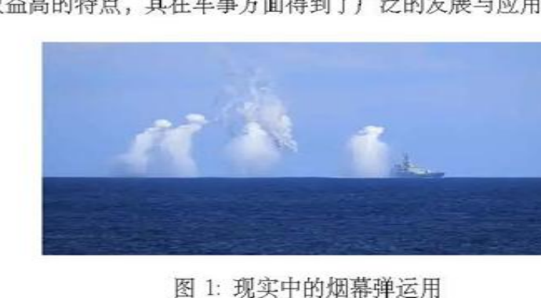

**Original caption:** 图1：现实中的烟幕弹运用

**中文图注:** 图1：现实中的烟幕弹运用

**Reading note:** 背景示例图，仅用于理解应用场景。

## 第 3 页

**Source:** p.3 S021

**Original:** 一 。 万 e

**中文:** 一 。 万 e

**Source:** p.3 S022

**Original:** \一 根 数 伟 化 单 机 多 深 飞 衍 方 应 , 逊 度 一 一 一 寺 押 都 伟 化 报 战 、 起 维 吊 闹 E

**中文:** \一根数伟化单机多深飞衍方应 , 逊度一一一寺押都伟化报战 、 起维吊闹 E

**Source:** p.3 S023

**Original:** 图 2: 各 问 题 关 系 图 二 、 问 题 分 析 2.1 问 题 一 的 分 析

**中文:** 图 2: 各问题关系图二 、 问题分析 2.1 问题一的分析

**Source:** p.3 S024

**Original:** 问 题 一 是 基 础 情 况 , 要 求 计 算 在 给 定 参 数 下 烟 幕 干 扰 弹 对 导 弹 M1 的 有 效 遮 蔽 时 长 , 首 先 可 以 利 用 题 目 给 定 的 参 数 算 出 烟 幕 弹 起 爆 寺 刻 烟 幕 弹 和 导 弹 的 位 置 作 为 后 续 模 型 的 初 值 , 之 后 需 要 根 据 空 间 几 何 的 知 识 找 到 滢 足 使 有 效 遮 挡 这 一 要 求 成 立 的 几 何 关 系 , 最 后 就 可 以 根 据 别 值 和 该 几 何 关 系 从 起 爆 时 刻 进 行 变 步 长 搜 索 找 出 满 足 有 效 遮 挡 的 时 间 范 园 。

**中文:** 问题一是基础情况 , 要求计算在给定参数下烟幕干扰弹对导弹 M1 的有效遮蔽时长 , 首先可以利用题目给定的参数算出烟幕弹起爆寺刻烟幕弹和导弹的位置作为后续模型的初值 , 之后需要根据空间几何的知识找到滢足使有效遮挡这一要求成立的几何关系 , 最后就可以根据别值和该几何关系从起爆时刻进行变步长搜索找出满足有效遮挡的时间范园 。

**Source:** p.3 S025

**Original:** 22 “ 问 题 二 的 分 析

**中文:** 22 “ 问题二的分析

**Source:** p.3 S026

**Original:** 问 题 二 不 同 于 问 题 一 在 给 定 的 参 数 下 求 解 , 而 是 需 要 延 用 问 题 一 的 分 析 , 把 无 人 机 航 向 速 度 、 烟 幕 弹 投 放 、 引 爆 时 间 四 个 参 数 作 为 决 策 变 量 , 以 最 大 化 有 效 遮 挡 时 间 作 为 目 标 函 数 建 立 单 机 单 弹 情 况 下 的 策 略 优 化 模 型 , 在 满 足 一 些 物 理 约 林、 运 动 学 约 柬 、 边 界 条 件 的 情 况 下 求 解 出 烟 幕 弹 的 最 优 投 放 策 略 。

**中文:** 问题二不同于问题一在给定的参数下求解 , 而是需要延用问题一的分析 , 把无人机航向速度 、 烟幕弹投放 、 引爆时间四个参数作为决策变量 , 以最大化有效遮挡时间作为目标函数建立单机单弹情况下的策略优化模型 , 在满足一些物理约林、 运动学约柬 、 边界条件的情况下求解出烟幕弹的最优投放策略 。

**Source:** p.3 S027

**Original:** 23 问 题 三 的 分 析

**中文:** 23 问题三的分析

**Source:** p.3 S028

**Original:** 问 题 三 基 于 问 题 二 的 优 化 模 型 , 需 协 谋 多 枚 烟 幕 弹 的 投 放 与 起 爆 时 序 , 避 免 时 间 重 蕊 或 追 漪 , 通 过 时 序 优 化 与 协 吟 控 制 延 长 总 有 效 遮 薇 时 间 。 由 于 三 枚 烟 幕 弹 是 由 同 一 无 人 机 发 射 , 其 在 空 间 上 位 置 相 差 不 远 , 考 悟 有 效 避 挡 时 , 可 能 会 存 在 单 个 云 团 不 能 有 效 途 挡 , 而 多 个 云 团 糊 合 时 会 形 成 有 效 遮 挡 的 情 况 。

**中文:** 问题三基于问题二的优化模型 , 需协谋多枚烟幕弹的投放与起爆时序 , 避免时间重蕊或追漪 , 通过时序优化与协吟控制延长总有效遮薇时间 。 由于三枚烟幕弹是由同一无人机发射 , 其在空间上位置相差不远 , 考悟有效避挡时 , 可能会存在单个云团不能有效途挡 , 而多个云团糊合时会形成有效遮挡的情况 。

**Source:** p.3 S029

**Original:** 2.4 “ 问 题 四 的 分 析

**中文:** 2.4 “ 问题四的分析

**Source:** p.3 S030

**Original:** 问 题 四 是 多 机 单 弹 拦 截 同 一 目 标 的 情 况 , 与 问 题 三 的 单 机 多 弹 模 式 不 同 , 问 题 四 的 核 心 在 于 多 无 人 机 之 间 的 空 间 协 同 和 时 间 协 谒 , 这 里 不 需 要 考 患 投 弹 时 间 间 隔 , 但 是 三 松 导 弹 爆 炸 产 生 的 云 团 应 该 避 免 在 空 间 上 过 度 重 蕊 , 同 时 时 间 上 要 保 持 连 续 。 这 需 要 恩 立 多 烟 幕 弹 协 同 途 藏 的 判 定 模 型 , 分 析 多 个 云 团 在 空 间 上 的 遮 薛 效 果 叠 办 关 系 , 在 考 虚 各 无 人 机 独 立 决 策 的 前 提 下 , 通 过 协 吟 目 标 函 数 确 保 整 体 遮 蕙 效 果 最 大 化 。

**中文:** 问题四是多机单弹拦截同一目标的情况 , 与问题三的单机多弹模式不同 , 问题四的核心在于多无人机之间的空间协同和时间协谒 , 这里不需要考患投弹时间间隔 , 但是三松导弹爆炸产生的云团应该避免在空间上过度重蕊 , 同时时间上要保持连续 。 这需要恩立多烟幕弹协同途藏的判定模型 , 分析多个云团在空间上的遮薛效果叠办关系 , 在考虚各无人机独立决策的前提下 , 通过协吟目标函数确保整体遮蕙效果最大化 。

### 图2：各问题关系图

**Placed near:** p.3 S021
**Source:** p.3 C002

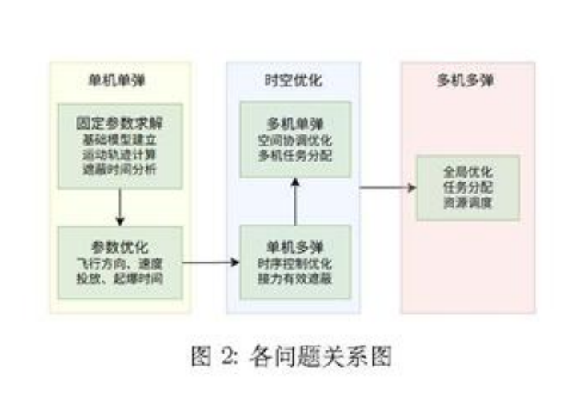

**Original caption:** 图2：各问题关系图

**中文图注:** 图2：各问题关系图

**Reading note:** 展示从固定参数计算到单机、多机、多目标优化的递进结构。

## 第 4 页

**Source:** p.4 S031

**Original:** 2.5 问 题 五 的 分 析

**中文:** 2.5 问题五的分析

**Source:** p.4 S032

**Original:** 问 题 五 是 最 困 难 的 多 机 多 弹 多 目 标 的 情 况 , 需 要 确 定 跷 架 无 人 机 去 拦 截 郅 枚 导 弹 , 每 个 无 人 机 需 要 投 多 少 枚 烧 幕 弹 以 及 总 体 投 放 的 策 略 , 直 接 考 虑 所 有 的 决 策 变 量 , 则 变 量 的 维 度 太 大 , 很 难 直 接 快 速 的 计 算 , 因 此 需 要 把 问 题 简 化 , 拆 分 成 多 个 步 骤 , 即 要 先 骏 定 资 源 分 配 的 策 略 , 再 决 定 烟 幕 弹 投 放 的 策 跟 , 以 提 高 计 算 效 率 。

**中文:** 问题五是最困难的多机多弹多目标的情况 , 需要确定跷架无人机去拦截郅枚导弹 , 每个无人机需要投多少枚烧幕弹以及总体投放的策略 , 直接考虑所有的决策变量 , 则变量的维度太大 , 很难直接快速的计算 , 因此需要把问题简化 , 拆分成多个步骤 , 即要先骏定资源分配的策略 , 再决定烟幕弹投放的策跟 , 以提高计算效率 。

**Source:** p.4 S033

**Original:** 三 、 模 型 假 设

**中文:** 三 、 模型假设

**Source:** p.4 S034

**Original:** . 奖 导 弹 、 无 人 机 、 烟 幕 弹 、 烟 幕 云 团 中 心 以 及 假 目 标 均 视 为 质 点 进 行 运 动 学 分 析 。 不 考 虑 空 气 阻 力 、 风 速 等 环 境 因 素 对 无 人 机 和 导 弹 飞 行 的 影 响 。 烟 幕 云 团 形 成 后 , 球 心 在 垂 直 方 向 以 3m - s 的 速 度 匀 迁 下 沉 。 . 无 人 机 受 领 任 务 和 调 整 飞 行 姿 态 的 时 间 忽 略 不 计 .

**中文:** . 奖导弹 、 无人机 、 烟幕弹 、 烟幕云团中心以及假目标均视为质点进行运动学分析 。 不考虑空气阻力 、 风速等环境因素对无人机和导弹飞行的影响 。 烟幕云团形成后 , 球心在垂直方向以 3m - s 的速度匀迁下沉 。 . 无人机受领任务和调整飞行姿态的时间忽略不计 .

**Source:** p.4 S035

**Original:** 点 幕 弹 起 爆 瞬 时 形 成 一 个 半 径 为 10 米 的 理 想 球 状 云 团 , 且 在 有 效 时 间 内 (20 秒 ) 其 半 径 和 遣 蔽 能 力 保 持 不 变 。

**中文:** 点幕弹起爆瞬时形成一个半径为 10 米的理想球状云团 , 且在有效时间内 (20 秒 ) 其半径和遣蔽能力保持不变 。

**Source:** p.4 S036

**Original:** 心

**中文:** 心

**Source:** p.4 S037

**Original:** E

**中文:** E

**Source:** p.4 S038

**Original:** &

**中文:** &

**Source:** p.4 S039

**Original:** 欣

**中文:** 欣

**Source:** p.4 S040

**Original:** 纠

**中文:** 纠

**Source:** p.4 S041

**Original:** 四 、 符 号 说 明 符 号 会 义 单 位 Fri(t) 导 弹 ; 在 时 刻 ¢ 的 位 置 向 量 m D 导 弹 ; 的 速 度 向 量 m/s U 导 弹 速 度 大 小 m/s Pry (1) 无 人 机 7 在 时 刻 t 的 位 置 向 量 m Uty 无 人 机 〗 的 迁 度 向 量 m/s 伟 无 人 机 7 的 航 向 角 ( 与 z 轶 夹 角 ) rad Pssx(t) 无 人 机 〗 投 放 的 第 k 枚 娇 幕 弹 的 位 置 m ta i 烟 幕 弹 投 放 时 间 s 功 兆 烟 幕 弹 起 爆 时 间 s Fejl(t) 烟 幕 弹 爆 炸 后 云 团 中 心 的 位 置 m Usink 云 团 下 沉 速 度 m/s g 重 力 加 迁 度 向 量 m/s* Q 真 实 目 标 圆 柱 体 表 面 区 域 3 Bool(t) 遣 蒙 状 态 布 尔 函 数 (1 为 遮 敲 ,0 为 未 遮 蔽 ) - tin 有 效 遮 蔽 开 始 时 刻 s tout 有 效 遮 蔽 结 束 时 刻 s

**中文:** 四 、 符号说明符号会义单位 Fri(t) 导弹 ; 在时刻 ¢ 的位置向量 m D 导弹 ; 的速度向量 m/s U 导弹速度大小 m/s Pry (1) 无人机 7 在时刻 t 的位置向量 m Uty 无人机 〗 的迁度向量 m/s 伟无人机 7 的航向角 ( 与 z 轶夹角 ) rad Pssx(t) 无人机 〗 投放的第 k 枚娇幕弹的位置 m ta i 烟幕弹投放时间 s 功兆烟幕弹起爆时间 s Fejl(t) 烟幕弹爆炸后云团中心的位置 m Usink 云团下沉速度 m/s g 重力加迁度向量 m/s* Q 真实目标圆柱体表面区域 3 Bool(t) 遣蒙状态布尔函数 (1 为遮敲 ,0 为未遮蔽 ) - tin 有效遮蔽开始时刻 s tout 有效遮蔽结束时刻 s

### 表1：符号说明（第一部分）

**Placed near:** p.4 S031
**Source:** p.4 C001

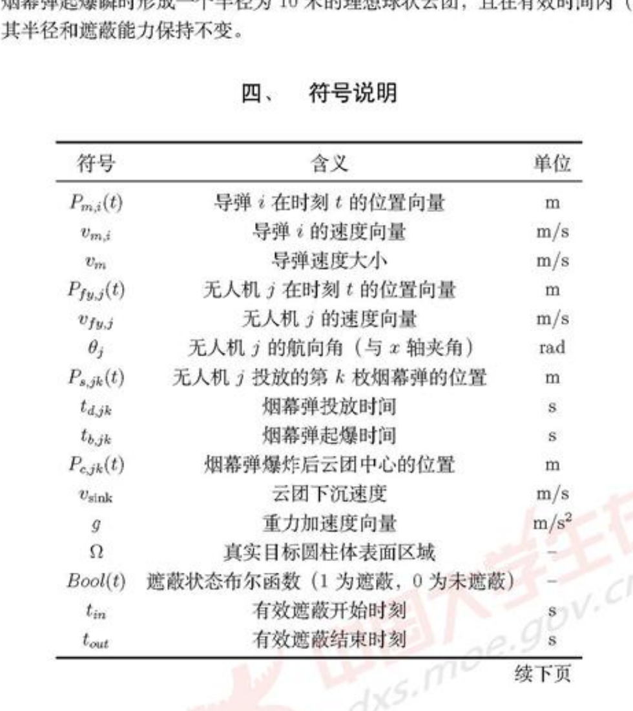

**Original caption:** 表1：符号说明（第一部分）

**中文图注:** 表1：符号说明（第一部分）

**Reading note:** 运动学、时间与遮蔽状态的核心符号。

## 第 5 页

**Source:** p.5 S042

**Original:** 表 1 符 号 说 明 ( 续 )

**中文:** 表 1 符号说明 ( 续 )

**Source:** p.5 S043

**Original:** 征 号 含 义 单 位

**中文:** 征号含义单位

**Source:** p.5 S044

**Original:** T 总 有 效 遮 薇 时 长 8

**中文:** T 总有效遮薇时长 8

**Source:** p.5 S045

**Original:** Al 烟 幕 弹 投 放 至 起 爆 的 时 间 间 隔 5

**中文:** Al 烟幕弹投放至起爆的时间间隔 5

**Source:** p.5 S046

**Original:** Uij 无 人 机 〗 投 向 导 弹 的 烟 幕 弹 数 量 = 五 、 模 型 准 备

**中文:** Uij 无人机 〗 投向导弹的烟幕弹数量 = 五 、 模型准备

**Source:** p.5 S047

**Original:** 根 据 题 意 , 本 文 的 所 有 求 解 都 是 建 立 在 空 间 直 角 坐 标 系 的 基 础 上 进 行 的 , 其 中 假 目 标 视 为 一 个 质 点 作 为 坐 标 系 原 点 , 水 平 面 作 为 坐 标 系 的 xOy 面 , 竖 直 向 上 的 方 向 作 为 # 轴 的 正 方 向 。 现 可 以 绘 制 出 本 文 的 空 间 直 角 坐 标 系 , 同 时 利 用 matlab 对 各 导 弹 与 各 无 人 机 的 初 始 位 置 进 行 可 视 化 处 理 :

**中文:** 根据题意 , 本文的所有求解都是建立在空间直角坐标系的基础上进行的 , 其中假目标视为一个质点作为坐标系原点 , 水平面作为坐标系的 xOy 面 , 竖直向上的方向作为 # 轴的正方向 。 现可以绘制出本文的空间直角坐标系 , 同时利用 matlab 对各导弹与各无人机的初始位置进行可视化处理 :

**Source:** p.5 S048

**Original:** (a) 坐 标 系 示 意 图 (b) 初 始 坐 标 可 视 化 图 图 3: 无 人 机 投 弹 干 拢 导 弹 示 意 囹

**中文:** (a) 坐标系示意图 (b) 初始坐标可视化图图 3: 无人机投弹干拢导弹示意囹

**Source:** p.5 S049

**Original:** 通 过 观 察 初 始 时 刻 的 各 导 弹 与 无 人 机 的 位 置 , 可 以 发 现 此 时 无 人 机 群 在 导 弹 群 前 方 按 照 扇 形 分 布 , 形 成 了 一 个 闪 现 拦 截 带 , 扇 形 的 角 度 约 为 30“、 同 时 距 离 目 标 最 远 的 导 弹 MI 的 导 弹 来 向 与 无 人 机 FY1 儿 乎 重 合 , 这 说 明 FY1 后 续 可 能 对 导 弹 迎 面 投 放 炽 幔 弹 , 形 成 烟 堤 进 行 阻 拦 。 同 时 在 高 度 z 上 , 无 人 机 群 成 梯 度 配 置 , 可 以 形 成 低 位 前 伸 烟 幕 拦 截 网 。

**中文:** 通过观察初始时刻的各导弹与无人机的位置 , 可以发现此时无人机群在导弹群前方按照扇形分布 , 形成了一个闪现拦截带 , 扇形的角度约为 30“、 同时距离目标最远的导弹 MI 的导弹来向与无人机 FY1 儿乎重合 , 这说明 FY1 后续可能对导弹迎面投放炽幔弹 , 形成烟堤进行阻拦 。 同时在高度 z 上 , 无人机群成梯度配置 , 可以形成低位前伸烟幕拦截网 。

**Source:** p.5 S050

**Original:** 5.1 运 动 轨 迹 方 程

**中文:** 5.1 运动轨迹方程

**Source:** p.5 S051

**Original:** 要 计 算 后 面 的 有 效 遮 挡 时 间 , 需 要 根 据 运 动 学 知 识 求 解 出 各 个 导 弹 、 各 个 无 人 机 及 烟 帝 弹 和 云 团 的 运 动 轨 迹 , 再 利 用 几 何 关 系 去 判 断 是 否 潭 足 有 效 遮 蔽 的 条 件 , 下 面 给 出 四 个 物 体 的 运 动 轨 迹 函 数 推 导 -

**中文:** 要计算后面的有效遮挡时间 , 需要根据运动学知识求解出各个导弹 、 各个无人机及烟帝弹和云团的运动轨迹 , 再利用几何关系去判断是否潭足有效遮蔽的条件 , 下面给出四个物体的运动轨迹函数推导 -

### 表1：符号说明（续）

**Placed near:** p.5 S042
**Source:** p.5 C002

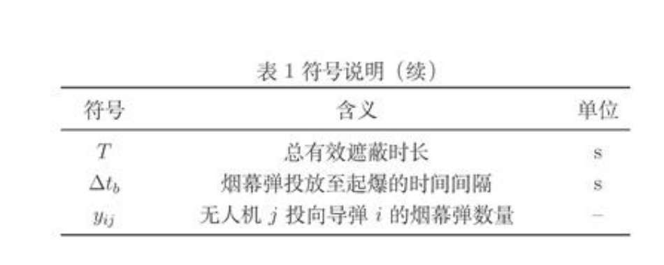

**Original caption:** 表1：符号说明（续）

**中文图注:** 表1：符号说明（续）

**Reading note:** 总时长、起爆延迟和任务分配数量符号。

### 图3：无人机投弹干扰导弹示意图

**Placed near:** p.5 S042
**Source:** p.5 C003

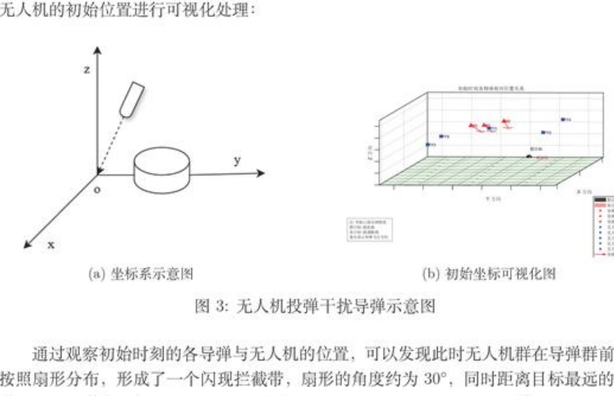

**Original caption:** 图3：无人机投弹干扰导弹示意图

**中文图注:** 图3：无人机投弹干扰导弹示意图

**Reading note:** 空间直角坐标系与初始位置分布。

## 第 6 页

**Source:** p.6 S052

**Original:** 5.1.1 导 弹 轨 迹

**中文:** 5.1.1 导弹轨迹

**Source:** p.6 S053

**Original:** 根 据 题 意 , 所 有 的 导 弹 均 以 300m/s 的 速 度 做 匀 速 直 线 运 动 , 速 度 的 方 向 沿 着 导 弹 与 原 点 的 逊 线 方 向 , 利 用 wn: 表 示 导 弹 5 的 速 度 向 量 , w 表 示 导 弹 的 追 度 大 小 , 其 值 5 300m/s. Py (0) 表 示 导 弹 5 在 初 始 时 刻 的 位 置 向 量 , 方 向 由 原 点 指 向 导 弹 ,5 的 取 值 为 1: 2, 3 根 据 方 向 向 量 的 计 算 方 法 可 知 导 弹 ; 的 速 度 向 量 可 以 表 示 为 : Pl , = a “ =R

**中文:** 根据题意 , 所有的导弹均以 300m/s 的速度做匀速直线运动 , 速度的方向沿着导弹与原点的逊线方向 , 利用 wn: 表示导弹 5 的速度向量 , w 表示导弹的追度大小 , 其值 5 300m/s. Py (0) 表示导弹 5 在初始时刻的位置向量 , 方向由原点指向导弹 ,5 的取值为 1: 2, 3 根据方向向量的计算方法可知导弹 ; 的速度向量可以表示为 : Pl , = a “ =R

**Source:** p.6 S054

**Original:** 知 道 了 速 度 向 量 后 根 据 匀 速 直 线 运 动 的 性 质 可 以 算 出 ¢ 时 刻 导 弹 ¢ 的 位 置 函 数 即 : Pm:i( 旭 二 Pmi(0) 十 Vni . (1=1,2,3) (5.2)

**中文:** 知道了速度向量后根据匀速直线运动的性质可以算出 ¢ 时刻导弹 ¢ 的位置函数即 : Pm:i( 旭二 Pmi(0) 十 Vni . (1=1,2,3) (5.2)

**Source:** p.6 S055

**Original:** 5.1.2 无 人 机 轨 迹

**中文:** 5.1.2 无人机轨迹

**Source:** p.6 S056

**Original:** 在 无 人 机 诉 指 派 任 务 后 , 无 人 机 脊 在 等 高 度 上 沿 着 确 定 的 航 向 做 匀 速 直 线 运 动 , 方 向 上 的 速 度 分 量 为 0, 因 此 只 霖 要 知 途 无 人 机 的 飞 行 航 向 角 就 可 以 确 定 出 无 人 机 的 速 度 向 量 , 假 设 无 人 机 7 的 航 线 与 z 轴 的 正 方 向 的 夹 觞 为 0:, 那 么 速 度 向 量 为 :

**中文:** 在无人机诉指派任务后 , 无人机脊在等高度上沿着确定的航向做匀速直线运动 , 方向上的速度分量为 0, 因此只霖要知途无人机的飞行航向角就可以确定出无人机的速度向量 , 假设无人机 7 的航线与 z 轴的正方向的夹觞为 0:, 那么速度向量为 :

**Source:** p.6 S057

**Original:** Vivi = (v,wcos0j,v;msin0,-,0) (j = 】，〈 .. '5) (5.:蠢) 同 样 的 有 了 无 人 机 的 速 度 向 量 和 初 始 的 位 置 就 能 得 到 无 人 机 的 位 置 函 数 : Pyyj(4) = Pyyjz(0) + vyz -5 仪 二 1,...,5) (5.4)

**中文:** Vivi = (v,wcos0j,v;msin0,-,0) (j = 】，〈 .. '5) (5.:蠢) 同样的有了无人机的速度向量和初始的位置就能得到无人机的位置函数 : Pyyj(4) = Pyyjz(0) + vyz -5 仪二 1,...,5) (5.4)

**Source:** p.6 S058

**Original:** 5.1.3 烟 幕 弹 轨 迹

**中文:** 5.1.3 烟幕弹轨迹

**Source:** p.6 S059

**Original:** 无 人 机 在 飞 行 到 指 定 地 点 时 投 放 烟 幕 弹 , 考 虑 到 重 力 和 惯 性 的 双 重 作 用 , 烟 幕 弹 投 放 后 做 抛 体 运 动 , 忽 略 空 气 阻 力 的 前 提 下 , 烟 幕 弹 速 度 在 zOy 平 面 上 的 投 影 由 于 惯 性 的 作 用 , 将 维 持 在 正 前 无 人 机 的 速 度 y 而 在 = 方 向 上 烟 幕 弹 将 在 重 力 加 速 度 9 下 做 自 由 落 体 运 动 , 将 第 7 个 无 人 机 发 射 出 的 第 K 个 烟 幕 弹 的 速 度 定 义 为 vajk, 则 v 可 以 表 示 为 :

**中文:** 无人机在飞行到指定地点时投放烟幕弹 , 考虑到重力和惯性的双重作用 , 烟幕弹投放后做抛体运动 , 忽略空气阻力的前提下 , 烟幕弹速度在 zOy 平面上的投影由于惯性的作用 , 将维持在正前无人机的速度 y 而在 = 方向上烟幕弹将在重力加速度 9 下做自由落体运动 , 将第 7 个无人机发射出的第 K 个烟幕弹的速度定义为 vajk, 则 v 可以表示为 :

**Source:** p.6 S060

**Original:** Vajk 二 (DjyjC08 休 ,Qyyyjsin 伟 jhs) (1=1,..., 5)(k=1,2,3) (5.5)

**中文:** Vajk 二 (DjyjC08 休 ,Qyyyjsin 伟 jhs) (1=1,..., 5)(k=1,2,3) (5.5)

**Source:** p.6 S061

**Original:** 其 中 u 表 示 自 由 落 体 的 迁 度 大 小 , 其 值 的 大 小 为 g(t 一 tajxj),tajk* 是 该 烟 幕 弹 的 投 放 时 间 。 假 设 在 tage 时 刻 , 姜 幕 弹 的 坐 标 为 Pajx(ta), 由 于 烟 幕 弹 在 抛 出 瞬 间 的 位 移 可 以 忽 略 不 记 , 所 以 在 投 放 时 烟 幕 弹 的 坐 标 等 价 于 无 人 机 的 坐 标 Pryj(ta) , 因 此 烟 幕 弹

**中文:** 其中 u 表示自由落体的迁度大小 , 其值的大小为 g(t 一 tajxj),tajk* 是该烟幕弹的投放时间 。 假设在 tage 时刻 , 姜幕弹的坐标为 Pajx(ta), 由于烟幕弹在抛出瞬间的位移可以忽略不记 , 所以在投放时烟幕弹的坐标等价于无人机的坐标 Pryj(ta) , 因此烟幕弹

## 第 7 页

**Source:** p.7 S062

**Original:** 的 位 置 函 数 可 以 表 示 为 :

**中文:** 的位置函数可以表示为 :

**Source:** p.7 S063

**Original:** Pau(0 = Prustage) +vp (0 —tag) + 580~ tag €2 tag G =1, 5k =1,2,3) (5.6) 其 中 g 一 (0.0,-9),9 WA 9.8 m/s".

**中文:** Pau(0 = Prustage) +vp (0 —tag) + 580~ tag €2 tag G =1, 5k =1,2,3) (5.6) 其中 g 一 (0.0,-9),9 WA 9.8 m/s".

**Source:** p.7 S064

**Original:** 5.1.4 云 团 中 心 轨 迹

**中文:** 5.1.4 云团中心轨迹

**Source:** p.7 S065

**Original:** 烟 幕 弹 爆 炸 后 形 成 的 云 团 将 以 团 以 3 m/s 的 迁 度 匀 速 下 沉 , 记 作 2aonx, 要 计 算 云 团 的 轨 迹 必 须 要 先 计 算 出 云 团 的 起 爆 位 置 , 而 计 算 起 爆 位 置 必 须 要 知 道 起 爆 时 间 ,

**中文:** 烟幕弹爆炸后形成的云团将以团以 3 m/s 的迁度匀速下沉 , 记作 2aonx, 要计算云团的轨迹必须要先计算出云团的起爆位置 , 而计算起爆位置必须要知道起爆时间 ,

**Source:** p.7 S066

**Original:** 范 成 二 线 或 十 A 李 孝 仪 二 工 2...3)(k 二 1.2,3) (5.7)

**中文:** 范成二线或十 A 李孝仪二工 2...3)(k 二 1.2,3) (5.7)

**Source:** p.7 S067

**Original:** 其 中 tjk 表 示 第 〗 架 无 人 机 投 出 的 第 枚 烟 幕 弹 起 爆 时 间 ,Atbjkx 表 示 该 烟 幕 弹 投 放 至 起 爆 的 时 间 间 隔 。 起 爆 点 位 置 即 炯 幕 弹 在 在 起 爆 时 刻 的 轨 迹 点 , 即 Ptx = Pak(ttlk)。 所 以 云 团 的 位 置 函 数 为 ;

**中文:** 其中 tjk 表示第 〗 架无人机投出的第枚烟幕弹起爆时间 ,Atbjkx 表示该烟幕弹投放至起爆的时间间隔 。 起爆点位置即炯幕弹在在起爆时刻的轨迹点 , 即 Ptx = Pak(ttlk)。 所以云团的位置函数为 ;

**Source:** p.7 S068

**Original:** P k(t) = (Boyxzr Fogky Pogks — Vsmnk ( 一 tbdk)) 井 fbjk (G=1,...,5)(k=1,2,3) (5.8) 根 据 上 面 的 四 个 位 置 函 数 就 可 以 计 算 出 各 个 时 刻 各 物 体 的 空 间 位 置 从 而 进 行 后 面 的 计 算 。

**中文:** P k(t) = (Boyxzr Fogky Pogks — Vsmnk ( 一 tbdk)) 井 fbjk (G=1,...,5)(k=1,2,3) (5.8) 根据上面的四个位置函数就可以计算出各个时刻各物体的空间位置从而进行后面的计算 。

**Source:** p.7 S069

**Original:** 5.2 有 效 遮 挡 判 定 式

**中文:** 5.2 有效遮挡判定式

**Source:** p.7 S070

**Original:** 如 果 把 导 弹 当 作 一 个 散 发 光 线 的 点 光 源 ( 发 射 不 可 见 的 电 磁 波 ) , 其 产 生 的 光 线 能 够 覆 盖 周 围 空 间 , 耍 让 圆 柱 形 状 的 真 实 目 标 不 被 导 弹 探 测 , 那 么 导 弹 产 生 的 光 线 就 不 能 照 射 到 圆 柱 上 , 所 以 有 效 遮 挡 的 情 境 即 炯 幕 弹 爆 炸 生 成 的 云 团 能 够 屏 蒲 所 有 照 向 圆 柱 的 光 线 , 使 圆 柱 得 到 很 好 的 隐 匿 。 可 以 想 象 到 点 光 源 射 合 一 个 球 体 会 在 球 后 生 成 一 个 圆 锥 形 的 部 分 区 域 , 只 要 圆 柱 能 够 完 全 落 在 这 一 区 域 内 , 那 么 就 能 有 效 地 屏 蒲 导 弹 的 定 位 。

**中文:** 如果把导弹当作一个散发光线的点光源 ( 发射不可见的电磁波 ) , 其产生的光线能够覆盖周围空间 , 耍让圆柱形状的真实目标不被导弹探测 , 那么导弹产生的光线就不能照射到圆柱上 , 所以有效遮挡的情境即炯幕弹爆炸生成的云团能够屏蒲所有照向圆柱的光线 , 使圆柱得到很好的隐匿 。 可以想象到点光源射合一个球体会在球后生成一个圆锥形的部分区域 , 只要圆柱能够完全落在这一区域内 , 那么就能有效地屏蒲导弹的定位 。

**Source:** p.7 S071

**Original:** 根 据 示 意 图 , 下 面 将 对 有 效 遮 挡 这 一 条 件 进 行 数 学 说 朋 , 给 定 一 条 由 点 P 和 P 定 义 的 线 段 , 其 中 P 表 示 的 是 导 弹 在 栋 一 时 刻 的 位 置 ,P2 表 示 真 实 目 标 圆 柱 上 的 任 意 一 点 , 以 及 此 时 的 云 团 球 体 , 其 球 心 为 C , 半 径 为 7 , 判 断 是 否 有 效 遮 挡 需 要 判 断 此 线 段 是 否 与 球 体 相 交 。

**中文:** 根据示意图 , 下面将对有效遮挡这一条件进行数学说朋 , 给定一条由点 P 和 P 定义的线段 , 其中 P 表示的是导弹在栋一时刻的位置 ,P2 表示真实目标圆柱上的任意一点 , 以及此时的云团球体 , 其球心为 C , 半径为 7 , 判断是否有效遮挡需要判断此线段是否与球体相交 。

**Source:** p.7 S072

**Original:** 一 个 球 体 S(C,r7) 由 其 球 心 C 和 半 径 r 唯 一 定 义 。 空 间 中 任 意 一 点 P 位 于 球 面 上 当 东 仅 当 滢 足 :

**中文:** 一个球体 S(C,r7) 由其球心 C 和半径 r 唯一定义 。 空间中任意一点 P 位于球面上当东仅当滢足 :

**Source:** p.7 S073

**Original:** IP-C| =r (5.9) 为 避 免 平 方 根 运 算 , 通 常 使 用 平 方 形 式 :

**中文:** IP-C| =r (5.9) 为避免平方根运算 , 通常使用平方形式 :

**Source:** p.7 S074

**Original:** P-C).-(P-C)=r2 (5.10) 式 中 . 表 示 向 量 点 积 运 算 。 这 个 方 程 表 达 了 球 面 上 任 意 点 P 到 球 心 C 的 距 离 平 方

**中文:** P-C).-(P-C)=r2 (5.10) 式中 . 表示向量点积运算 。 这个方程表达了球面上任意点 P 到球心 C 的距离平方

**Source:** p.7 S075

**Original:** 7

**中文:** 7

## 第 8 页

**Source:** p.8 S076

**Original:** 图 4 有 效 遮 挡 示 意 图

**中文:** 图 4 有效遮挡示意图

**Source:** p.8 S077

**Original:** 等 于 半 径 平 方 的 儿 何 关 系 。

**中文:** 等于半径平方的儿何关系 。

**Source:** p.8 S078

**Original:** 同 时 线 益 叶 九 上 的 任 意 点 P(4) 可 以 表 示 为 : P(t) =Pu+s(Pa-Pl),sE [0,1] (5.11) 其 中 : s = 0 时 , P(0) =Py ( 线 段 起 点 ); s = 1 时 , P(1) = Pa ( 线 段 终 点 ); 0 < s < 1

**中文:** 同时线益叶九上的任意点 P(4) 可以表示为 : P(t) =Pu+s(Pa-Pl),sE [0,1] (5.11) 其中 : s = 0 时 , P(0) =Py ( 线段起点 ); s = 1 时 , P(1) = Pa ( 线段终点 ); 0 < s < 1

**Source:** p.8 S079

**Original:** 寸 ,P(4) 在 线 段 内 部 ; 当 s < 0 或 s > 1 时 ,P(t) 位 于 线 段 的 延 长 线 上 。

**中文:** 寸 ,P(4) 在线段内部 ; 当 s < 0 或 s > 1 时 ,P(t) 位于线段的延长线上 。

**Source:** p.8 S080

**Original:** 令 =P, - Pl, 将 线 段 参 数 方 程 (5.11) 代 入 球 面 方 程 (5.10), 得 到 : (Pu+sQ- C) - (Py + sd — C) = 口 (5.12) 引 人 向 量 OC =Py ~ C, 表 示 从 球 心 指 向 线 段 起 点 的 向 量 , 则 方 程 简 化 为 : (oC+sd) .(0C+sd) = 亢 (5.13) 将 上 面 的 公 式 展 开 得 : $(d-d) +2s(d- OC) + (0C.0C) — 12 = 0 (5.14) 这 是 一 个 关 于 参 数 s 的 一 元 二 次 方 程 , 标 准 形 式 为 : a82 十 助 十 c 二 0 (5.15) 其 中 系 数 为 : a=d-d=|d? b=20C-d) ¢=0C:-0C—r*=|0C]-r? (5.16) 系 数 a 恒 为 正 ( 除 非 4 = 0, 即 线 段 退 化 为 点 ),c 的 符 号 取 决 于 乞 是 否 在 球 体 内 。

**中文:** 令 =P, - Pl, 将线段参数方程 (5.11) 代入球面方程 (5.10), 得到 : (Pu+sQ- C) - (Py + sd — C) = 口 (5.12) 引人向量 OC =Py ~ C, 表示从球心指向线段起点的向量 , 则方程简化为 : (oC+sd) .(0C+sd) = 亢 (5.13) 将上面的公式展开得 : $(d-d) +2s(d- OC) + (0C.0C) — 12 = 0 (5.14) 这是一个关于参数 s 的一元二次方程 , 标准形式为 : a82 十助十 c 二 0 (5.15) 其中系数为 : a=d-d=|d? b=20C-d) ¢=0C:-0C—r*=|0C]-r? (5.16) 系数 a 恒为正 ( 除非 4 = 0, 即线段退化为点 ),c 的符号取决于乞是否在球体内 。

**Source:** p.8 S081

**Original:** 8

**中文:** 8

### 图4：有效遮挡示意图

**Placed near:** p.8 S076
**Source:** p.8 C004

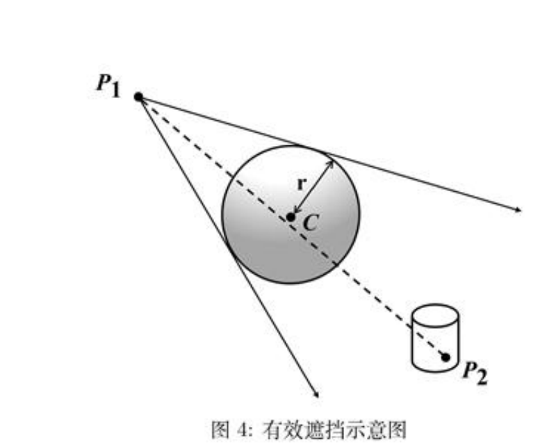

**Original caption:** 图4：有效遮挡示意图

**中文图注:** 图4：有效遮挡示意图

**Reading note:** 视线线段与球形遮挡体相交是核心几何判据。

## 第 9 页

**Source:** p.9 S082

**Original:** 利 用 上 面 算 出 的 参 数 表 达 式 , 下 面 根 据 一 元 二 次 方 程 的 判 别 式 进 行 根 的 讨 论 , 计 算 判 别 式 : 忘 二 万 一 4ac (5.17)

**中文:** 利用上面算出的参数表达式 , 下面根据一元二次方程的判别式进行根的讨论 , 计算判别式 : 忘二万一 4ac (5.17)

**Source:** p.9 S083

**Original:** 根 据 判 别 式 的 值 判 断 相 交 情 况 ; A < 0: 无 实 数 解 , 直 线 与 球 体 无 交 点 , 线 段 肯 定 不 与 球 体 相 交 ; A = 0: 一 个 实 数 解 , 直 线 与 球 体 相 切 , 有 一 个 交 点 ; A > 0: 两 个 实 数 解 , 直 线 贯 穿 球 体 , 有 两 个 交 点 - 仅 考 虑 直 线 与 球 体 的 交 点 的 个 数 不 足 以 说 朋 云 团 有 效 地 遮 挡 了 导 弹 的 光 线 , 例 如 当 导 弹 的 相 对 位 置 运 行 到 了 云 团 和 真 实 目 标 之 间 时 , 线 段 的 延 长 线 休 然 可 能 会 与 云 团 有 交 点 , 但 是 却 不 能 谨 挡 导 弹 , 因 此 还 需 要 考 虑 交 点 与 线 段 凡 叉 的 位 置 关 系 , 只 有 当 两 个 实 数 解 : it ;a‘/z e ’2‘0‘/3 (5.18) 滢 足 以 下 其 中 一 个 条 件 : 至 少 一 个 交 点 在 线 段 上 , 此 时 si €[0,1] 8 s2 E [0,1], 则 线 段 与 球 体 表 面 格 交 。 这 对 应 于 导 弹 视 线 从 烟 幕 云 团 中 穿 过 的 情 形 ; 线 段 完 全 在 球 体 内 部 , 此 时 s! < 0 且 ss > 1, 则 整 个 线 段 都 在 球 体 内 。 这 对 应 于 导 弹 已 经 完 全 进 入 烟 幔 内 部 , 视 线 被 完 全 遮 蒙 的 情 形 。 才 能 诫 朋 该 点 被 有 效 谦 挡 、 而 要 使 整 个 圆 柱 被 有 效 遮 挡 , 则 国 柱 上 的 任 意 一 点 己 都 应 该 潞 足 该 条 件 、 所 以 有 效 遮 挡 判 别 式 用 数 学 公 式 表 达 为 :

**中文:** 根据判别式的值判断相交情况 ; A < 0: 无实数解 , 直线与球体无交点 , 线段肯定不与球体相交 ; A = 0: 一个实数解 , 直线与球体相切 , 有一个交点 ; A > 0: 两个实数解 , 直线贯穿球体 , 有两个交点 - 仅考虑直线与球体的交点的个数不足以说朋云团有效地遮挡了导弹的光线 , 例如当导弹的相对位置运行到了云团和真实目标之间时 , 线段的延长线休然可能会与云团有交点 , 但是却不能谨挡导弹 , 因此还需要考虑交点与线段凡叉的位置关系 , 只有当两个实数解 : it ;a‘/z e ’2‘0‘/3 (5.18) 滢足以下其中一个条件 : 至少一个交点在线段上 , 此时 si €[0,1] 8 s2 E [0,1], 则线段与球体表面格交 。 这对应于导弹视线从烟幕云团中穿过的情形 ; 线段完全在球体内部 , 此时 s! < 0 且 ss > 1, 则整个线段都在球体内 。 这对应于导弹已经完全进入烟幔内部 , 视线被完全遮蒙的情形 。 才能诫朋该点被有效谦挡 、 而要使整个圆柱被有效遮挡 , 则国柱上的任意一点己都应该潞足该条件 、 所以有效遮挡判别式用数学公式表达为 :

**Source:** p.9 S084

**Original:** YPeQ={(z,u,2) ER® |2+ @y —200 <7, 0<2<10}, PBNC(P)#2

**中文:** YPeQ={(z,u,2) ER® |2+ @y —200 <7, 0<2<10}, PBNC(P)#2

**Source:** p.9 S085

**Original:** (5.19)

**中文:** (5.19)

**Source:** p.9 S086

**Original:** 其 中 : Q = {(z,y,2) € B3 | z2 4 (y 一 200)2 < 73, 0 < 2 < 10} 表 示 圆 柱 的 整 个 表 面 五 及 表 示 线 段 ,C(:) 表 示 以 C 为 球 心 , 半 径 为 10m 的 球 体 。

**中文:** 其中 : Q = {(z,y,2) € B3 | z2 4 (y 一 200)2 < 73, 0 < 2 < 10} 表示圆柱的整个表面五及表示线段 ,C(:) 表示以 C 为球心 , 半径为 10m 的球体 。

**Source:** p.9 S087

**Original:** 5.2.1 有 效 遮 蔽 时 间 区 间 说 明

**中文:** 5.2.1 有效遮蔽时间区间说明

**Source:** p.9 S088

**Original:** 由 于 导 弹 和 云 团 的 运 动 速 度 是 恒 定 的 , 所 以 遮 蒲 情 况 不 会 发 生 突 变 , 只 会 在 一 段 时 间 内 有 效 遮 蔽 , 一 段 时 间 内 没 有 有 效 谨 蔽 。 记 进 人 有 效 谨 挡 的 时 刻 为 垃 , 离 开 有 效 谦 挡 的 时 间 为 芸 w, 假 设 存 在 n 个 有 效 避 挡 的 连 缄 区 间 那 么 这 些 有 效 区 间 都 应 该 滢 足 有 效 遣 挡 的 判 定 式 : w 陋 , 坚 j,vPE, PPN C(PAt)) £ @

**中文:** 由于导弹和云团的运动速度是恒定的 , 所以遮蒲情况不会发生突变 , 只会在一段时间内有效遮蔽 , 一段时间内没有有效谨蔽 。 记进人有效谨挡的时刻为垃 , 离开有效谦挡的时间为芸 w, 假设存在 n 个有效避挡的连缄区间那么这些有效区间都应该滢足有效遣挡的判定式 : w 陋 , 坚 j,vPE, PPN C(PAt)) £ @

**Source:** p.9 S089

**Original:** 同 时 , 瀛 足 有 效 遮 挡 的 时 间 段 应 该 包 含 于 炽 幕 弹 起 爆 和 点 幕 弹 浓 度 降 低 这 两 个 关 键 时 间 点 , 即 求 解 模 型 中 的 时 间 t 应 该 潜 足 :

**中文:** 同时 , 瀛足有效遮挡的时间段应该包含于炽幕弹起爆和点幕弹浓度降低这两个关键时间点 , 即求解模型中的时间 t 应该潜足 :

**Source:** p.9 S090

**Original:** 吊 <t <ty+20 (5.20)

**中文:** 吊 <t <ty+20 (5.20)

**Source:** p.9 S091

**Original:** 再 进 一 步 推 导 可 以 把 上 述 公 式 变 为 :

**中文:** 再进一步推导可以把上述公式变为 :

**Source:** p.9 S092

**Original:** te itk thel I 十 20| k=1

**中文:** te itk thel I 十 20| k=1

## 第 10 页

**Source:** p.10 S093

**Original:** 考 虔 到 每 个 有 效 遣 挡 时 间 段 与 总 体 的 时 间 关 系 后 , 还 应 该 考 虑 每 个 时 间 段 相 互 之 间 的 关 系 , 即 各 个 时 间 段 之 间 没 有 重 篱 , 它 们 是 相 互 分 离 的 。 即 :

**中文:** 考虔到每个有效遣挡时间段与总体的时间关系后 , 还应该考虑每个时间段相互之间的关系 , 即各个时间段之间没有重篱 , 它们是相互分离的 。 即 :

**Source:** p.10 S094

**Original:** 陆 , 炎 n 限 M 坂 ] 二 二 (1,2...n 一 1)

**中文:** 陆 , 炎 n 限 M 坂 ] 二二 (1,2...n 一 1)

**Source:** p.10 S095

**Original:** 5.2.2 判 定 式 相 关 参 数 说 明

**中文:** 5.2.2 判定式相关参数说明

**Source:** p.10 S096

**Original:** 针 对 单 机 单 弹 的 情 况 , 根 据 上 文 的 分 析 , 已 经 知 道 了 判 定 有 效 遮 挡 所 需 数 据 的 计 算 方 法 , 下 面 进 行 一 个 总 结 :

**中文:** 针对单机单弹的情况 , 根据上文的分析 , 已经知道了判定有效遮挡所需数据的计算方法 , 下面进行一个总结 :

**Source:** p.10 S097

**Original:** 及 是 圆 柱 表 面 上 的 任 意 一 点 , 可 以 利 用 数 学 表 达 式 VP € Q = {(z,y,2}) € B? | @+ (y— 2000 <73, 0 三 # 三 10} 表 出 , 对 于 导 弹 在 某 一 时 刻 的 位 置 叉 , 由 导 弹 的 位 置 函 数 可 以 得 出 :

**中文:** 及是圆柱表面上的任意一点 , 可以利用数学表达式 VP € Q = {(z,y,2}) € B? | @+ (y— 2000 <73, 0 三 # 三 10} 表出 , 对于导弹在某一时刻的位置叉 , 由导弹的位置函数可以得出 :

**Source:** p.10 S098

**Original:** Py =Ppi(t) 二 Pms(0} 十 Vm - ¢ (5.21)

**中文:** Py =Ppi(t) 二 Pms(0} 十 Vm - ¢ (5.21)

**Source:** p.10 S099

**Original:** 云 团 的 球 心 可 以 通 过 云 团 的 位 置 函 数 求 出 :

**中文:** 云团的球心可以通过云团的位置函数求出 :

**Source:** p.10 S100

**Original:** Peyi(t) = (Rogizes Pogiys 民 J 一 Vaink - 代 一 fbjk)) €2 o Puux(4 = Pryiltae) + Vpyi- (t —tage) + 38 (¢ —tag)® 五 tajk Viyi = (Vg 0086, vp, 5 5in6;,0)

**中文:** Peyi(t) = (Rogizes Pogiys 民 J 一 Vaink - 代一 fbjk)) €2 o Puux(4 = Pryiltae) + Vpyi- (t —tage) + 38 (¢ —tag)® 五 tajk Viyi = (Vg 0086, vp, 5 5in6;,0)

**Source:** p.10 S101

**Original:** Pryit) = Pyua(0) + vy -t

**中文:** Pryit) = Pyua(0) + vy -t

**Source:** p.10 S102

**Original:** 5.2.3 基 于 布 尔 函 数 的 有 效 遮 蔽 条 件 表 达 为 了 便 于 后 文 中 有 效 遮 挡 条 件 的 表 述 , 本 文 引 入 了 谦 蔽 状 态 的 布 尔 函 数 :

**中文:** 5.2.3 基于布尔函数的有效遮蔽条件表达为了便于后文中有效遮挡条件的表述 , 本文引入了谦蔽状态的布尔函数 :

**Source:** p.10 S103

**Original:** 1,ifYR EQ, PPNC(Pt)#02 ……(){，′(_)={ it VP, 页 nC(R(0)+ R

**中文:** 1,ifYR EQ, PPNC(Pt)#02 ……(){，′(_)={ it VP, 页 nC(R(0)+ R

**Source:** p.10 S104

**Original:** 0, otherwise

**中文:** 0, otherwise

**Source:** p.10 S105

**Original:** 那 么 对 于 有 效 遮 蒲 时 间 区 间 的 开 始 时 刻 tm, 其 前 一 段 微 小 时 间 没 有 达 到 有 效 遮 蕾 , 则 其 林 对 应 的 布 尔 函 数 值 为 0, 其 后 一 段 微 小 时 间 达 到 了 有 效 谨 蒋 , 则 其 布 尔 值 输 出 为 1, 用 数 学 表 达 式 可 以 写 为 :

**中文:** 那么对于有效遮蒲时间区间的开始时刻 tm, 其前一段微小时间没有达到有效遮蕾 , 则其林对应的布尔函数值为 0, 其后一段微小时间达到了有效谨蒋 , 则其布尔值输出为 1, 用数学表达式可以写为 :

**Source:** p.10 S106

**Original:** Bool(t},) A ~Bool(t;,) = 1 (5.24)

**中文:** Bool(t},) A ~Bool(t;,) = 1 (5.24)

**Source:** p.10 S107

**Original:** 同 样 的 , 对 于 有 效 屏 蔽 的 结 束 时 刻 tu:, 其 前 一 段 微 小 时 间 达 到 了 有 效 遮 蒲 , 则 其

**中文:** 同样的 , 对于有效屏蔽的结束时刻 tu:, 其前一段微小时间达到了有效遮蒲 , 则其

**Source:** p.10 S108

**Original:** 相 对 应 的 布 尔 函 数 值 为 1, 其 后 一 段 微 小 时 间 没 有 达 到 有 效 谟 蔽 , 则 其 布 尔 值 输 出 为 0, 用 数 学 表 达 式 可 以 写 为 :

**中文:** 相对应的布尔函数值为 1, 其后一段微小时间没有达到有效谟蔽 , 则其布尔值输出为 0, 用数学表达式可以写为 :

**Source:** p.10 S109

**Original:** Bool(t,,) AJBool(t+t,) =1 (5.25)

**中文:** Bool(t,,) AJBool(t+t,) =1 (5.25)

**Source:** p.10 S110

**Original:** 所 以 潴 足 有 效 遮 蒲 的 时 刻 都 应 该 滢 足 :

**中文:** 所以潴足有效遮蒲的时刻都应该滢足 :

**Source:** p.10 S111

**Original:** 工 = 东 < R+ | Bool(t) = 1} (5.26)

**中文:** 工 = 东 < R+ | Bool(t) = 1} (5.26)

**Source:** p.10 S112

**Original:** 10

**中文:** 10

## 第 11 页

**Source:** p.11 S113

**Original:** 有 效 遮 挡 时 长 及 所 有 有 效 遮 挡 时 间 点 的 集 合 , 即 为 这 个 集 合 的 总 长 度 : 尔 夺 [, Bool(t) dt (5.27)

**中文:** 有效遮挡时长及所有有效遮挡时间点的集合 , 即为这个集合的总长度 : 尔夺 [, Bool(t) dt (5.27)

**Source:** p.11 S114

**Original:** 时 间 t 的 积 分 区 间 为 |0, coj, 这 是 因 为 在 有 效 谨 挡 时 间 段 布 尔 值 才 为 1, 积 分 即 为 这 一 段 的 时 长 , 而 在 非 有 效 遮 挡 的 时 段 , 积 分 值 为 0, 不 会 对 结 果 造 成 影 响 , 这 样 考 虑 可 以 避 免 上 文 关 于 存 在 多 段 有 效 时 间 的 考 虑 , 使 模 型 的 约 丛 减 少 , 计 算 效 率 更 优

**中文:** 时间 t 的积分区间为 |0, coj, 这是因为在有效谨挡时间段布尔值才为 1, 积分即为这一段的时长 , 而在非有效遮挡的时段 , 积分值为 0, 不会对结果造成影响 , 这样考虑可以避免上文关于存在多段有效时间的考虑 , 使模型的约丛减少 , 计算效率更优

**Source:** p.11 S115

**Original:** 六 、 问 题 一 模 型 建 立 及 求 解

**中文:** 六 、 问题一模型建立及求解

**Source:** p.11 S116

**Original:** 问 题 一 针 对 具 体 的 一 个 场 景 , 在 所 有 参 数 都 已 经 绘 定 的 情 况 下 ( 烟 幕 弹 投 放 时 间 为 15s$, 起 爆 时 间 为 5.18}, 需 要 求 解 单 枚 烟 幕 弹 对 单 枚 导 弹 的 有 效 谨 挡 时 长 。 需 要 利 用 各 物 体 的 位 置 函 数 以 及 有 效 遣 挡 判 定 式 来 确 定 发 生 有 效 蒙 挡 的 时 间 段 。

**中文:** 问题一针对具体的一个场景 , 在所有参数都已经绘定的情况下 ( 烟幕弹投放时间为 15s$, 起爆时间为 5.18}, 需要求解单枚烟幕弹对单枚导弹的有效谨挡时长 。 需要利用各物体的位置函数以及有效遣挡判定式来确定发生有效蒙挡的时间段 。

**Source:** p.11 S117

**Original:** 6.1 有 效 时 长 计 算 模 型

**中文:** 6.1 有效时长计算模型

**Source:** p.11 S118

**Original:** 6.1.1 导 弹 M1 与 烟 幕 云 团 球 心 的 轨 迹

**中文:** 6.1.1 导弹 M1 与烟幕云团球心的轨迹

**Source:** p.11 S119

**Original:** 根 据 模 型 准 备 部 分 的 分 析 , 可 以 得 出 无 人 机 FY1 和 导 弹 M1 在 给 定 的 参 数 下 的 位 置 函 数 , 以 及 点 幕 弹 和 云 团 的 运 动 轨 迹 :

**中文:** 根据模型准备部分的分析 , 可以得出无人机 FY1 和导弹 M1 在给定的参数下的位置函数 , 以及点幕弹和云团的运动轨迹 :

**Source:** p.11 S120

**Original:** 双 是 圆 柱 表 面 上 的 任 意 一 点 , 可 以 利 用 数 学 表 达 式 Y 已 € Q 表 出 , 对 于 导 弹 在 桅 一 时 刻 的 位 置 及 , 这 里 指 的 是 导 弹 M 的 位 置 , 由 导 弹 的 位 置 函 数 可 以 得 出 :

**中文:** 双是圆柱表面上的任意一点 , 可以利用数学表达式 Y 已 € Q 表出 , 对于导弹在桅一时刻的位置及 , 这里指的是导弹 M 的位置 , 由导弹的位置函数可以得出 :

**Source:** p.11 S121

**Original:** Py = Pma( 日 二 Pm(0) 十 Vmu - ¢ (6.1) 云 团 的 球 心 可 以 通 过 云 团 的 位 置 函 数 求 出 :

**中文:** Py = Pma( 日二 Pm(0) 十 Vmu - ¢ (6.1) 云团的球心可以通过云团的位置函数求出 :

**Source:** p.11 S122

**Original:** Pal( 甘 五 ( 氏 z 氏 aly , 邝 llz 一 Uaink 代 一 加 l))》 井 李 ul P,1i(t) = Ppa(tan) 十 Vfyl 仪 一 taul) 十 巍' 传 一 taal)* 一 井 李 ll Vi1 = (Upy,1 €086y, vpy 1 Sinu, 0)

**中文:** Pal( 甘五 ( 氏 z 氏 aly , 邝 llz 一 Uaink 代一加 l))》 井李 ul P,1i(t) = Ppa(tan) 十 Vfyl 仪一 taul) 十巍' 传一 taal)* 一井李 ll Vi1 = (Upy,1 €086y, vpy 1 Sinu, 0)

**Source:** p.11 S123

**Original:** Pyyi( =Ppya(0) 十 vyuu .t

**中文:** Pyyi( =Ppya(0) 十 vyuu .t

**Source:** p.11 S124

**Original:** (6.2)

**中文:** (6.2)

**Source:** p.11 S125

**Original:** 6.1.2 判 定 式 说 明

**中文:** 6.1.2 判定式说明

**Source:** p.11 S126

**Original:** 该 问 题 考 虑 的 是 单 枚 烟 幕 弹 与 单 枚 导 弹 的 情 况 , 所 以 只 需 要 考 虑 单 个 云 团 的 遮 挡 , 而 不 存 在 云 团 间 的 糊 合 , 所 以 滢 足 有 效 遮 挡 的 判 别 式 为 :

**中文:** 该问题考虑的是单枚烟幕弹与单枚导弹的情况 , 所以只需要考虑单个云团的遮挡 , 而不存在云团间的糊合 , 所以滢足有效遮挡的判别式为 :

**Source:** p.11 S127

**Original:** Bool(t) = {l, ifYR E Q, PmPanNC(Poult))#@ (63)

**中文:** Bool(t) = {l, ifYR E Q, PmPanNC(Poult))#@ (63)

**Source:** p.11 S128

**Original:** 0, otherwise

**中文:** 0, otherwise

## 第 12 页

**Source:** p.12 S129

**Original:** 上 式 中 的 C( 及 ul(6)) 是 无 人 机 FY1 发 射 的 云 团 形 成 的 球 体 , Cu 是 球 体 的 球 心 , 其 数 值 根 据 即 为 云 团 中 心 轨 迹 的 位 置 函 数 P<Jx(4) 的 大 小 酸 定 。

**中文:** 上式中的 C( 及 ul(6)) 是无人机 FY1 发射的云团形成的球体 , Cu 是球体的球心 , 其数值根据即为云团中心轨迹的位置函数 P<Jx(4) 的大小酸定 。

**Source:** p.12 S130

**Original:** 6.1.3 有 效 时 长 计 算 模 型 汇 总 综 上 , 有 效 遮 挡 时 间 为 各 有 效 遮 挡 时 间 点 的 集 合 长 度 ,, 则 在 固 定 参 数 下 求 解 有 效 遮 数 时 长 的 计 算 模 型 如 下 ; . P / Bool(t) dt 0

**中文:** 6.1.3 有效时长计算模型汇总综上 , 有效遮挡时间为各有效遮挡时间点的集合长度 ,, 则在固定参数下求解有效遮数时长的计算模型如下 ; . P / Bool(t) dt 0

**Source:** p.12 S131

**Original:** b, = Pmia() = Ppa(0) + Vmi - 8 Peu(t) 井 ( 邝 uz, aly, Foars 一 Uank (E— o)) 井 吊 u Pazl( 旦 二 Pfyl(tall) 十 yjyl - 仑 一 如 ll) 十 吊 (¢ — tan)® > tan St 1 | Vjyl 二 (bfy i C0Sb, jy l SipL,0) (6.4) Ppya(t) =Ppya(0) 十 yy - 1, fVRER, PuPaNC(Pu(t)#o

**中文:** b, = Pmia() = Ppa(0) + Vmi - 8 Peu(t) 井 ( 邝 uz, aly, Foars 一 Uank (E— o)) 井吊 u Pazl( 旦二 Pfyl(tall) 十 yjyl - 仑一如 ll) 十吊 (¢ — tan)® > tan St 1 | Vjyl 二 (bfy i C0Sb, jy l SipL,0) (6.4) Ppya(t) =Ppya(0) 十 yy - 1, fVRER, PuPaNC(Pu(t)#o

**Source:** p.12 S132

**Original:** Bool(t) = 0, otherwise

**中文:** Bool(t) = 0, otherwise

**Source:** p.12 S133

**Original:** 、

**中文:** 、

**Source:** p.12 S134

**Original:** 6.2 模 型 的 求 解 6.2.1 有 效 遮 蔽 时 间 区 间 是 一 段 连 续 的 区 间

**中文:** 6.2 模型的求解 6.2.1 有效遮蔽时间区间是一段连续的区间

**Source:** p.12 S135

**Original:** 真 目 标 被 点 幕 云 团 有 效 遮 蒲 的 时 间 必 为 一 段 连 续 时 间 区 间 。 理 由 如 下 :

**中文:** 真目标被点幕云团有效遮蒲的时间必为一段连续时间区间 。 理由如下 :

**Source:** p.12 S136

**Original:** 导 弹 M(t) 沿 直 线 匀 速 靠 近 原 点 , 云 团 球 心 C(t) 仅 沅 竖 直 方 向 匀 迁 下 沉 , 这 些 运 动 书 迹 均 为 违 续 且 单 调 的 函 数 。 对 于 给 定 时 刻 t, 圆 柱 是 否 被 完 全 避 蔽 , 相 当 于 判 断 : 从 导 弹 出 发 的 所 有 视 线 是 否 都 被 半 径 固 定 的 球 B(t) 阻 挡 , 是 否 遣 蔽 由 导 弹 、 云 团 和 圆 柱 的 相 对 位 置 关 系 欧 定 , 而 这 一 几 何 关 系 是 随 时 间 连 续 演 化 的 。

**中文:** 导弹 M(t) 沿直线匀速靠近原点 , 云团球心 C(t) 仅沅竖直方向匀迁下沉 , 这些运动书迹均为违续且单调的函数 。 对于给定时刻 t, 圆柱是否被完全避蔽 , 相当于判断 : 从导弹出发的所有视线是否都被半径固定的球 B(t) 阻挡 , 是否遣蔽由导弹 、 云团和圆柱的相对位置关系欧定 , 而这一几何关系是随时间连续演化的 。

**Source:** p.12 S137

**Original:** 由 于 导 弹 和 云 团 的 运 动 没 有 振 荡 或 往 复 , 遣 蔽 关 系 的 变 化 只 能 按 以 下 顺 序 单 调 发 生 ; 初 始 时 圆 柱 不 在 阴 影 之 内 ; 随 后 随 着 导 弹 接 近 和 云 团 下 沉 , 烟 幕 阴 影 的 投 影 逐 淅 扩 大 并 首 次 完 全 覆 盖 圆 柱 ; 此 后 在 一 段 时 间 内 圆 柱 保 持 完 全 遣 敲 ; 最 终 阴 影 边 界 离 开 圆 柱 , 完 全 避 蔽 消 失 。 整 个 过 程 中 不 存 在 的 跳 跃 , 因 为 对 应 的 几 何 覆 盖 条 件 在 连 续 单 调 的 运 动 下 只 能 经 历 一 次 进 入 和 一 次 退 出 。 由 此 可 知 , 圆 柱 整 体 的 完 全 遮 蒲 持 续 时 间 必 然 构 成 一 个 连 通 区 间 ( 在 本 问 题 的 实 际 参 数 下 为 非 空 ), 即 一 段 迷 续 的 时 间 区 间 。

**中文:** 由于导弹和云团的运动没有振荡或往复 , 遣蔽关系的变化只能按以下顺序单调发生 ; 初始时圆柱不在阴影之内 ; 随后随着导弹接近和云团下沉 , 烟幕阴影的投影逐淅扩大并首次完全覆盖圆柱 ; 此后在一段时间内圆柱保持完全遣敲 ; 最终阴影边界离开圆柱 , 完全避蔽消失 。 整个过程中不存在的跳跃 , 因为对应的几何覆盖条件在连续单调的运动下只能经历一次进入和一次退出 。 由此可知 , 圆柱整体的完全遮蒲持续时间必然构成一个连通区间 ( 在本问题的实际参数下为非空 ), 即一段迷续的时间区间 。

**Source:** p.12 S138

**Original:** 6.2.2 求 解 定 位 圆 周 简 化 证 昂

**中文:** 6.2.2 求解定位圆周简化证昂

**Source:** p.12 S139

**Original:** 问 题 一 需 要 判 断 射 向 真 目 标 圆 柱 体 上 任 意 一 点 的 视 线 线 段 是 否 与 半 径 为 10 米 的 烟 幕 球 体 相 交 。 而 这 显 然 是 不 可 能 实 现 的 , 在 求 解 过 程 中 , 只 能 对 圆 柱 体 进 行 离 散 化 取 点 , 而 直 接 对 整 个 圆 柱 体 进 行 离 散 化 取 点 会 导 致 求 解 效 率 低 下 。

**中文:** 问题一需要判断射向真目标圆柱体上任意一点的视线线段是否与半径为 10 米的烟幕球体相交 。 而这显然是不可能实现的 , 在求解过程中 , 只能对圆柱体进行离散化取点 , 而直接对整个圆柱体进行离散化取点会导致求解效率低下 。

**Source:** p.12 S140

**Original:** 注 意 到 : 要 判 断 一 个 物 体 是 否 被 完 全 遮 蒂 , 只 需 判 断 它 最 难 被 避 薇 的 部 分 即 可 。 对 于 圆 柱 体 , 这 个 最 难 被 避 蒲 的 部 分 是 从 导 弹 的 视 角 观 察 到 的 物 体 的 外 轮 廓 线 ( 如 图 5 所

**中文:** 注意到 : 要判断一个物体是否被完全遮蒂 , 只需判断它最难被避薇的部分即可 。 对于圆柱体 , 这个最难被避蒲的部分是从导弹的视角观察到的物体的外轮廓线 ( 如图 5 所

**Source:** p.12 S141

**Original:** 12

**中文:** 12

## 第 13 页

**Source:** p.13 S142

**Original:** 示 ) , 如 果 阆 柱 的 外 轮 庭 线 被 完 全 造 蔽 , 那 么 物 体 表 而 上 所 有 在 轮 廖 线 内 部 的 点 也 必 然 被 遮 蔽 。 对 于 园 柱 体 而 言 , 其 轮 膝 线 通 常 由 上 下 底 面 圆 周 的 两 段 圆 孟 和 两 条 侧 面 的 竖 直 母 线 构 成 〔 如 图 6 所 示 )。

**中文:** 示 ) , 如果阆柱的外轮庭线被完全造蔽 , 那么物体表而上所有在轮廖线内部的点也必然被遮蔽 。 对于园柱体而言 , 其轮膝线通常由上下底面圆周的两段圆孟和两条侧面的竖直母线构成 〔 如图 6 所示 )。

**Source:** p.13 S143

**Original:** 导 弹 M1

**中文:** 导弹 M1

**Source:** p.13 S144

**Original:** 图 $ 导 弹 视 角 下 观 察 圆 柱 图 6: 导 弹 视 角 下 圆 柱 体 的 外 轮 廓 因 此 , 我 们 将 判 晚 整 个 阅 柱 体 是 舌 被 炯 幕 云 团 造 蔽 简 化 为 : 判 暹 阅 柱 仰 在 导 弹 的 视 角 下 的 外 轮 庭 是 否 被 炯 慧 云 团 完 全 遨 蔽 。

**中文:** 图 $ 导弹视角下观察圆柱图 6: 导弹视角下圆柱体的外轮廓因此 , 我们将判晚整个阅柱体是舌被炯幕云团造蔽简化为 : 判暹阅柱仰在导弹的视角下的外轮庭是否被炯慧云团完全遨蔽 。

**Source:** p.13 S145

**Original:** 经 过 进 一 步 的 分 析 , 我 们 发 现 利 用 烟 幕 球 体 的 凸 性 , 可 以 再 次 篓 化 这 个 问 题 : 只 需 判 断 阆 柱 体 上 下 西 个 底 而 阆 周 是 否 被 完 全 造 蔽 , 即 可 判 定 整 个 阅 柱 体 是 香 被 完 全 造 蔽 。 其 体 证 明 如 下 ,

**中文:** 经过进一步的分析 , 我们发现利用烟幕球体的凸性 , 可以再次篓化这个问题 : 只需判断阆柱体上下西个底而阆周是否被完全造蔽 , 即可判定整个阅柱体是香被完全造蔽 。 其体证明如下 ,

**Source:** p.13 S146

**Original:** 图 7: 圆 柱 体 被 避 蔽 示 意 图 图 8: 截 面 PAB 示 意 囹

**中文:** 图 7: 圆柱体被避蔽示意图图 8: 截面 PAB 示意囹

**Source:** p.13 S147

**Original:** 命 题 : 若 导 弹 位 置 为 P, 丁 对 于 任 意 分 别 位 于 上 底 和 下 底 圆 周 上 的 两 点 4 ( 上 底 ) 和 B ( 下 底 ) 对 应 的 射 线 P4 与 PB 都 与 烟 幕 球 体 S 相 交 ( 即 被 遮 挡 )1, 则 对 于 线 段 4B 上 任 意 一 点 Q, 射 线 PQ 也 与 烟 幕 球 体 S 相 交 ( 也 被 遮 挡 )。

**中文:** 命题 : 若导弹位置为 P, 丁对于任意分别位于上底和下底圆周上的两点 4 ( 上底 ) 和 B ( 下底 ) 对应的射线 P4 与 PB 都与烟幕球体 S 相交 ( 即被遮挡 )1, 则对于线段 4B 上任意一点 Q, 射线 PQ 也与烟幕球体 S 相交 ( 也被遮挡 )。

**Source:** p.13 S148

**Original:** 证 明 . 因 为 P4 与 PB 都 与 S 相 交 , 这 说 明 平 面 PAB 和 球 体 5 的 交 集 不 为 空 , 它 们 的 交 集 为 一 个 国 盘 。 在 平 面 P4B 上 , 令 :

**中文:** 证明 . 因为 P4 与 PB 都与 S 相交 , 这说明平面 PAB 和球体 5 的交集不为空 , 它们的交集为一个国盘 。 在平面 P4B 上 , 令 :

**Source:** p.13 S149

**Original:** D = Sn 平 面 P4B

**中文:** D = Sn 平面 P4B

**Source:** p.13 S150

**Original:** 13

**中文:** 13

### 图5-6：导弹视角下的圆柱及外轮廓

**Placed near:** p.13 S142
**Source:** p.13 C005

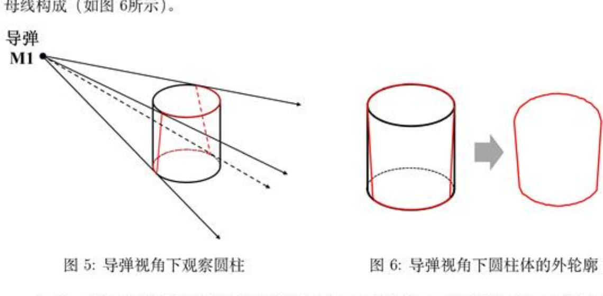

**Original caption:** 图5-6：导弹视角下的圆柱及外轮廓

**中文图注:** 图5-6：导弹视角下的圆柱及外轮廓

**Reading note:** 把目标表面全采样降为视角轮廓判断。

### 图7-8：圆柱遮蔽与凸性证明截面

**Placed near:** p.13 S142
**Source:** p.13 C006

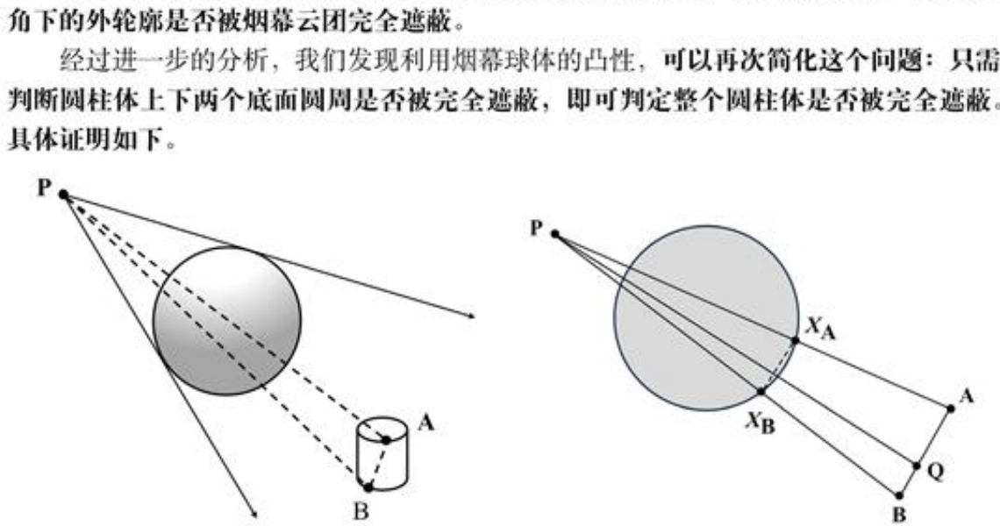

**Original caption:** 图7-8：圆柱遮蔽与凸性证明截面

**中文图注:** 图7-8：圆柱遮蔽与凸性证明截面

**Reading note:** 利用球体的凸性，把侧面判断进一步降为上下圆周判断。

## 第 14 页

**Source:** p.14 S151

**Original:** 区 烈 D 是 一 个 闭 的 国 盘 。 要 证 明 原 命 题 , 即 证 明 在 二 维 平 面 内 , 从 点 尸 指 向 位 于 AL 日 之 闻 任 一 点 Q 的 线 段 也 与 国 盘 口 眼 交 。

**中文:** 区烈 D 是一个闭的国盘 。 要证明原命题 , 即证明在二维平面内 , 从点尸指向位于 AL 日之闻任一点 Q 的线段也与国盘口眼交 。

**Source:** p.14 S152

**Original:** 令 Xa 为 PAL 刀 的 棠 个 交 点 。 同 理 取 Xe 为 PB 与 D 的 桀 一 个 交 点 。 则 有 Xs,XpeD.

**中文:** 令 Xa 为 PAL 刀的棠个交点 。 同理取 Xe 为 PB 与 D 的桀一个交点 。 则有 Xs,XpeD.

**Source:** p.14 S153

**Original:** 因 为 口 是 凸 的 , 线 段 XaXB 完 全 包 含 在 口 内 。

**中文:** 因为口是凸的 , 线段 XaXB 完全包含在口内 。

**Source:** p.14 S154

**Original:** 因 为 Xa E PA 且 Xp € PB。 因 此 XyXp 是 位 于 三 角 形 P4B 内 部 的 一 条 逊 线 ( 或 在 其 边 界 上 ), 从 P 指 向 迪 AB 上 任 意 一 点 Q 的 线 段 必 与 线 毅 XaXB 相 交 。

**中文:** 因为 Xa E PA 且 Xp € PB。 因此 XyXp 是位于三角形 P4B 内部的一条逊线 ( 或在其边界上 ), 从 P 指向迪 AB 上任意一点 Q 的线段必与线毅 XaXB 相交 。

**Source:** p.14 S155

**Original:** 又 由 于 线 段 XaXp C 口 , 所 以 线 段 PQ 和 线 段 XaXB 交 点 也 属 于 口 。 因 此 射 线 PQ 与 口 相 交 , 得 证 。 口

**中文:** 又由于线段 XaXp C 口 , 所以线段 PQ 和线段 XaXB 交点也属于口 。 因此射线 PQ 与口相交 , 得证 。 口

**Source:** p.14 S156

**Original:** 6.2.3 圆 周 离 散 化 及 采 样 点 数 的 选 取

**中文:** 6.2.3 圆周离散化及采样点数的选取

**Source:** p.14 S157

**Original:** 根 据 前 文 的 证 朋 , 我 们 只 需 判 断 圆 柱 体 的 上 下 底 面 圆 周 是 否 被 完 全 遣 蔽 , 在 数 值 计 算 中 , 我 们 通 过 在 圆 周 上 均 匀 选 取 有 限 个 采 样 点 来 近 似 模 拟 连 续 的 圆 周 、

**中文:** 根据前文的证朋 , 我们只需判断圆柱体的上下底面圆周是否被完全遣蔽 , 在数值计算中 , 我们通过在圆周上均匀选取有限个采样点来近似模拟连续的圆周 、

**Source:** p.14 S158

**Original:** 采 弯 点 数 ( 记 为 n) 的 选 取 需 要 在 计 算 精 度 和 效 率 之 间 取 得 平 衡 。 为 了 量 化 几 何 近 似 的 精 度 , 我 们 计 算 了 内 接 正 n 边 形 与 圆 的 面 积 眼 对 误 差 , 从 表 2 可 以 看 出 , 当 n =300 时 , 相 对 误 差 仅 为 0.0073%, 此 时 正 300 边 形 在 几 何 上 已 经 能 够 很 好 地 逼 近 圆 。

**中文:** 采弯点数 ( 记为 n) 的选取需要在计算精度和效率之间取得平衡 。 为了量化几何近似的精度 , 我们计算了内接正 n 边形与圆的面积眼对误差 , 从表 2 可以看出 , 当 n =300 时 , 相对误差仅为 0.0073%, 此时正 300 边形在几何上已经能够很好地逼近圆 。

**Source:** p.14 S159

**Original:** 表 2: 不 同 n 值 下 正 n 边 形 与 圆 的 面 积 柑 对 误 差

**中文:** 表 2: 不同 n 值下正 n 边形与圆的面积柑对误差

**Source:** p.14 S160

**Original:** 取 点 个 数 (n) 100 200 300 500 1000 相 对 误 差 (%) 0.06578 0.01645 0.00731 0.00263 0.00066

**中文:** 取点个数 (n) 100 200 300 500 1000 相对误差 (%) 0.06578 0.01645 0.00731 0.00263 0.00066

**Source:** p.14 S161

**Original:** 因 此 , 在 模 型 的 求 解 过 程 中 , 我 们 暂 时 选 取 n = 300, 即 在 上 下 底 面 圆 周 上 各 均 匀 取 300 个 点 进 行 途 蒋 判 断 . 该 选 择 的 合 理 性 将 在 后 文 的 结 果 验 证 部 分 通 过 敏 感 性 分 析 进 一 步 砥 认 。

**中文:** 因此 , 在模型的求解过程中 , 我们暂时选取 n = 300, 即在上下底面圆周上各均匀取 300 个点进行途蒋判断 . 该选择的合理性将在后文的结果验证部分通过敏感性分析进一步砥认 。

**Source:** p.14 S162

**Original:** 6.2.4 二 分 法 查 找 有 效 遮 挡 时 间 段 的 开 始 和 结 束 时 刻

**中文:** 6.2.4 二分法查找有效遮挡时间段的开始和结束时刻

**Source:** p.14 S163

**Original:** 上 文 已 经 说 明 了 有 效 遨 挡 的 时 间 段 是 一 段 单 一 连 续 的 时 间 段 , 故 本 问 可 以 通 过 二 分 查 找 法 机 搜 寻 有 效 造 挡 时 间 段 的 开 始 时 刻 fn 和 结 李 时 刻 t 。

**中文:** 上文已经说明了有效遨挡的时间段是一段单一连续的时间段 , 故本问可以通过二分查找法机搜寻有效造挡时间段的开始时刻 fn 和结李时刻 t 。

**Source:** p.14 S164

**Original:** 算 法 包 含 两 个 阶 段 : 第 一 步 , 需 要 找 到 一 个 在 有 效 遮 敲 区 间 内 部 的 时 刻 f“; 第 二 步 , 利 用 该 时 刻 作 为 端 点 , 通 过 一 分 法 分 别 逼 近 有 效 遣 蒲 区 间 的 开 始 时 刻 t 和 绪 李 时 刻 foas。

**中文:** 算法包含两个阶段 : 第一步 , 需要找到一个在有效遮敲区间内部的时刻 f“; 第二步 , 利用该时刻作为端点 , 通过一分法分别逼近有效遣蒲区间的开始时刻 t 和绪李时刻 foas。

**Source:** p.14 S165

**Original:** Step 1 算 法 初 始 化 : 定 义 初 始 点 集 S = [to,t6+10,t5+20} , 设 置 时 间 精 度 s 一 10-5, 定 义 初 始 时 间 网 格 尺 寸 f =10 ( 即 5 中 根 邻 两 点 的 初 始 间 附 ) 。

**中文:** Step 1 算法初始化 : 定义初始点集 S = [to,t6+10,t5+20} , 设置时间精度 s 一 10-5, 定义初始时间网格尺寸 f =10 ( 即 5 中根邻两点的初始间附 ) 。

**Source:** p.14 S166

**Original:** Step 2 选 代 点 集 : 若 当 前 迪 代 的 网 格 尺 寸 6 < s0, 则 算 法 终 止 ; 转 至 step4, 培 于 有 序 集 合 Sk = fsa,s,...,sm} , 生 成 新 的 滁 试 点 集 Soou 一 { 为 一 41}81。 对 绍 一 个 滢 足 t e Suco 的 t 计 算 遮 薛 状 态 C(4).

**中文:** Step 2 选代点集 : 若当前迪代的网格尺寸 6 < s0, 则算法终止 ; 转至 step4, 培于有序集合 Sk = fsa,s,...,sm} , 生成新的滁试点集 Soou 一 { 为一 41}81。 对绍一个滢足 t e Suco 的 t 计算遮薛状态 C(4).

### 表2：正 n 边形逼近圆的面积相对误差

**Placed near:** p.14 S151
**Source:** p.14 C003

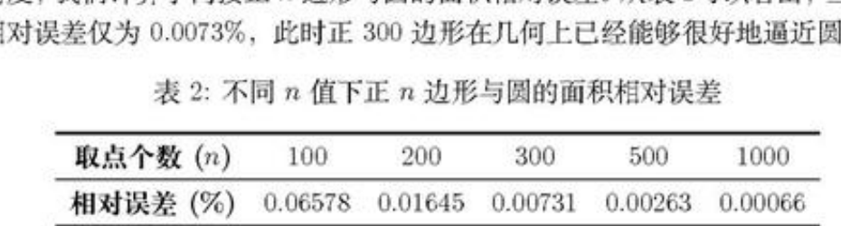

**Original caption:** 表2：正 n 边形逼近圆的面积相对误差

**中文图注:** 表2：正 n 边形逼近圆的面积相对误差

**Reading note:** 用于选择圆周离散采样点数。

## 第 15 页

**Source:** p.15 S167

**Original:** 结 丛 更 新 网 格 参 数 目 设 葛 招 劲 旷 闭 页 根 | S 生 成 测 试 点 并 计 算 - el i <m> 怠

**中文:** 结丛更新网格参数目设葛招劲旷闭页根 | S 生成测试点并计算 - el i <m> 怠

**Source:** p.15 S168

**Original:** 对 zs 他 有 两 个 区 闭 分 别 进 行 二 分 搜 索

**中文:** 对 zs 他有两个区闭分别进行二分搜索

**Source:** p.15 S169

**Original:** 图 9: 问 题 一 算 法 总 体 流 程 图

**中文:** 图 9: 问题一算法总体流程图

**Source:** p.15 S170

**Original:** Step 3 检 验 新 的 测 试 点 集 : 若 Snw 中 存 在 1 满 足 C(t) = 1, 则 令 “ 二 4, 成 功 找 到 有 效 遮 挡 时 间 段 内 的 一 个 时 刻 , 结 束 算 法 。

**中文:** Step 3 检验新的测试点集 : 若 Snw 中存在 1 满足 C(t) = 1, 则令 “ 二 4, 成功找到有效遮挡时间段内的一个时刻 , 结束算法 。

**Source:** p.15 S171

**Original:** 若 不 存 在 这 样 的 t, 则 通 过 合 并 点 集 来 更 新 St+i = Sk U Sn, 并 更 新 网 格 尺 寸 +l 二 仁 /2 转 至 step2 继 续 迭 代 。

**中文:** 若不存在这样的 t, 则通过合并点集来更新 St+i = Sk U Sn, 并更新网格尺寸 +l 二仁 /2 转至 step2 继续迭代 。

**Source:** p.15 S172

**Original:** Step 4 终 止 条 件 : 若 在 有 限 次 迭 代 后 , 仍 未 找 到 滢 足 C(t) = 1 的 点 , 即 在 网 格 精 度 高 于 so 前 仍 未 找 到 满 足 C(t) = 1 的 点 , 则 可 以 判 定 有 效 遮 蔽 区 间 的 长 度 小 于 当 前 搜 素 精 度 co, 算 法 终 止 。

**中文:** Step 4 终止条件 : 若在有限次迭代后 , 仍未找到滢足 C(t) = 1 的点 , 即在网格精度高于 so 前仍未找到满足 C(t) = 1 的点 , 则可以判定有效遮蔽区间的长度小于当前搜素精度 co, 算法终止 。

**Source:** p.15 S173

**Original:** 6.2.5 用 二 分 查 找 法 求 解 有 效 遮 蔽 区 间 的 起 始 时 刻 hn

**中文:** 6.2.5 用二分查找法求解有效遮蔽区间的起始时刻 hn

**Source:** p.15 S174

**Original:** 二 分 查 找 法 的 示 意 闸 以 及 具 体 步 骤 如 下 : _._ E - < - 起 爆 时 刻 mid tin fout mid “ 起 爆 时 刻 +20s

**中文:** 二分查找法的示意闸以及具体步骤如下 : _._ E - < - 起爆时刻 mid tin fout mid “ 起爆时刻 +20s

**Source:** p.15 S175

**Original:** 图 10: 二 分 查 找 法 示 意 囹

**中文:** 图 10: 二分查找法示意囹

**Source:** p.15 S176

**Original:** Step 1 初 始 化 搜 索 区 间 : 设 定 初 始 搜 索 区 间 为 [left,rigAht] = [t5.4], 其 中 b 是 烟 幕 起 爆 时 刻 。 设 定 时 间 精 度 s = 1075。 初 始 化 起 始 时 刻 的 当 前 值 为 tu = 匕 。

**中文:** Step 1 初始化搜索区间 : 设定初始搜索区间为 [left,rigAht] = [t5.4], 其中 b 是烟幕起爆时刻 。 设定时间精度 s = 1075。 初始化起始时刻的当前值为 tu = 匕 。

**Source:** p.15 S177

**Original:** Step 2 计 算 中 间 点 : 根 据 当 前 区 间 [ieft.righ], 计 算 中 点 mid = (left+ right)/2. 计 算 Ctmid) 的 值 来 判 断 在 mid 时 刻 真 目 标 是 否 被 完 全 遮 敲 。

**中文:** Step 2 计算中间点 : 根据当前区间 [ieft.righ], 计算中点 mid = (left+ right)/2. 计算 Ctmid) 的值来判断在 mid 时刻真目标是否被完全遮敲 。

**Source:** p.15 S178

**Original:** Step 3 更 新 区 间 : 如 果 C(mid) = 1, 说 明 mid 时 刻 仍 在 有 效 遍 蒲 地 内 , 真 正 的 起 始 时 刻 可 能 等 于 或 早 于 mid。 我 们 记 录 下 这 个 可 能 的 新 边 界 tu = id, 并 向 左 继 续 搜 索 , 更 新 区 间 为 [left.mid] 。

**中文:** Step 3 更新区间 : 如果 C(mid) = 1, 说明 mid 时刻仍在有效遍蒲地内 , 真正的起始时刻可能等于或早于 mid。 我们记录下这个可能的新边界 tu = id, 并向左继续搜索 , 更新区间为 [left.mid] 。

**Source:** p.15 S179

**Original:** 如 果 C(mid) = 0, 说 明 mid 时 刻 已 经 早 于 有 效 避 菲 掷 的 起 始 点 , 起 始 时 刻 必 然 在 mid 之 后 。 目 标 值 位 于 [mid.rig 切 , 更 新 区 间 为 [mid, right].

**中文:** 如果 C(mid) = 0, 说明 mid 时刻已经早于有效避菲掷的起始点 , 起始时刻必然在 mid 之后 。 目标值位于 [mid.rig 切 , 更新区间为 [mid, right].

**Source:** p.15 S180

**Original:** 15

**中文:** 15

### 图9：问题一算法总体流程图

**Placed near:** p.15 S167
**Source:** p.15 C007

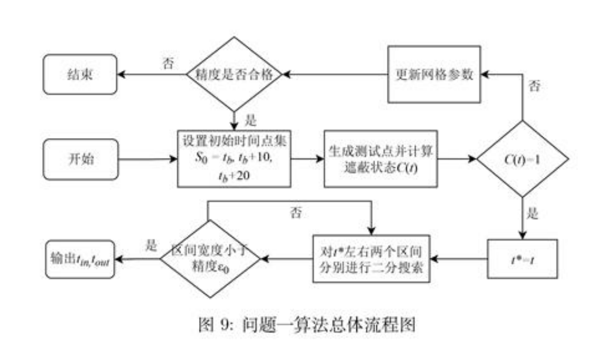

**Original caption:** 图9：问题一算法总体流程图

**中文图注:** 图9：问题一算法总体流程图

**Reading note:** 先寻找区间内可行点，再二分定位左右边界。

### 图10：二分查找法示意图

**Placed near:** p.15 S167
**Source:** p.15 C008

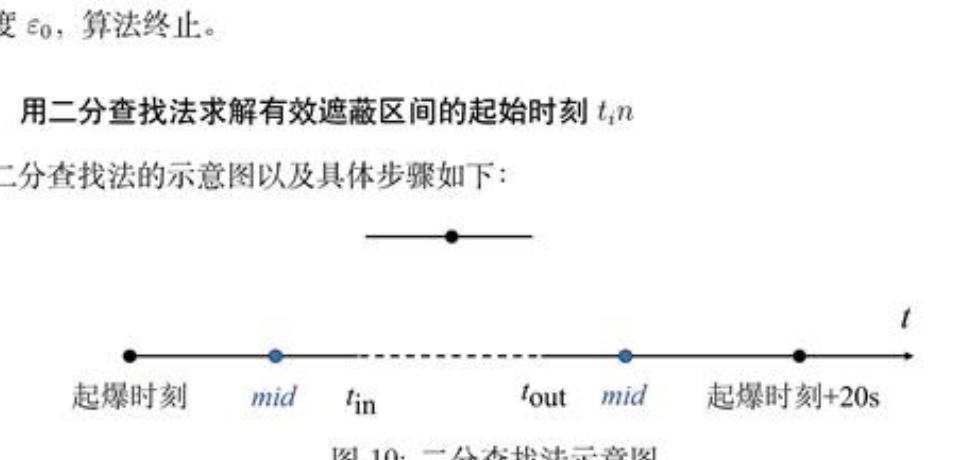

**Original caption:** 图10：二分查找法示意图

**中文图注:** 图10：二分查找法示意图

**Reading note:** 连续可行时间区间的双边界搜索。

## 第 16 页

**Source:** p.16 S181

**Original:** Step 4 求 解 统 果 : 循 环 迭 代 直 至 区 间 宽 度 right — left < s, 迭 代 结 束 时 ,ttn 的 最 终 值 即 为 有 效 语 蔽 区 间 的 精 确 起 始 时 刻 。

**中文:** Step 4 求解统果 : 循环迭代直至区间宽度 right — left < s, 迭代结束时 ,ttn 的最终值即为有效语蔽区间的精确起始时刻 。

**Source:** p.16 S182

**Original:** 6.2.6 用 二 分 查 找 法 求 解 有 效 遮 蔽 区 间 的 结 束 时 刻 tout

**中文:** 6.2.6 用二分查找法求解有效遮蔽区间的结束时刻 tout

**Source:** p.16 S183

**Original:** 求 解 结 柬 时 刻 tout 的 过 程 与 求 解 tn 的 方 法 完 全 类 似 , 同 样 采 用 二 分 查 找 法 , 其 不 同 之 处 仅 在 于 :

**中文:** 求解结柬时刻 tout 的过程与求解 tn 的方法完全类似 , 同样采用二分查找法 , 其不同之处仅在于 :

**Source:** p.16 S184

**Original:** 1. 初 始 搜 索 区 间 设 定 为 [left,raght| = [t*,t, 十 20]。

**中文:** 1. 初始搜索区间设定为 [left,raght| = [t*,t, 十 20]。

**Source:** p.16 S185

**Original:** 2. 区 间 更 新 递 辑 (Step 3):

**中文:** 2. 区间更新递辑 (Step 3):

**Source:** p.16 S186

**Original:** 如 果 C(mad) = 1, 说 明 有 效 遮 蒲 尚 未 结 束 , 真 正 的 结 束 时 刻 位 于 或 晚 于 mid, 因 此 向 右 遏 索 , 更 新 区 间 为 [mid,right].

**中文:** 如果 C(mad) = 1, 说明有效遮蒲尚未结束 , 真正的结束时刻位于或晚于 mid, 因此向右遏索 , 更新区间为 [mid,right].

**Source:** p.16 S187

**Original:** 如 果 Ctmid) = 0, 说 明 mid 时 刻 已 超 出 有 效 遮 蒲 范 围 , 结 束 时 刻 必 然 早 于 mid, 因 此 向 左 搜 索 , 更 新 区 间 为 [le/t,maid| .

**中文:** 如果 Ctmid) = 0, 说明 mid 时刻已超出有效遮蒲范围 , 结束时刻必然早于 mid, 因此向左搜索 , 更新区间为 [le/t,maid| .

**Source:** p.16 S188

**Original:** 算 法 的 其 余 步 骤 与 终 止 条 件 均 与 求 解 tn 的 过 程 相 同

**中文:** 算法的其余步骤与终止条件均与求解 tn 的过程相同

**Source:** p.16 S189

**Original:** 6.3 结 果 展 示

**中文:** 6.3 结果展示

**Source:** p.16 S190

**Original:** 通 过 前 文 所 述 的 计 算 方 法 , 得 到 有 效 避 挡 时 间 段 的 开 始 时 刻 tn 和 结 束 时 刻 tou。 然 后 胸 求 得 的 起 止 时 刻 相 减 , 即 可 得 到 问 题 一 需 要 求 得 的 有 效 谭 蔽 时 长 7 = tout 一 tn 我 们 最 终 求 得 的 烟 幕 干 扰 弹 对 M1 的 有 效 遨 蔽 时 长 为 1.391643s,

**中文:** 通过前文所述的计算方法 , 得到有效避挡时间段的开始时刻 tn 和结束时刻 tou。 然后胸求得的起止时刻相减 , 即可得到问题一需要求得的有效谭蔽时长 7 = tout 一 tn 我们最终求得的烟幕干扰弹对 M1 的有效遨蔽时长为 1.391643s,

**Source:** p.16 S191

**Original:** 6.4 结 果 的 分 析 与 验 证

**中文:** 6.4 结果的分析与验证

**Source:** p.16 S192

**Original:** 6.4.1 离 散 化 点 数 n 的 敏 感 性 分 析

**中文:** 6.4.1 离散化点数 n 的敏感性分析

**Source:** p.16 S193

**Original:** 为 验 证 模 型 求 解 过 程 中 所 选 取 的 圆 周 离 敬 化 点 数 n = 300 的 合 理 性 与 结 果 的 稳 定 性 , 我 们 进 行 了 一 项 敏 感 性 分 析 。 我 们 分 别 取 n = {100,200,300,500, 1000} , 并 重 复 问 题 一 的 完 整 求 解 过 程 , 得 到 的 有 效 遮 蒲 时 间 结 果 如 表 3 所 示 。

**中文:** 为验证模型求解过程中所选取的圆周离敬化点数 n = 300 的合理性与结果的稳定性 , 我们进行了一项敏感性分析 。 我们分别取 n = {100,200,300,500, 1000} , 并重复问题一的完整求解过程 , 得到的有效遮蒲时间结果如表 3 所示 。

**Source:** p.16 S194

**Original:** 表 3: 不 同 n 值 下 的 有 效 谨 蔽 时 长

**中文:** 表 3: 不同 n 值下的有效谨蔽时长

**Source:** p.16 S195

**Original:** 取 点 个 数 (2) 100 200 300 500 1000 有 效 时 长 (s) 1.391646 1.391644 “1.391643 1.301643 “1.391643

**中文:** 取点个数 (2) 100 200 300 500 1000 有效时长 (s) 1.391646 1.391644 “1.391643 1.301643 “1.391643

**Source:** p.16 S196

**Original:** 从 上 表 可 以 看 出 , 当 n > 300 时 , 计 算 得 到 的 有 效 遮 薇 时 长 在 小 数 点 后 六 位 上 保 持 一 致 , 表 明 结 果 已 经 收 敛 。 这 证 明 我 们 选 择 n = 300 不 仅 保 证 了 计 算 结 果 的 精 确 性 和 稳 定 性 , 也 避 免 了 因 n 值 过 大 而 导 致 的 额 外 计 算 开 销 , 因 此 , 我 们 认 为 基 于 n =300 计 算 出 的 有 效 遮 蔽 时 长 1.391643s 是 可 靠 的 。

**中文:** 从上表可以看出 , 当 n > 300 时 , 计算得到的有效遮薇时长在小数点后六位上保持一致 , 表明结果已经收敛 。 这证明我们选择 n = 300 不仅保证了计算结果的精确性和稳定性 , 也避免了因 n 值过大而导致的额外计算开销 , 因此 , 我们认为基于 n =300 计算出的有效遮蔽时长 1.391643s 是可靠的 。

**Source:** p.16 S197

**Original:** 七 、 问 题 二 模 型 建 立 及 求 解

**中文:** 七 、 问题二模型建立及求解

**Source:** p.16 S198

**Original:** 问 题 二 在 问 题 一 建 立 的 数 学 模 型 基 础 上 , 从 国 定 参 数 计 算 提 升 到 多 参 数 的 优 化 , 这 是 一 个 典 型 的 非 线 性 优 化 问 题 。 在 实 际 军 事 应 用 中 , 炯 幕 干 扰 弹 的 投 放 策 觊 优 化 具 有 重

**中文:** 问题二在问题一建立的数学模型基础上 , 从国定参数计算提升到多参数的优化 , 这是一个典型的非线性优化问题 。 在实际军事应用中 , 炯幕干扰弹的投放策觊优化具有重

**Source:** p.16 S199

**Original:** 16

**中文:** 16

### 表3：不同采样点数下的有效遮蔽时长

**Placed near:** p.16 S181
**Source:** p.16 C004

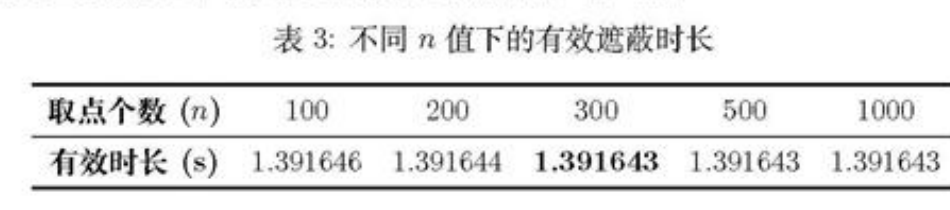

**Original caption:** 表3：不同采样点数下的有效遮蔽时长

**中文图注:** 表3：不同采样点数下的有效遮蔽时长

**Reading note:** n 不小于 300 后结果在六位小数上稳定。

## 第 17 页

**Source:** p.17 S200

**Original:** 要 意 义 “ 通 过 精 确 控 制 无 人 机 的 飞 行 参 数 和 烟 幕 弹 的 引 爆 时 间 , 可 以 在 最 合 适 的 时 间 、 最 合 适 的 位 置 形 成 有 效 遮 蒲 。 本 问 针 对 这 一 背 景 进 行 最 优 策 路 的 研 究 , 下 面 对 问 题 二 的 优 化 模 型 的 建 立 进 行 详 细 说 明 :

**中文:** 要意义 “ 通过精确控制无人机的飞行参数和烟幕弹的引爆时间 , 可以在最合适的时间 、 最合适的位置形成有效遮蒲 。 本问针对这一背景进行最优策路的研究 , 下面对问题二的优化模型的建立进行详细说明 :

**Source:** p.17 S201

**Original:** 7.1 单 机 单 弹 优 化 模 型 的 建 立 7.1.1 决 策 变 量 定 义 本 问 需 要 决 策 无 人 机 FY1 往 郧 边 飞 , 以 多 大 的 速 度 飞 , 何 时 投 放 烟 幕 弹 , 何 时 引 爆 烟 幕 弹 这 四 个 问 题 。 因 此 本 文 定 义 了 一 个 四 维 决 策 空 间 : X = (8,vpy,ta,ts) E R? (7.1)

**中文:** 7.1 单机单弹优化模型的建立 7.1.1 决策变量定义本问需要决策无人机 FY1 往郧边飞 , 以多大的速度飞 , 何时投放烟幕弹 , 何时引爆烟幕弹这四个问题 。 因此本文定义了一个四维决策空间 : X = (8,vpy,ta,ts) E R? (7.1)

**Source:** p.17 S202

**Original:** 其 中 各 变 量 的 物 理 含 义 和 约 束 范 围 如 下 : 航 向 角 9: 决 定 了 无 人 机 的 飞 行 方 向 , 直 接 影 响 炽 幕 弹 的 投 放 位 置 。0 E |0,2r| 覆 盖 所 有 可 能 的 方 向 选 择 , 飞 行 速 度 vy, 影 响 无 人 机 到 达 投 放 点 的 时 间 , v |70,140]my/s 反 跑 了 无 人 机 的 性 能 限 制 , 投 放 时 间 ta: 决 定 了 烟 幕 弹 何 时 开 始 自 由 飞 行 ,ts = 0 表 示 在 受 领 任 务 后 的 某 个 时 间 点 投 放 。

**中文:** 其中各变量的物理含义和约束范围如下 : 航向角 9: 决定了无人机的飞行方向 , 直接影响炽幕弹的投放位置 。0 E |0,2r| 覆盖所有可能的方向选择 , 飞行速度 vy, 影响无人机到达投放点的时间 , v |70,140]my/s 反跑了无人机的性能限制 , 投放时间 ta: 决定了烟幕弹何时开始自由飞行 ,ts = 0 表示在受领任务后的某个时间点投放 。

**Source:** p.17 S203

**Original:** 7.1.2 目 标 函 数 设 置

**中文:** 7.1.2 目标函数设置

**Source:** p.17 S204

**Original:** 研 究 烟 幕 弹 的 投 放 策 略 最 终 的 目 的 在 于 延 长 有 效 遮 档 的 时 间 , 所 以 应 该 选 取 最 大 化 有 效 遮 挡 时 间 作 为 目 标 函 数 , 因 此 求 解 最 优 策 畦 的 目 标 函 数 x) 的 表 达 式 为 ;

**中文:** 研究烟幕弹的投放策略最终的目的在于延长有效遮档的时间 , 所以应该选取最大化有效遮挡时间作为目标函数 , 因此求解最优策畦的目标函数 x) 的表达式为 ;

**Source:** p.17 S205

**Original:** max  f(X) 二 fout — t = 兄 ™ Bool(t)dt (7.2)

**中文:** max f(X) 二 fout — t = 兄 ™ Bool(t)dt (7.2)

**Source:** p.17 S206

**Original:** 7.1.3 约 束 条 件 分 析

**中文:** 7.1.3 约束条件分析

**Source:** p.17 S207

**Original:** 违 度 约 束 : 无 人 机 FY1 的 飞 行 速 度 vy 必 须 是 一 个 在 70 m/s 到 140 m/s 的 区 间 内 的 常 数 。 70 < vy 三 140 (7.3)

**中文:** 违度约束 : 无人机 FY1 的飞行速度 vy 必须是一个在 70 m/s 到 140 m/s 的区间内的常数 。 70 < vy 三 140 (7.3)

**Source:** p.17 S208

**Original:** 飞 行 方 向 角 约 束 : 无 人 机 的 飞 行 方 向 角 4 可 以 是 水 平 面 内 的 任 意 方 向 ,9 € |0,2r| 就 能 覆 盖 所 有 可 能 的 飞 行 方 向 ;: 0 一 8 一 2r (7.4)

**中文:** 飞行方向角约束 : 无人机的飞行方向角 4 可以是水平面内的任意方向 ,9 € |0,2r| 就能覆盖所有可能的飞行方向 ;: 0 一 8 一 2r (7.4)

**Source:** p.17 S209

**Original:** 等 高 度 飞 行 约 束 : 无 人 机 须 在 初 始 高 度 1800 米 进 行 等 高 度 飞 行 , 其 飞 行 速 度 的 垂 直 分 量 为 0。

**中文:** 等高度飞行约束 : 无人机须在初始高度 1800 米进行等高度飞行 , 其飞行速度的垂直分量为 0。

**Source:** p.17 S210

**Original:** 时 间 约 束 : 姜 幕 弹 的 投 放 时 间 td 必 须 在 任 务 开 始 后 , 烟 幕 弹 的 起 爆 时 间 t5 必 须 晚 于 或 等 于 其 投 放 时 间 ta, 因 此 两 者 应 该 滢 足 ;

**中文:** 时间约束 : 姜幕弹的投放时间 td 必须在任务开始后 , 烟幕弹的起爆时间 t5 必须晚于或等于其投放时间 ta, 因此两者应该滢足 ;

**Source:** p.17 S211

**Original:** 红 妤 之 0 , ta<ty (7.5)

**中文:** 红妤之 0 , ta<ty (7.5)

## 第 18 页

**Source:** p.18 S212

**Original:** 有 效 遮 蔽 窗 口 约 束 : 姜 幕 云 团 仅 在 起 爆 后 的 20 秒 内 可 以 提 供 有 效 遮 蒲 , 因 此 , 最 终 计 算 出 的 有 效 谨 蒙 时 间 区 间 |tn,toud] 必 须 完 全 包 含 在 [t, + 20| 这 个 时 间 窗 口 内 :

**中文:** 有效遮蔽窗口约束 : 姜幕云团仅在起爆后的 20 秒内可以提供有效遮蒲 , 因此 , 最终计算出的有效谨蒙时间区间 |tn,toud] 必须完全包含在 [t, + 20| 这个时间窗口内 :

**Source:** p.18 S213

**Original:** [tn,tou] S I + 20] (7.6)

**中文:** [tn,tou] S I + 20] (7.6)

**Source:** p.18 S214

**Original:** 有 效 遮 挡 判 定 约 束 : 根 据 第 一 问 的 分 析 , 单 一 烟 幕 弹 对 于 导 弹 M1 的 有 效 遮 挡 判 定 是 根 据 定 义 的 布 尔 函 数 确 定 的 , 所 以 :

**中文:** 有效遮挡判定约束 : 根据第一问的分析 , 单一烟幕弹对于导弹 M1 的有效遮挡判定是根据定义的布尔函数确定的 , 所以 :

**Source:** p.18 S215

**Original:** 1, IVREQ, PmBnC(Pu(t) #2 0, otherwise

**中文:** 1, IVREQ, PmBnC(Pu(t) #2 0, otherwise

**Source:** p.18 S216

**Original:** Bool(t) = { (7.7)

**中文:** Bool(t) = { (7.7)

**Source:** p.18 S217

**Original:** 7.1.4 “ 模 型 汇 总 综 上 求 解 本 问 题 的 优 化 模 型 为 :

**中文:** 7.1.4 “ 模型汇总综上求解本问题的优化模型为 :

**Source:** p.18 S218

**Original:** mQz 八死)=塔阗Bmz…毗

**中文:** mQz 八死)=塔阗Bmz…毗

**Source:** p.18 S219

**Original:** ′!′′″ € [70,140],t, > ta + 1,t4 > 0,0 € [0, 27] 柏 三 口 三 周 十 20

**中文:** ′!′′″ € [70,140],t, > ta + 1,t4 > 0,0 € [0, 27] 柏三口三周十 20

**Source:** p.18 S220

**Original:** Pm,u(] = Pr(0) 十 V .t

**中文:** Pm,u(] = Pr(0) 十 V .t

**Source:** p.18 S221

**Original:** Pou(t) = Rz, By P —Vank - (E =) 五 加 8 1 SP,1i(t) =Ppya(ta) + vy 「 任 一 加 ) 十 邹 . 代 一 加 ) t=>ta (7.8) Vi1 = (Vgy1 086,05, 5in6,0) Prya(t) = Ppya(0) + vpy -t

**中文:** Pou(t) = Rz, By P —Vank - (E =) 五加 8 1 SP,1i(t) =Ppya(ta) + vy 「 任一加 ) 十邹 . 代一加 ) t=>ta (7.8) Vi1 = (Vgy1 086,05, 5in6,0) Prya(t) = Ppya(0) + vpy -t

**Source:** p.18 S222

**Original:** 1, ifYPReQ, PuPanC(Pu()#2

**中文:** 1, ifYPReQ, PuPanC(Pu()#2

**Source:** p.18 S223

**Original:** Bool(t) = 腻 otherwise

**中文:** Bool(t) = 腻 otherwise

**Source:** p.18 S224

**Original:** \

**中文:** \

**Source:** p.18 S225

**Original:** 7.2 “ 优 化 模 型 求 解 7.2.1 多 起 点 变 步 长 搜 索 寻 优

**中文:** 7.2 “ 优化模型求解 7.2.1 多起点变步长搜索寻优

**Source:** p.18 S226

**Original:** 由 于 本 问 题 的 目 标 函 数 有 效 遮 蔽 时 长 t) 没 有 解 析 表 达 式 , 其 函 数 值 需 要 通 过 横 拉 仿 真 才 能 得 到 , 这 导 致 它 的 梯 度 信 息 难 以 计 算 , 传 统 的 橼 度 下 降 等 优 化 算 法 不 再 适 用 。 因 此 , 我 们 设 计 了 一 种 多 起 点 变 步 长 搜 索 算 法 。 通 过 在 可 行 基 内 进 行 多 次 随 机 采 样 汝 保 证 解 的 全 局 探 索 性 , 并 对 每 个 采 样 点 采 用 自 适 应 变 步 长 的 坐 标 搜 索 方 法 进 行 局 部 寻 优 , 从 而 有 效 平 衡 了 全 局 搜 索 与 局 部 收 敛 的 效 率 , 并 且 能 够 防 止 陷 人 局 部 最 优 -

**中文:** 由于本问题的目标函数有效遮蔽时长 t) 没有解析表达式 , 其函数值需要通过横拉仿真才能得到 , 这导致它的梯度信息难以计算 , 传统的橼度下降等优化算法不再适用 。 因此 , 我们设计了一种多起点变步长搜索算法 。 通过在可行基内进行多次随机采样汝保证解的全局探索性 , 并对每个采样点采用自适应变步长的坐标搜索方法进行局部寻优 , 从而有效平衡了全局搜索与局部收敛的效率 , 并且能够防止陷人局部最优 -

**Source:** p.18 S227

**Original:** Step 1 初 始 化 与 全 局 札 样 : 为 避 免 陷 人 局 部 最 优 , 我 们 首 先 在 整 个 可 行 解 空 间 内 进 行 全 局 随 机 抽 祭 , 生 成 N 个 初 始 解 作 为 局 部 搜 索 的 起 点 。

**中文:** Step 1 初始化与全局札样 : 为避免陷人局部最优 , 我们首先在整个可行解空间内进行全局随机抽祭 , 生成 N 个初始解作为局部搜索的起点 。

**Source:** p.18 S228

**Original:** 每 一 个 初 始 解 X = (0,07, ta, ) 都 是 通 过 在 其 四 个 决 策 变 量 的 各 自 可 行 垣 , 进 行 独 立 的 均 匀 随 机 采 样 而 生 成 的 。 这 保 证 了 初 始 种 群 在 整 个 多 维 参 数 空 间 中 的 分 布 是 均 匀

**中文:** 每一个初始解 X = (0,07, ta, ) 都是通过在其四个决策变量的各自可行垣 , 进行独立的均匀随机采样而生成的 。 这保证了初始种群在整个多维参数空间中的分布是均匀

**Source:** p.18 S229

**Original:** 18

**中文:** 18

## 第 19 页

**Source:** p.19 S230

**Original:** 的 , 从 而 更 有 可 能 找 到 全 局 最 优 解 。

**中文:** 的 , 从而更有可能找到全局最优解 。

**Source:** p.19 S231

**Original:** Step 2 生 成 测 试 解 : 对 每 一 个 初 始 解 ( , 执 行 一 次 变 步 长 坐 标 搜 索 进 行 局 部 寻 优 。 令 当 前 迭 代 的 最 优 解 为 isx, 并 初 始 化 步 长 衰 减 等 级 K = 0. 算 法 迪 代 执 行 直 至 达 到 最 大 预 设 值 Kz

**中文:** Step 2 生成测试解 : 对每一个初始解 ( , 执行一次变步长坐标搜索进行局部寻优 。 令当前迭代的最优解为 isx, 并初始化步长衰减等级 K = 0. 算法迪代执行直至达到最大预设值 Kz

**Source:** p.19 S232

**Original:** 依 次 遍 历 四 个 决 策 变 量 维 度 (7 = 1,2,3,4)。 在 当 前 维 度 7 上 , 生 成 两 个 测 试 解 :

**中文:** 依次遍历四个决策变量维度 (7 = 1,2,3,4)。 在当前维度 7 上 , 生成两个测试解 :

**Source:** p.19 S233

**Original:** 〈 + 二h 十 诚 - 白

**中文:** 〈 + 二h 十诚 - 白

**Source:** p.19 S234

**Original:** 其 中 Aj 是 维 度 〗 的 初 始 搜 索 步 长 ,ej 是 该 维 度 的 单 位 基 向 量 。

**中文:** 其中 Aj 是维度 〗 的初始搜索步长 ,ej 是该维度的单位基向量 。

**Source:** p.19 S235

**Original:** Step 3 拂 优 更 新 : 若 f(X+) > f(Xicax) 或 【 匕 ) > f(tiest), 则 更 新 tbex 为 更 优 的 解

**中文:** Step 3 拂优更新 : 若 f(X+) > f(Xicax) 或 【 匕 ) > f(tiest), 则更新 tbex 为更优的解

**Source:** p.19 S236

**Original:** 若 本 轮 搜 索 未 能 找 到 更 优 解 , 则 对 步 长 进 行 衰 减 , k 小 k + 1

**中文:** 若本轮搜索未能找到更优解 , 则对步长进行衰减 , k 小 k + 1

**Source:** p.19 S237

**Original:** 否 则 , 保 持 k 不 变 , 以 更 新 后 的 Xew 为 中 心 开 始 新 一 轮 的 坐 标 轮 换 探 索 。

**中文:** 否则 , 保持 k 不变 , 以更新后的 Xew 为中心开始新一轮的坐标轮换探索 。

**Source:** p.19 S238

**Original:** Step 4 确 定 全 局 最 优 解 :

**中文:** Step 4 确定全局最优解 :

**Source:** p.19 S239

**Original:** # Step 2 的 局 部 寻 优 过 程 应 用 于 全 部 N 个 初 始 点 , 会 得 到 N 个 对 应 的 局 部 最 优 点 。 最 后 , 通 过 比 较 这 N 个 点 的 目 标 函 数 值 , 选 取 其 中 最 大 者 , 即 为 最 终 求 得 的 全 局 最 优 投 放 策 路 。

**中文:** # Step 2 的局部寻优过程应用于全部 N 个初始点 , 会得到 N 个对应的局部最优点 。 最后 , 通过比较这 N 个点的目标函数值 , 选取其中最大者 , 即为最终求得的全局最优投放策路 。

**Source:** p.19 S240

**Original:** 7.2.2 单 个 无 人 机 单 个 干 扰 弹 的 投 放 最 优 策 略

**中文:** 7.2.2 单个无人机单个干扰弹的投放最优策略

**Source:** p.19 S241

**Original:** 根 据 以 上 算 法 步 骤 , 我 们 最 终 求 出 : 无 人 机 FY1 在 受 领 任 务 0.8977s 后 投 放 一 枚 烫 幕 干 扰 弹 , 间 隋 0.0497s 后 起 爆 , 这 弯 有 效 遮 蔽 时 长 最 长 , 最 长 有 效 遮 蔽 时 长 为 4.5873s, 飞 行 方 向 : 5.168。 (0.0002 弥 度 ), 无 人 机 朝 z 轴 正 方 向 路 偏 向 y 轲 正 方 向 飞 行 。 飞 行 速 度 为 136.3663m/s, 无 人 机 以 接 近 其 追 度 的 上 限 飞 行 , 以 求 尽 快 抵 达 最 优 投 放 区 域 。 烟 幕 干 扰 弹 投 放 点 华 标 (z, y, 2) 为 (17921.9184, 11.0270, 1800.0000), 烟 幕 干 扰 弹 起 爆 点 坐 标 (z, v, 2) 为 (17928.6682, 11.6375, 1799.9879)

**中文:** 根据以上算法步骤 , 我们最终求出 : 无人机 FY1 在受领任务 0.8977s 后投放一枚烫幕干扰弹 , 间隋 0.0497s 后起爆 , 这弯有效遮蔽时长最长 , 最长有效遮蔽时长为 4.5873s, 飞行方向 : 5.168。 (0.0002 弥度 ), 无人机朝 z 轴正方向路偏向 y 轲正方向飞行 。 飞行速度为 136.3663m/s, 无人机以接近其追度的上限飞行 , 以求尽快抵达最优投放区域 。 烟幕干扰弹投放点华标 (z, y, 2) 为 (17921.9184, 11.0270, 1800.0000), 烟幕干扰弹起爆点坐标 (z, v, 2) 为 (17928.6682, 11.6375, 1799.9879)

**Source:** p.19 S242

**Original:** 7.3 结 果 的 分 析 与 验 证

**中文:** 7.3 结果的分析与验证

**Source:** p.19 S243

**Original:** 为 验 证 本 文 所 采 用 的 多 起 点 变 步 长 搜 索 算 法 求 解 这 个 优 化 模 型 的 可 靠 性 与 准 确 性 , 我 们 采 用 粒 子 群 优 化 算 法 对 问 题 二 进 行 独 立 的 再 次 求 解 。 粒 子 群 算 法 在 解 空 间 中 进 行 全 局 报 索 , 同 样 适 用 于 求 解 目 标 函 数 复 杂 、 非 凸 的 优 化 问 题 。 将 两 种 算 法 求 解 得 到 的 最 优 投 放 策 路 进 行 对 比 , 具 体 结 果 如 表 4 所 示 :

**中文:** 为验证本文所采用的多起点变步长搜索算法求解这个优化模型的可靠性与准确性 , 我们采用粒子群优化算法对问题二进行独立的再次求解 。 粒子群算法在解空间中进行全局报索 , 同样适用于求解目标函数复杂 、 非凸的优化问题 。 将两种算法求解得到的最优投放策路进行对比 , 具体结果如表 4 所示 :

**Source:** p.19 S244

**Original:** 19

**中文:** 19

## 第 20 页

**Source:** p.20 S245

**Original:** 表 4 两 种 优 化 算 法 最 优 策 略 对 比

**中文:** 表 4 两种优化算法最优策略对比

**Source:** p.20 S246

**Original:** 决 策 变 量 / 目 标 变 步 长 搜 索 ( 本 文 算 法 ) 粥 子 群 优 化 (PSO) 最 长 有 效 遮 蔽 时 长 (s) 4.587300 4.587772 飞 行 方 向 ( 弧 度 ) 0.0902 0.0880 飞 行 迁 度 (m/s) 136.3663 137.8825 投 放 时 间 ta (s) 0.8977 0.9389 越 爆 延 迟 At, (5) 0.0497 0.0106

**中文:** 决策变量 / 目标变步长搜索 ( 本文算法 ) 粥子群优化 (PSO) 最长有效遮蔽时长 (s) 4.587300 4.587772 飞行方向 ( 弧度 ) 0.0902 0.0880 飞行迁度 (m/s) 136.3663 137.8825 投放时间 ta (s) 0.8977 0.9389 越爆延迟 At, (5) 0.0497 0.0106

**Source:** p.20 S247

**Original:** 从 表 4 可 以 看 出 , 两 种 截 然 不 同 的 优 化 算 法 所 求 得 的 最 长 有 效 遮 蒲 时 长 分 别 为 4.5873 秒 和 4.5878 秒 , 相 对 误 差 仅 为 0.01%。 这 表 明 我 们 的 多 起 点 变 步 长 搜 索 算 法 在 求 解 这 个 优 化 模 型 上 的 准 确 性 和 可 靠 性 很 高 ,

**中文:** 从表 4 可以看出 , 两种截然不同的优化算法所求得的最长有效遮蒲时长分别为 4.5873 秒和 4.5878 秒 , 相对误差仅为 0.01%。 这表明我们的多起点变步长搜索算法在求解这个优化模型上的准确性和可靠性很高 ,

**Source:** p.20 S248

**Original:** 办 外 , 两 种 算 法 绝 出 的 最 优 策 略 在 核 心 特 征 上 保 持 一 致 。 比 如 , 无 人 机 的 飞 行 速 度 都 接 近 其 性 能 上 限 (140 m/s) , 行 方 向 角 都 非 常 小 ( 约 0.09 甄 度 /5 觞 度 , 即 朝 z 轶 正 向 路 偏 向 y 轻 正 方 向 飞 行 ), 投 放 时 间 都 在 0.9 秒 左 右 、 从 这 些 相 似 之 处 我 们 可 以 得 出 最 优 策 略 的 一 些 规 律 : 耐 最 有 效 误 挡 其 视 线 , 理 想 的 点 幕 云 团 就 应 该 位 于 导 弹 到 真 目 标 这 条 视 线 路 径 上 。 并 且 无 人 机 FY1 的 初 始 位 置 在 导 弹 到 真 目 标 和 导 弹 到 假 目 标 这 两 个 直 线 附 近 , 因 此 , 最 直 接 高 效 的 投 放 策 略 就 是 迎 着 导 弹 来 的 方 向 飞 过 去 , 这 祭 就 能 最 快 地 将 烟 幕 干 扰 弹 部 署 到 导 弹 的 必 经 之 路 上 , 形 成 一 道 迎 面 的 烟 幕 云 团 。 微 小 的 角 度 偏 荣 (5.1“) 是 为 了 更 好 地 对 准 圆 柱 体 轮 廓 而 非 仅 仅 是 其 中 心 点 所 做 出 的 精 细 调 整 。

**中文:** 办外 , 两种算法绝出的最优策略在核心特征上保持一致 。 比如 , 无人机的飞行速度都接近其性能上限 (140 m/s) , 行方向角都非常小 ( 约 0.09 甄度 /5 觞度 , 即朝 z 轶正向路偏向 y 轻正方向飞行 ), 投放时间都在 0.9 秒左右 、 从这些相似之处我们可以得出最优策略的一些规律 : 耐最有效误挡其视线 , 理想的点幕云团就应该位于导弹到真目标这条视线路径上 。 并且无人机 FY1 的初始位置在导弹到真目标和导弹到假目标这两个直线附近 , 因此 , 最直接高效的投放策略就是迎着导弹来的方向飞过去 , 这祭就能最快地将烟幕干扰弹部署到导弹的必经之路上 , 形成一道迎面的烟幕云团 。 微小的角度偏荣 (5.1“) 是为了更好地对准圆柱体轮廓而非仅仅是其中心点所做出的精细调整 。

**Source:** p.20 S249

**Original:** 八 、 问 题 三 模 型 建 立 及 求 解

**中文:** 八 、 问题三模型建立及求解

**Source:** p.20 S250

**Original:** 问 题 三 在 问 题 二 的 基 础 上 , 从 单 架 无 人 机 投 放 一 枚 妾 幕 弹 提 升 到 了 单 架 无 人 机 投 放 多 枚 烟 幕 弹 , 这 就 导 致 需 要 综 合 考 虑 三 枚 烟 幕 弹 的 投 放 时 间 序 列 、 引 爆 时 间 序 列 、 飞 机 的 航 向 速 度 等 , 确 定 出 一 个 能 够 有 效 衔 接 并 且 最 大 化 总 有 效 遨 挡 时 间 的 方 案 , 在 本 间 中 , 优 化 模 型 中 关 于 时 间 的 变 量 从 两 个 单 独 的 时 间 变 为 了 两 个 格 互 关 联 的 时 间 序 列 。 下 面 对 这 种 十 机 多 弹 的 优 化 槲 型 的 建 立 进 行 说 明 。

**中文:** 问题三在问题二的基础上 , 从单架无人机投放一枚妾幕弹提升到了单架无人机投放多枚烟幕弹 , 这就导致需要综合考虑三枚烟幕弹的投放时间序列 、 引爆时间序列 、 飞机的航向速度等 , 确定出一个能够有效衔接并且最大化总有效遨挡时间的方案 , 在本间中 , 优化模型中关于时间的变量从两个单独的时间变为了两个格互关联的时间序列 。 下面对这种十机多弹的优化槲型的建立进行说明 。

**Source:** p.20 S251

**Original:** 8.1 单 机 多 弹 优 化 槲 型 的 建 立

**中文:** 8.1 单机多弹优化槲型的建立

**Source:** p.20 S252

**Original:** 8.1.1 决 策 变 量 的 定 义

**中文:** 8.1.1 决策变量的定义

**Source:** p.20 S253

**Original:** 同 问 题 一 一 样 , 本 问 只 考 虑 一 架 无 人 机 , 所 以 设 该 无 人 机 的 航 向 和 速 度 分 别 为 4 和 yfy, 而 起 爆 时 间 和 引 爆 时 间 都 变 成 了 三 个 , 因 此 令 三 枚 烟 幕 弹 的 投 放 时 间 和 起 爆 时 间 分 别 为 tall,taa,tas 和 tul,tta,tbs。 所 以 本 问 的 决 策 空 间 变 为 :

**中文:** 同问题一一样 , 本问只考虑一架无人机 , 所以设该无人机的航向和速度分别为 4 和 yfy, 而起爆时间和引爆时间都变成了三个 , 因此令三枚烟幕弹的投放时间和起爆时间分别为 tall,taa,tas 和 tul,tta,tbs。 所以本问的决策空间变为 :

**Source:** p.20 S254

**Original:** 化 二 (g)′′′'/|'′`囊攀【.【v 仪 2) 鲍飚'九J，钵鏖， z′′':薯) (8_l)

**中文:** 化二 (g)′′′'/|'′`囊攀【.【v 仪 2) 鲍飚'九J，钵鏖， z′′':薯) (8_l)

**Source:** p.20 S255

**Original:** 这 些 决 策 变 量 都 应 该 约 丛 在 相 应 的 范 围 内 , 下 文 将 给 出 详 细 说 明 。

**中文:** 这些决策变量都应该约丛在相应的范围内 , 下文将给出详细说明 。

**Source:** p.20 S256

**Original:** 20

**中文:** 20

### 表4：变步长搜索与粒子群优化结果对比

**Placed near:** p.20 S245
**Source:** p.20 C005

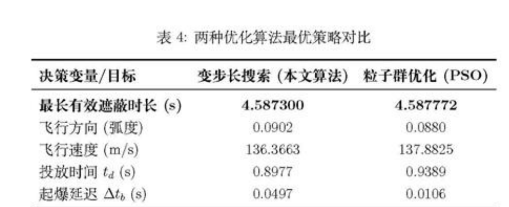

**Original caption:** 表4：变步长搜索与粒子群优化结果对比

**中文图注:** 表4：变步长搜索与粒子群优化结果对比

**Reading note:** 用独立优化器验证黑箱搜索结果。

## 第 21 页

**Source:** p.21 S257

**Original:** 8.1.2 目 标 函 数 设 置

**中文:** 8.1.2 目标函数设置

**Source:** p.21 S258

**Original:** 前 文 已 经 误 明 了 单 枚 娇 幕 弹 对 同 一 个 导 弹 的 有 效 於 挡 时 间 是 一 段 单 一 连 续 的 时 间 段 , 但 是 在 引 入 么 外 两 枚 烫 幕 弹 后 , 不 同 的 烧 幕 弹 对 同 一 导 弹 的 有 效 遮 挡 时 间 段 可 能 会 由 于 投 放 时 间 序 列 和 引 爆 时 间 序 列 的 决 策 而 发 生 重 叠 或 者 衔 接 , 因 此 本 问 中 有 效 遮 挡 的 时 间 段 不 再 由 单 一 的 两 个 时 间 点 决 定 , 而 是 需 要 综 合 三 枚 烧 幕 弹 共 同 的 有 效 遮 挡 效 果 。

**中文:** 前文已经误明了单枚娇幕弹对同一个导弹的有效於挡时间是一段单一连续的时间段 , 但是在引入么外两枚烫幕弹后 , 不同的烧幕弹对同一导弹的有效遮挡时间段可能会由于投放时间序列和引爆时间序列的决策而发生重叠或者衔接 , 因此本问中有效遮挡的时间段不再由单一的两个时间点决定 , 而是需要综合三枚烧幕弹共同的有效遮挡效果 。

**Source:** p.21 S259

**Original:** 厚 有 的 判 定 式 是 判 断 导 弹 视 线 P P 是 否 与 单 个 球 体 C(P) 相 交 。 现 在 , 我 们 霁 要 判 断 视 织 是 否 与 任 意 一 个 点 幕 云 团 相 交 在 时 刻 t, 真 目 标 国 柱 体 被 有 效 增 蒙 的 条 件 是 : 对 于 圆 柱 体 表 面 上 的 任 意 一 点 亿 , 连 接 导 弹 位 置 Pnu(t) 与 叉 的 视 线 线 段 PP, 至 少 与 这 3 个 烟 幕 云 团 中 的 一 个 相 交 。

**中文:** 厚有的判定式是判断导弹视线 P P 是否与单个球体 C(P) 相交 。 现在 , 我们霁要判断视织是否与任意一个点幕云团相交在时刻 t, 真目标国柱体被有效增蒙的条件是 : 对于圆柱体表面上的任意一点亿 , 连接导弹位置 Pnu(t) 与叉的视线线段 PP, 至少与这 3 个烟幕云团中的一个相交 。

**Source:** p.21 S260

**Original:** 新 的 有 效 遮 挡 判 定 式 为 :

**中文:** 新的有效遮挡判定式为 :

**Source:** p.21 S261

**Original:** YPeQ, 3ke{l1,2,3} st 1 佐 云 nC(P.n(0) 久 Q (8.2)

**中文:** YPeQ, 3ke{l1,2,3} st 1 佐云 nC(P.n(0) 久 Q (8.2)

**Source:** p.21 S262

**Original:** 其 中 C(Fox) 代 表 FY1 投 下 的 第 k 个 有 效 云 团 基 于 此 , 我 们 重 新 定 义 布 尔 函 数 Bool(t):

**中文:** 其中 C(Fox) 代表 FY1 投下的第 k 个有效云团基于此 , 我们重新定义布尔函数 Bool(t):

**Source:** p.21 S263

**Original:** 1,ifyR E 爬赶? 矶B贼〉 T Pn(0 又 大

**中文:** 1,ifyR E 爬赶? 矶B贼〉 T Pn(0 又大

**Source:** p.21 S264

**Original:** 0, otherwise

**中文:** 0, otherwise

**Source:** p.21 S265

**Original:** Bool(t) = { (8.3)

**中文:** Bool(t) = { (8.3)

**Source:** p.21 S266

**Original:** 这 里 的 N(6) 表 示 在 时 刻 t 处 于 有 效 期 内 的 云 团 总 数 。 这 个 函 数 Bool(4) = 1 的 时 刻 , 就 构 成 了 总 的 有 效 谨 蒋 时 间 。

**中文:** 这里的 N(6) 表示在时刻 t 处于有效期内的云团总数 。 这个函数 Bool(4) = 1 的时刻 , 就构成了总的有效谨蒋时间 。

**Source:** p.21 S267

**Original:** 令 了 为 所 有 潴 足 Bool(t) = 1 的 时 刻 t 的 集 合 。 这 个 集 合 可 能 是 由 多 个 不 连 续 的 时 间 段 组 成 的 。

**中文:** 令了为所有潴足 Bool(t) = 1 的时刻 t 的集合 。 这个集合可能是由多个不连续的时间段组成的 。

**Source:** p.21 S268

**Original:** T = {t € R* | Bool(t) = 1} (8.4) 目 标 函 数 卵 为 这 个 集 合 的 总 长 度 : max 万 ) = _乙<】p Bool(t) at (8.5)

**中文:** T = {t € R* | Bool(t) = 1} (8.4) 目标函数卵为这个集合的总长度 : max 万 ) = _乙<】p Bool(t) at (8.5)

**Source:** p.21 S269

**Original:** 8.1.3 约 束 条 件 分 析

**中文:** 8.1.3 约束条件分析

**Source:** p.21 S270

**Original:** 物 理 约 束 : 决 策 变 量 以 及 一 些 量 的 取 值 范 围 应 该 符 合 题 意 与 物 理 实 际 , 所 以 应 该 源 趾 : 70 三 wjy 三 140 , 0<0<2r , y 二 0 标 吊 标 之 0 k=(1,2,3) (8.6) to 与 tdx “ 札 二 (1,2,3)

**中文:** 物理约束 : 决策变量以及一些量的取值范围应该符合题意与物理实际 , 所以应该源趾 : 70 三 wjy 三 140 , 0<0<2r , y 二 0 标吊标之 0 k=(1,2,3) (8.6) to 与 tdx “ 札二 (1,2,3)

**Source:** p.21 S271

**Original:** 有 效 遨 蔽 窗 口 约 束 : 烟 幕 弹 爆 炸 产 生 的 云 团 只 在 起 爆 后 的 20s 内 可 以 提 供 有 效 谨

**中文:** 有效遨蔽窗口约束 : 烟幕弹爆炸产生的云团只在起爆后的 20s 内可以提供有效谨

## 第 22 页

**Source:** p.22 S272

**Original:** 挡 , 因 此 每 一 枚 炯 幕 弹 的 有 效 遮 挡 时 长 应 该 含 与 起 爆 时 刻 到 起 爆 20s 这 两 个 时 刻 之 间 : [tinks toute] € |mtbx 十 2 (k=1,2,3) (8.7)

**中文:** 挡 , 因此每一枚炯幕弹的有效遮挡时长应该含与起爆时刻到起爆 20s 这两个时刻之间 : [tinks toute] € |mtbx 十 2 (k=1,2,3) (8.7)

**Source:** p.22 S273

**Original:** 投 放 延 迟 约 束 : 根 据 题 意 虽 然 同 一 烟 幕 弹 投 放 时 间 和 引 爆 时 间 没 有 影 响 , 但 同 一 架 无 人 机 投 放 多 枚 烟 幕 弹 , 其 投 放 间 隔 必 须 在 1s 以 上 :

**中文:** 投放延迟约束 : 根据题意虽然同一烟幕弹投放时间和引爆时间没有影响 , 但同一架无人机投放多枚烟幕弹 , 其投放间隔必须在 1s 以上 :

**Source:** p.22 S274

**Original:** 城 三 标 -1 (k=1,2) (88)

**中文:** 城三标 -1 (k=1,2) (88)

**Source:** p.22 S275

**Original:** 8.1.4 _ 模 型 汇 总 综 上 , 单 架 无 人 机 投 放 多 枚 烟 幕 弹 的 策 洛 优 化 模 型 为 :

**中文:** 8.1.4 _ 模型汇总综上 , 单架无人机投放多枚烟幕弹的策洛优化模型为 :

**Source:** p.22 S276

**Original:** max  f(X) = /:o Bool(t) dt

**中文:** max f(X) = /:o Bool(t) dt

**Source:** p.22 S277

**Original:** (70 <0 <140 , 0<0<2m , vy, =0 4 柯 x 芊 0 k=(1,2,3) ok > tax k=(1,2,3) [tin by tour k] S [tox, tox +20] (k=1,2,3) 继 与 甄 k —1 (k=1,2) i (P (8) = Pros(0) + Vi .t i Pc.ll:(t) a (F叠,]=缠' ′〕!^J'′' /〕』^l【′z 一 Uaink “ (羲 27 tb.k)) 口 之 李 k 1Paauk( 二 Pfy(taxk) 十 vfy - (¢ — tap) 十 邹 ( 一 taj2 ¢ > tax Vi 二 (oyycos0,ojy sin0,0) 【P(t) = Ppy (0) +vp, .t 1, IVREeR, PuBnCPu)#0 (k=1,23)

**中文:** (70 <0 <140 , 0<0<2m , vy, =0 4 柯 x 芊 0 k=(1,2,3) ok > tax k=(1,2,3) [tin by tour k] S [tox, tox +20] (k=1,2,3) 继与甄 k —1 (k=1,2) i (P (8) = Pros(0) + Vi .t i Pc.ll:(t) a (F叠,]=缠' ′〕!^J'′' /〕』^l【′z 一 Uaink “ (羲 27 tb.k)) 口之李 k 1Paauk( 二 Pfy(taxk) 十 vfy - (¢ — tap) 十邹 ( 一 taj2 ¢ > tax Vi 二 (oyycos0,ojy sin0,0) 【P(t) = Ppy (0) +vp, .t 1, IVREeR, PuBnCPu)#0 (k=1,23)

**Source:** p.22 S278

**Original:** 0, otherwise

**中文:** 0, otherwise

**Source:** p.22 S279

**Original:** Bool(t) =

**中文:** Bool(t) =

**Source:** p.22 S280

**Original:** 8.2 “ 优 化 模 型 求 解

**中文:** 8.2 “ 优化模型求解

**Source:** p.22 S281

**Original:** 本 问 共 有 八 个 决 策 变 量 , 一 般 的 算 法 解 决 不 了 高 维 变 量 空 间 的 模 型 , 而 且 目 标 函 数 是 没 有 解 析 表 达 式 的 , 仅 是 一 些 逻 辑 表 达 , 函 数 值 需 要 通 过 数 值 仿 真 计 算 , 梯 度 信 息 难 以 获 取 。 由 于 差 分 进 化 算 法 能 够 处 理 高 维 、 非 线 性 优 化 问 题 同 时 不 依 赖 梯 度 信 息 , 适 合 复 杂 仿 真 计 算 的 特 点 , 本 问 选 择 利 用 差 分 进 化 法 进 行 求 解 。

**中文:** 本问共有八个决策变量 , 一般的算法解决不了高维变量空间的模型 , 而且目标函数是没有解析表达式的 , 仅是一些逻辑表达 , 函数值需要通过数值仿真计算 , 梯度信息难以获取 。 由于差分进化算法能够处理高维 、 非线性优化问题同时不依赖梯度信息 , 适合复杂仿真计算的特点 , 本问选择利用差分进化法进行求解 。

## 第 23 页

**Source:** p.23 S282

**Original:** 8.2.1 差 分 进 化 算 法

**中文:** 8.2.1 差分进化算法

**Source:** p.23 S283

**Original:** - 输 出 最 优 个 体

**中文:** - 输出最优个体

**Source:** p.23 S284

**Original:** 满 足 迭 代 次 数 ?

**中文:** 满足迭代次数 ?

**Source:** p.23 S285

**Original:** 优 化 初 始 种 群

**中文:** 优化初始种群

**Source:** p.23 S286

**Original:** !

**中文:** !

**Source:** p.23 S287

**Original:** 变 异 操 作

**中文:** 变异操作

**Source:** p.23 S288

**Original:** 1

**中文:** 1

**Source:** p.23 S289

**Original:** 选 择 操 作 『 一 一 交 叉 操 作

**中文:** 选择操作 『 一一交叉操作

**Source:** p.23 S290

**Original:** 车

**中文:** 车

**Source:** p.23 S291

**Original:** 一 | “ 新 种 群 | 一 一 保 留 部 分 精 英

**中文:** 一 | “ 新种群 | 一一保留部分精英

**Source:** p.23 S292

**Original:** 图 11: 荣 分 进 化 算 法 流 程 图

**中文:** 图 11: 荣分进化算法流程图

**Source:** p.23 S293

**Original:** Step 1 初 始 化 : 设 定 种 群 规 模 N = 100、 最 大 迭 代 次 数 ¢ = 500、 变 异 因 子 广 = 0.5 及 交 叉 概 率 CR = 09 等 关 键 参 数 。 钗 个 个 体 为 一 个 8 维 决 策 向 量 X = (0. vpy, t Loz s, s oz, dos) o 在 可 行 域 内 随 机 生 成 初 始 种 群 , 并 确 保 其 满 足 所 有 的 约 束 条 件 。

**中文:** Step 1 初始化 : 设定种群规模 N = 100、 最大迭代次数 ¢ = 500、 变异因子广 = 0.5 及交叉概率 CR = 09 等关键参数 。 钗个个体为一个 8 维决策向量 X = (0. vpy, t Loz s, s oz, dos) o 在可行域内随机生成初始种群 , 并确保其满足所有的约束条件 。

**Source:** p.23 S294

**Original:** Step 2 个 体 评 估 与 约 束 处 理 : 对 种 群 中 的 每 个 个 体 心 通 过 模 拟 仿 真 计 算 其 对 应 的 总 有 效 遮 蔽 时 长 /(t)。 采 用 惩 罚 函 数 法 处 理 约 束 , 将 约 束 违 反 度 整 合 到 适 应 度 评 估 中 , 使 种 群 向 可 行 基 搜 索

**中文:** Step 2 个体评估与约束处理 : 对种群中的每个个体心通过模拟仿真计算其对应的总有效遮蔽时长 /(t)。 采用惩罚函数法处理约束 , 将约束违反度整合到适应度评估中 , 使种群向可行基搜索

**Source:** p.23 S295

**Original:** Step 3 群 分 进 化 操 作 : 对 种 群 中 的 每 一 个 个 体 志 进 行 如 下 变 异 和 交 叉 操 作 以 生 成 试 验 向 量 Ui

**中文:** Step 3 群分进化操作 : 对种群中的每一个个体志进行如下变异和交叉操作以生成试验向量 Ui

**Source:** p.23 S296

**Original:** 变 异 ; 从 当 前 种 群 中 随 机 选 择 二 个 与 心 不 同 的 个 体 匕 1, 九 a,X「s, 根 据 式 8.10 生 成 变 异 向 量 。

**中文:** 变异 ; 从当前种群中随机选择二个与心不同的个体匕 1, 九 a,X「s, 根据式 8.10 生成变异向量 。

**Source:** p.23 S297

**Original:** Vi=&Xn + F- (X2 — Xg) (8.10)

**中文:** Vi=&Xn + F- (X2 — Xg) (8.10)

**Source:** p.23 S298

**Original:** AL APt Vi 与 目 标 向 量 心 进 行 交 又 , 生 成 试 验 向 量 Li。 本 文 采 用 一 项 式 交 又 , 即 以 交 叉 概 率 C R 决 定 试 验 向 量 的 每 个 维 度 是 继 承 自 变 异 向 量 还 是 目 标 向 量 , 并 确 保 至 少 有 一 个 维 度 发 生 交 换 、 以 引 人 新 信 息 。

**中文:** AL APt Vi 与目标向量心进行交又 , 生成试验向量 Li。 本文采用一项式交又 , 即以交叉概率 C R 决定试验向量的每个维度是继承自变异向量还是目标向量 , 并确保至少有一个维度发生交换 、 以引人新信息 。

**Source:** p.23 S299

**Original:** 23

**中文:** 23

### 图11：差分进化算法流程图

**Placed near:** p.23 S282
**Source:** p.23 C009

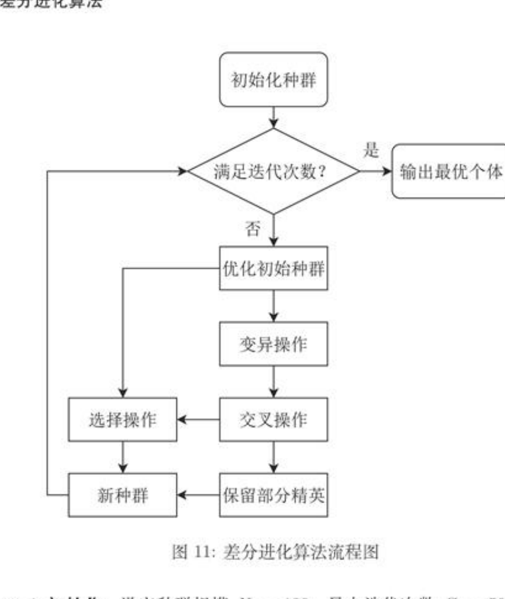

**Original caption:** 图11：差分进化算法流程图

**中文图注:** 图11：差分进化算法流程图

**Reading note:** 高维、非线性、无梯度仿真优化的求解流程。

## 第 24 页

**Source:** p.24 S300

**Original:** Step 4 选 择 : 计 算 试 验 向 量 L 的 目 标 函 数 值 f(U:), 如 果 f(Us) 优 于 f( 乙 ), 则 在 下 一 代 中 用 余 替 换 心 ; 否 则 , 保 留 原 个 体 书 。

**中文:** Step 4 选择 : 计算试验向量 L 的目标函数值 f(U:), 如果 f(Us) 优于 f( 乙 ), 则在下一代中用余替换心 ; 否则 , 保留原个体书 。

**Source:** p.24 S301

**Original:** Step 5 迭 代 与 输 出 : 重 复 执 行 Step 2 至 Step 4, 直 到 达 到 预 设 的 最 大 迭 代 次 数 Gmazr。 算 法 终 止 后 , 输 出 整 个 进 化 过 程 中 记 录 下 的 最 优 个 体 tisx, 该 个 体 对 应 的 决 策 变 量 组 合 卵 为 所 求 的 无 人 机 最 优 投 放 策 略 , 其 对 应 的 目 标 函 数 值 即 为 最 长 有 效 遮 薇 时 间 。

**中文:** Step 5 迭代与输出 : 重复执行 Step 2 至 Step 4, 直到达到预设的最大迭代次数 Gmazr。 算法终止后 , 输出整个进化过程中记录下的最优个体 tisx, 该个体对应的决策变量组合卵为所求的无人机最优投放策略 , 其对应的目标函数值即为最长有效遮薇时间 。

**Source:** p.24 S302

**Original:** 8.2.2 求 解 结 果

**中文:** 8.2.2 求解结果

**Source:** p.24 S303

**Original:** 根 据 上 述 流 程 , 本 问 利 用 荣 分 进 化 算 法 求 解 出 的 无 人 机 FY1 投 放 3 枚 烟 幕 弹 于 扰 导 弹 M1 的 最 优 策 骆 下 对 应 的 最 大 有 效 遮 挡 时 间 是 6.93586s, 无 人 机 航 向 方 向 角 为 ; 13.57377° , 无 人 机 速 度 大 小 为 : 116.81318m /s。 万 枚 点 幕 弹 的 具 体 投 放 策 略 见 表 5。

**中文:** 根据上述流程 , 本问利用荣分进化算法求解出的无人机 FY1 投放 3 枚烟幕弹于扰导弹 M1 的最优策骆下对应的最大有效遮挡时间是 6.93586s, 无人机航向方向角为 ; 13.57377° , 无人机速度大小为 : 116.81318m /s。 万枚点幕弹的具体投放策略见表 5。

**Source:** p.24 S304

**Original:** 表 5: 烟 幕 干 扰 弹 投 放 与 效 能 数 据

**中文:** 表 5: 烟幕干扰弹投放与效能数据

**Source:** p.24 S305

**Original:** X ¥ 2 X Y Z 1 17800 0 1800 17800 0 1800 2 17915.99463 13.80460 1800 17915.99463 13.80460 1800 3 22048.21768 505.58318 1800 23013.0268 727.51534 533.54687 烟 幕 弹 序 号 生 效 时 间 (s) 失 效 时 间 (s) 有 效 干 扰 时 长 (s)

**中文:** X ¥ 2 X Y Z 1 17800 0 1800 17800 0 1800 2 17915.99463 13.80460 1800 17915.99463 13.80460 1800 3 22048.21768 505.58318 1800 23013.0268 727.51534 533.54687 烟幕弹序号生效时间 (s) 失效时间 (s) 有效干扰时长 (s)

**Source:** p.24 S306

**Original:** 1 0.79116 541117 2.55600 1.00000 5.07793 4.37985 0.00000 0.00000 0.00000

**中文:** 1 0.79116 541117 2.55600 1.00000 5.07793 4.37985 0.00000 0.00000 0.00000

**Source:** p.24 S307

**Original:** W

**中文:** W

**Source:** p.24 S308

**Original:** 分 析 上 表 中 数 据 可 以 看 出 , 第 二 发 烟 幕 干 扰 弹 于 1s 极 易 期 开 始 生 效 , 持 绪 到 了 5.07793s, 贡 献 了 407793s 的 有 效 遮 蔽 , 占 到 了 总 有 效 遮 挡 时 间 的 极 大 部 分 , 诫 朋 第 二 枚 烟 幕 弹 的 投 放 策 略 是 极 优 的 , 但 是 该 参 数 下 的 无 人 机 行 进 轨 迹 会 很 早 的 与 导 弹 相 遇 , 使 无 人 机 相 对 于 目 标 的 位 置 比 导 弹 更 远 , 之 后 投 放 的 烟 幕 弹 不 能 够 再 提 供 有 效 遮 挡 , 这 也 是 第 三 枚 烟 幕 弹 始 终 没 有 发 挥 作 用 的 原 因 。 导 致 这 种 现 象 出 现 的 原 因 可 能 与 无 人 机 的 初 始 位 置 有 关 , 在 其 他 的 初 始 位 置 可 能 可 以 找 到 真 正 的 全 局 最 优 的 投 放 策 骅 达 到 最 大 的 有 效 遮 挡 时 长 。

**中文:** 分析上表中数据可以看出 , 第二发烟幕干扰弹于 1s 极易期开始生效 , 持绪到了 5.07793s, 贡献了 407793s 的有效遮蔽 , 占到了总有效遮挡时间的极大部分 , 诫朋第二枚烟幕弹的投放策略是极优的 , 但是该参数下的无人机行进轨迹会很早的与导弹相遇 , 使无人机相对于目标的位置比导弹更远 , 之后投放的烟幕弹不能够再提供有效遮挡 , 这也是第三枚烟幕弹始终没有发挥作用的原因 。 导致这种现象出现的原因可能与无人机的初始位置有关 , 在其他的初始位置可能可以找到真正的全局最优的投放策骅达到最大的有效遮挡时长 。

**Source:** p.24 S309

**Original:** 九 、 问 题 四 模 型 建 立 及 求 解

**中文:** 九 、 问题四模型建立及求解

**Source:** p.24 S310

**Original:** 问 题 四 要 求 利 用 FY1、FY2、FY3 三 架 无 人 机 各 投 放 一 枚 烟 幕 弹 以 干 扰 来 袭 的 M1 导 弹 。 此 问 题 从 单 无 人 机 的 任 务 规 划 , 转 变 为 一 个 协 同 优 化 问 题 , 与 第 三 问 不 同 的 地 方 在 于 : 三 个 无 人 机 各 自 投 弹 不 需 要 考 虑 不 同 烟 幕 弹 的 投 放 时 间 的 制 约 , 三 个 烟 幕 弹 的 投 放 时 间 是 相 互 独 立 的 。 需 要 为 三 架 无 人 机 分 别 规 划 出 最 优 的 飞 行 策 路 和 投 弹 时 机 , 使 得 三 枚 烟 幕 弹 形 成 的 遮 蒲 效 果 能 够 同 实 现 对 真 目 标 总 有 效 遮 蔽 时 间 的 最 大 化 .

**中文:** 问题四要求利用 FY1、FY2、FY3 三架无人机各投放一枚烟幕弹以干扰来袭的 M1 导弹 。 此问题从单无人机的任务规划 , 转变为一个协同优化问题 , 与第三问不同的地方在于 : 三个无人机各自投弹不需要考虑不同烟幕弹的投放时间的制约 , 三个烟幕弹的投放时间是相互独立的 。 需要为三架无人机分别规划出最优的飞行策路和投弹时机 , 使得三枚烟幕弹形成的遮蒲效果能够同实现对真目标总有效遮蔽时间的最大化 .

### 表5：烟幕干扰弹投放与效能数据

**Placed near:** p.24 S300
**Source:** p.24 C006

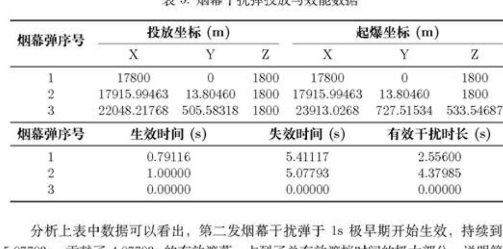

**Original caption:** 表5：烟幕干扰弹投放与效能数据

**中文图注:** 表5：烟幕干扰弹投放与效能数据

**Reading note:** 第三枚资源未产生作用，提示应检查收敛性和资源冗余。

## 第 25 页

**Source:** p.25 S311

**Original:** 9.1 多 机 单 弹 优 化 模 型 的 建 立 9.1.1 决 策 变 量 的 定 义

**中文:** 9.1 多机单弹优化模型的建立 9.1.1 决策变量的定义

**Source:** p.25 S312

**Original:** 本 闭 份 然 以 最 大 化 有 效 遮 挡 时 间 为 目 标 , 但 现 在 有 三 架 无 人 机 分 别 投 一 枚 烫 霁 弹 , 而 不 是 一 架 无 人 机 独 自 投 三 枚 , 因 此 需 要 决 策 的 参 数 是 三 架 无 人 机 各 自 的 航 向 、 速 度 以 及 烟 幕 弹 的 投 放 与 引 爆 时 间 , 即 决 策 空 间 为 :

**中文:** 本闭份然以最大化有效遮挡时间为目标 , 但现在有三架无人机分别投一枚烫霁弹 , 而不是一架无人机独自投三枚 , 因此需要决策的参数是三架无人机各自的航向 、 速度以及烟幕弹的投放与引爆时间 , 即决策空间为 :

**Source:** p.25 S313

**Original:** 巩 二 (05,05 tastes), 总 变 量 匕 二 (xtb,xa,xs) E R12. (9.1) 上 式 中 的 取 值 为 7 = 1,2,3, 代 表 了 三 架 无 人 机 ,

**中文:** 巩二 (05,05 tastes), 总变量匕二 (xtb,xa,xs) E R12. (9.1) 上式中的取值为 7 = 1,2,3, 代表了三架无人机 ,

**Source:** p.25 S314

**Original:** 0.1.2 目 标 函 数 的 设 置

**中文:** 0.1.2 目标函数的设置

**Source:** p.25 S315

**Original:** 同 问 题 三 一 桔 , 问 题 四 的 目 标 也 是 最 大 化 有 效 避 挡 时 间 , 因 此 在 形 式 上 , 问 题 四 的 目 标 函 数 与 问 题 三 完 全 一 致 :

**中文:** 同问题三一桔 , 问题四的目标也是最大化有效避挡时间 , 因此在形式上 , 问题四的目标函数与问题三完全一致 :

**Source:** p.25 S316

**Original:** max  f(X) = /(”/三〉′)r)【(t)(】!t` (9.2)

**中文:** max f(X) = /(”/三〉′)r)【(t)(】!t` (9.2)

**Source:** p.25 S317

**Original:** 0

**中文:** 0

**Source:** p.25 S318

**Original:** 其 中 , 布 尔 函 数 的 定 义 需 要 进 行 调 整 , 无 人 机 FY1 投 下 的 第 k DNTAEHE C(Fey) 应 该 变 为 第 7 架 无 人 机 投 下 的 云 团 C(F.,) 即 :

**中文:** 其中 , 布尔函数的定义需要进行调整 , 无人机 FY1 投下的第 k DNTAEHE C(Fey) 应该变为第 7 架无人机投下的云团 C(F.,) 即 :

**Source:** p.25 S319

**Original:** 1, VR eR, 3j€{1,2,3}, PuPNC(P;(t)) # 2

**中文:** 1, VR eR, 3j€{1,2,3}, PuPNC(P;(t)) # 2

**Source:** p.25 S320

**Original:** 0, otherwise.

**中文:** 0, otherwise.

**Source:** p.25 S321

**Original:** Bool(t) = { (9.3)

**中文:** Bool(t) = { (9.3)

**Source:** p.25 S322

**Original:** 9.1.3 约 束 条 件 分 析

**中文:** 9.1.3 约束条件分析

**Source:** p.25 S323

**Original:** 由 于 三 架 无 人 机 投 放 烟 幕 弹 同 样 需 要 滢 足 物 理 约 束 以 及 烟 幕 弹 爆 炸 产 生 的 云 团 的 有 效 期 的 约 李 , 这 与 上 文 的 模 型 中 的 分 析 并 无 太 大 差 别 , 这 里 不 再 赘 述 、 即 滢 足 :

**中文:** 由于三架无人机投放烟幕弹同样需要滢足物理约束以及烟幕弹爆炸产生的云团的有效期的约李 , 这与上文的模型中的分析并无太大差别 , 这里不再赘述 、 即滢足 :

**Source:** p.25 S324

**Original:** 70 三 vyyj 三 140 , 0<G;<2m , vygjs 一 0 红 力 绊 芒 0 §=(1,2,3) (9.4) 埕 芒 标 3=0(1,2,3)

**中文:** 70 三 vyyj 三 140 , 0<G;<2m , vygjs 一 0 红力绊芒 0 §=(1,2,3) (9.4) 埕芒标 3=0(1,2,3)

**Source:** p.25 S325

**Original:** 0.1.4 _ 模 型 汇 总 综 上 , 多 架 无 人 机 各 自 投 放 单 枚 烟 幕 弹 的 最 优 投 放 策 略 求 解 模 型 为 :

**中文:** 0.1.4 _ 模型汇总综上 , 多架无人机各自投放单枚烟幕弹的最优投放策略求解模型为 :

**Source:** p.25 S326

**Original:** max “ 一 加 ) = f Bool(t) dt

**中文:** max “ 一加 ) = f Bool(t) dt

**Source:** p.25 S327

**Original:** 25

**中文:** 25

## 第 26 页

**Source:** p.26 S328

**Original:** 70 三 vjyj 三 140 , 0<G; <2 , vyyjz =0

**中文:** 70 三 vjyj 三 140 , 0<G; <2 , vyyjz =0

**Source:** p.26 S329

**Original:** taj,ttj 三 0 5 二 (1,2,3)

**中文:** taj,ttj 三 0 5 二 (1,2,3)

**Source:** p.26 S330

**Original:** toj 尹 taj 7=10(1,2,3)

**中文:** toj 尹 taj 7=10(1,2,3)

**Source:** p.26 S331

**Original:** [tings toues] € Itogotos +20] 吊 =1,253)

**中文:** [tings toues] € Itogotos +20] 吊 =1,253)

**Source:** p.26 S332

**Original:** }mJ… 二 Pma(0) 十 Vmu .t

**中文:** }mJ… 二 Pma(0) 十 Vmu .t

**Source:** p.26 S333

**Original:** s.t.4 | Pey(t) = (Poyzs Poyys Bogs 一 Uaink - 代 一 tbJ)) = toy (95) SP(t) = Ppyiltas) + Vey (6 —tag) + 3g- (t —tag)® t>tay

**中文:** s.t.4 | Pey(t) = (Poyzs Poyys Bogs 一 Uaink - 代一 tbJ)) = toy (95) SP(t) = Ppyiltas) + Vey (6 —tag) + 3g- (t —tag)® t>tay

**Source:** p.26 S334

**Original:** Vivi = ("fvdcosgivvlu-jsm 9j,0)

**中文:** Vivi = ("fvdcosgivvlu-jsm 9j,0)

**Source:** p.26 S335

**Original:** Py i(t) = Py 5(0) 十 vfoi -t

**中文:** Py i(t) = Py 5(0) 十 vfoi -t

**Source:** p.26 S336

**Original:** 1, YR e 3j€{1,2,3}, Pu@®P:NC(Py(t)) # @

**中文:** 1, YR e 3j€{1,2,3}, Pu@®P:NC(Py(t)) # @

**Source:** p.26 S337

**Original:** 0, otherwise.

**中文:** 0, otherwise.

**Source:** p.26 S338

**Original:** Bool(t) =

**中文:** Bool(t) =

**Source:** p.26 S339

**Original:** \

**中文:** \

**Source:** p.26 S340

**Original:** 0.2 优 化 模 型 求 解 0.2.1 基 于 预 测 拦 截 点 的 协 同 优 化 策 酮

**中文:** 0.2 优化模型求解 0.2.1 基于预测拦截点的协同优化策酮

**Source:** p.26 S341

**Original:** 问 题 4 的 优 化 模 型 涉 及 3 个 无 人 机 , 决 策 变 量 较 多 , 如 果 直 接 进 行 求 解 会 导 致 效 辞 低 下 。 由 问 题 2 的 结 果 分 析 可 知 : 要 最 有 效 谨 挡 其 视 线 , 理 愚 的 烟 幕 云 团 应 该 近 似 位 于 导 弹 到 真 目 标 这 条 视 线 路 径 上 , 同 时 , 由 于 真 目 标 距 离 原 点 的 距 离 相 对 于 真 目 标 距 离 导 弹 以 及 原 点 距 离 导 弹 的 距 离 很 小 , 导 弹 到 真 目 标 的 这 条 线 段 和 导 弹 到 假 目 标 ( 即 原 点 ) 的 线 段 很 接 近 , 所 以 近 似 有 : 理 想 的 烟 幕 云 团 应 该 近 似 位 于 导 弹 到 假 目 标 ( 即 原 点 ) 这 条 视 线 路 径 上 。 因 此 , 最 直 接 高 效 的 投 放 策 路 就 是 迎 着 导 弹 来 的 方 向 飞 过 去 , 然 后 将 炽 幕 干 扰 弹 投 放 到 导 弹 到 假 目 标 ( 即 原 点 】 这 条 视 线 路 径 上 , 形 成 一 个 迎 面 的 烟 幕 云 团 。

**中文:** 问题 4 的优化模型涉及 3 个无人机 , 决策变量较多 , 如果直接进行求解会导致效辞低下 。 由问题 2 的结果分析可知 : 要最有效谨挡其视线 , 理愚的烟幕云团应该近似位于导弹到真目标这条视线路径上 , 同时 , 由于真目标距离原点的距离相对于真目标距离导弹以及原点距离导弹的距离很小 , 导弹到真目标的这条线段和导弹到假目标 ( 即原点 ) 的线段很接近 , 所以近似有 : 理想的烟幕云团应该近似位于导弹到假目标 ( 即原点 ) 这条视线路径上 。 因此 , 最直接高效的投放策路就是迎着导弹来的方向飞过去 , 然后将炽幕干扰弹投放到导弹到假目标 ( 即原点 】 这条视线路径上 , 形成一个迎面的烟幕云团 。

**Source:** p.26 S342

**Original:** 基 于 以 上 分 析 , 我 们 考 虔 将 炯 幕 十 扰 弹 投 到 导 弹 到 假 目 标 ( 即 原 点 ) 的 线 段 上 , 然 后 再 对 这 个 结 果 进 行 微 调 , 从 而 得 到 烟 幕 干 扰 弹 的 投 放 策 略 。 为 进 一 步 简 化 并 获 得 高 质 量 的 初 始 解 , 我 们 提 出 一 个 更 强 的 约 束 作 为 寻 优 起 点 : 在 杷 一 时 刻 , 炯 幕 于 扰 弹 的 中 心 与 导 弹 的 位 置 完 全 重 合 。 即 :

**中文:** 基于以上分析 , 我们考虔将炯幕十扰弹投到导弹到假目标 ( 即原点 ) 的线段上 , 然后再对这个结果进行微调 , 从而得到烟幕干扰弹的投放策略 。 为进一步简化并获得高质量的初始解 , 我们提出一个更强的约束作为寻优起点 : 在杷一时刻 , 炯幕于扰弹的中心与导弹的位置完全重合 。 即 :

**Source:** p.26 S343

**Original:** Pyj(t) 二 Pnl(4) (9.6)

**中文:** Pyj(t) 二 Pnl(4) (9.6)

**Source:** p.26 S344

**Original:** 通 过 一 些 运 动 学 分 析 建 立 一 组 不 等 式 来 求 得 能 够 得 到 潴 足 条 件 的 一 些 解 集 。 具 体 而 言 : 我 们 希 望 知 道 是 否 存 在 某 一 组 滢 足 所 有 约 不 条 件 的 决 策 变 量 (ofyi,05,t45), 能 使 得 在 桅 一 时 刻 t, 烟 幕 于 扰 弹 的 中 心 与 导 弹 的 位 置 完 全 重 合 , 建 立 不 等 式 组 和 求 解 的 具 体 过 程 如 下 :

**中文:** 通过一些运动学分析建立一组不等式来求得能够得到潴足条件的一些解集 。 具体而言 : 我们希望知道是否存在某一组滢足所有约不条件的决策变量 (ofyi,05,t45), 能使得在桅一时刻 t, 烟幕于扰弹的中心与导弹的位置完全重合 , 建立不等式组和求解的具体过程如下 :

**Source:** p.26 S345

**Original:** 为 简 化 求 解 过 程 , 我 们 引 入 比 例 系 数 s E |0, 11, 定 义 为 点 幕 弹 自 由 落 体 时 间 卞 无 人 机 总 飞 行 时 间 t 的 比 值 。 因 此 , 投 放 时 间 ta 可 表 示 为 taj = t(1 一 s)。

**中文:** 为简化求解过程 , 我们引入比例系数 s E |0, 11, 定义为点幕弹自由落体时间卞无人机总飞行时间 t 的比值 。 因此 , 投放时间 ta 可表示为 taj = t(1 一 s)。

**Source:** p.26 S346

**Original:** 令 Pj(4 = (@e,Ys,2) 和 Pn(t) = (rmiyyWmu,sml), 养 中 :

**中文:** 令 Pj(4 = (@e,Ys,2) 和 Pn(t) = (rmiyyWmu,sml), 养中 :

**Source:** p.26 S347

**Original:** 26

**中文:** 26

## 第 27 页

**Source:** p.27 S348

**Original:** ( 二 zJ(0) + vpy s cos(6) 1, y(0 = Y1y5(0) + gy sin(8y) , (0.7) s(0 = 27,5(0) = ot - tay)?

**中文:** ( 二 zJ(0) + vpy s cos(6) 1, y(0 = Y1y5(0) + gy sin(8y) , (0.7) s(0 = 27,5(0) = ot - tay)?

**Source:** p.27 S349

**Original:** 重 合 条 件 Poy(t) = Poi(4) 可 分 解 为 以 下 方 程 组 :

**中文:** 重合条件 Poy(t) = Poi(4) 可分解为以下方程组 :

**Source:** p.27 S350

**Original:** ayyJ(0) + vy cos(0;) t 二 zm( 刃 Yyj(0) + vpyisin(6s) - £ =y (¢) (9.8) 2p34(0) — 39(s - ) = zm(4)

**中文:** ayyJ(0) + vy cos(0;) t 二 zm( 刃 Yyj(0) + vpyisin(6s) - £ =y (¢) (9.8) 2p34(0) — 39(s - ) = zm(4)

**Source:** p.27 S351

**Original:** 该 方 程 组 为 我 们 提 供 了 一 种 高 效 的 求 解 路 径 。 对 于 任 意 一 个 假 定 的 拦 截 时 刻 1, 由 Z 轴 方 程 可 直 接 解 出 所 需 的 自 由 落 体 时 间 比 例 s

**中文:** 该方程组为我们提供了一种高效的求解路径 。 对于任意一个假定的拦截时刻 1, 由 Z 轴方程可直接解出所需的自由落体时间比例 s

**Source:** p.27 S352

**Original:** oo L 260000 - zm(®) ©9) ty g 其 次 , 联 立 X 轴 和 Y 轴 方 程 , 可 解 出 无 人 机 为 在 时 刻 ! 到 达 目 标 水 平 位 置 (zm(4),ym(4)) 所 需 的 恒 定 飞 行 速 度 大 小 ooy:

**中文:** oo L 260000 - zm(®) ©9) ty g 其次 , 联立 X 轴和 Y 轴方程 , 可解出无人机为在时刻 ! 到达目标水平位置 (zm(4),ym(4)) 所需的恒定飞行速度大小 ooy:

**Source:** p.27 S353

**Original:** o195 = 士 Vtem(0 = 213500 + (0 (0P (9.10)

**中文:** o195 = 士 Vtem(0 = 213500 + (0 (0P (9.10)

**Source:** p.27 S354

**Original:** 然 而 , 并 非 任 意 时 刻 ¢ 都 存 在 可 行 策 略 。 一 个 解 要 想 在 物 理 上 成 立 , 必 须 同 时 潭 足 以 下 所 有 约 束 条 件 ; syyJ(0) 2 2m(t) 0<s<l1 (9.11) 70 < vy, < 140

**中文:** 然而 , 并非任意时刻 ¢ 都存在可行策略 。 一个解要想在物理上成立 , 必须同时潭足以下所有约束条件 ; syyJ(0) 2 2m(t) 0<s<l1 (9.11) 70 < vy, < 140

**Source:** p.27 S355

**Original:** 最 终 可 以 求 得 可 行 时 刻 ¢ 的 解 集 , 只 需 选 取 在 这 个 解 集 中 城 小 的 那 个 时 刻 即 可 , 理 由 如 下 :

**中文:** 最终可以求得可行时刻 ¢ 的解集 , 只需选取在这个解集中城小的那个时刻即可 , 理由如下 :

**Source:** p.27 S356

**Original:** 随 着 时 刻 的 增 长 、 导 弹 持 续 向 原 点 方 向 移 动 , 所 以 导 弹 距 离 原 点 的 距 离 会 逐 游 况 小 。 因 此 真 目 标 、 导 弹 和 原 点 的 夹 角 会 持 续 增 大 , 即 导 弹 对 于 真 目 标 圆 柱 体 的 切 向 线 速 度 逐 渐 增 大 , 并 且 导 弹 和 真 目 标 的 距 离 在 减 小 。 所 以 导 弹 对 于 真 目 标 圆 柱 体 的 切 向 角 速 度 在 逐 渐 增 大 。 这 会 导 致 导 弹 以 更 快 的 速 度 掠 过 烟 幕 云 团 , 使 得 有 效 避 蕊 时 间 变 短 , 因 此 需 要 选 取 尽 可 能 小 的 1.

**中文:** 随着时刻的增长 、 导弹持续向原点方向移动 , 所以导弹距离原点的距离会逐游况小 。 因此真目标 、 导弹和原点的夹角会持续增大 , 即导弹对于真目标圆柱体的切向线速度逐渐增大 , 并且导弹和真目标的距离在减小 。 所以导弹对于真目标圆柱体的切向角速度在逐渐增大 。 这会导致导弹以更快的速度掠过烟幕云团 , 使得有效避蕊时间变短 , 因此需要选取尽可能小的 1.

**Source:** p.27 S357

**Original:** 得 到 的 解 是 基 于 导 弹 和 烟 幕 干 扰 弹 重 合 这 一 理 想 化 近 似 , 寥′辜董蠢i】i芘]步霰!!【璧曹]影)史j鹭晏【〕'又姿匕 对 真 实 圆 柱 目 标 的 有 效 遮 蔽 时 长 。 我 们 采 用 精 细 化 的 局 部 网 格 搜 索 来 对 上 文 得 到 的 近 似 量 优 解 进 行 微 调 , 算 法 具 体 步 骤 如 下 :

**中文:** 得到的解是基于导弹和烟幕干扰弹重合这一理想化近似 , 寥′辜董蠢i】i芘]步霰!!【璧曹]影)史j鹭晏【〕'又姿匕对真实圆柱目标的有效遮蔽时长 。 我们采用精细化的局部网格搜索来对上文得到的近似量优解进行微调 , 算法具体步骤如下 :

**Source:** p.27 S358

**Original:** stepl 定 义 搜 索 空 间 : 以 上 文 得 到 的 近 似 量 优 解 Xo = (6o, vryo.tao, Ato) 作 为 搜 索

**中文:** stepl 定义搜索空间 : 以上文得到的近似量优解 Xo = (6o, vryo.tao, Ato) 作为搜索

**Source:** p.27 S359

**Original:** 27

**中文:** 27

## 第 28 页

**Source:** p.28 S360

**Original:** 空 间 的 中 心 , 在 这 个 中 心 附 近 定 义 一 个 搜 索 垣 。 step2 网 格 离 散 化 与 遍 历 : 各 维 度 的 搜 索 域 范 围 及 离 散 化 如 下 : 航 向 角 9 在 弼 度 区 间 [8& — 0.2,60 + 0.2] 内 以 0.008 张 度 为 步 长 进 行 采 样 。 飞 行 速 度 vy, 在 区 间 Imaxfwjyo — 20,70}, min{vg, o + 20,140} m/s 内 均 匀 采 样 50 个 点 。 投 放 时 间 ta 在 [tao 一 5,tao + 5] 秒 区 间 内 均 匀 采 样 80 个 点 。 引 爆 延 迟 Aty 在 |At,o — 5, Aty + 5] 秒 区 间 内 均 匀 采 桦 80 个 点 。 step3 候 选 策 略 评 估 与 择 优 : 对 于 网 格 中 的 每 一 个 策 略 X,na 进 行 模 拟 仿 真 , 计 算 出 该 策 略 下 对 真 目 标 的 有 效 遮 蒙 时 长 7 动 态 更 新 最 大 的 有 效 遮 蒙 时 长 和 决 策 变 量 。 stepd 输 出 : 道 历 所 有 网 格 节 点 后 , 算 法 输 出 最 终 记 录 的 Xew, 作 为 该 架 无 人 机 在 当 前 情 形 下 的 最 优 投 放 笺 略 、

**中文:** 空间的中心 , 在这个中心附近定义一个搜索垣 。 step2 网格离散化与遍历 : 各维度的搜索域范围及离散化如下 : 航向角 9 在弼度区间 [8& — 0.2,60 + 0.2] 内以 0.008 张度为步长进行采样 。 飞行速度 vy, 在区间 Imaxfwjyo — 20,70}, min{vg, o + 20,140} m/s 内均匀采样 50 个点 。 投放时间 ta 在 [tao 一 5,tao + 5] 秒区间内均匀采样 80 个点 。 引爆延迟 Aty 在 |At,o — 5, Aty + 5] 秒区间内均匀采桦 80 个点 。 step3 候选策略评估与择优 : 对于网格中的每一个策略 X,na 进行模拟仿真 , 计算出该策略下对真目标的有效遮蒙时长 7 动态更新最大的有效遮蒙时长和决策变量 。 stepd 输出 : 道历所有网格节点后 , 算法输出最终记录的 Xew, 作为该架无人机在当前情形下的最优投放笺略 、

**Source:** p.28 S361

**Original:** 022 求 解 结 果

**中文:** 022 求解结果

**Source:** p.28 S362

**Original:** 根 据 对 预 潞 拦 截 点 的 分 析 , 本 文 在 采 用 局 部 网 格 搜 索 进 行 求 解 时 , 效 率 得 到 了 极 大 的 提 高 。 最 终 利 用 局 部 网 格 报 索 求 解 出 最 大 总 有 效 遨 蕊 时 闰 达 到 11.125936s, 其 余 结 果 可 见 附 似 result2.xlsx。 各 炯 幕 弹 的 避 葛 时 间 段 衔 接 良 好 , 形 成 了 连 续 的 有 效 遮 蒲 效 果 , 各 无 人 机 投 放 烟 幕 弹 的 具 体 策 略 见 表 6:

**中文:** 根据对预潞拦截点的分析 , 本文在采用局部网格搜索进行求解时 , 效率得到了极大的提高 。 最终利用局部网格报索求解出最大总有效遨蕊时闰达到 11.125936s, 其余结果可见附似 result2.xlsx。 各炯幕弹的避葛时间段衔接良好 , 形成了连续的有效遮蒲效果 , 各无人机投放烟幕弹的具体策略见表 6:

**Source:** p.28 S363

**Original:** 表 6: 烟 幕 于 扰 弹 投 放 策 略

**中文:** 表 6: 烟幕于扰弹投放策略

**Source:** p.28 S364

**Original:** 烟 蔡 弹 序 号 投 放 坐 标 (m) 起 爆 坐 标 (m) X 蒙 Z X i 4 Z 1 17763.38330  1.17214 “ 1800 “17552.65402 7.91777 1762.82904 2 13251.30020 260.33090 1400 “13521.74556 14.01253 1361.06668 3 6455.35305 -208.59043 700 “ 6498.39015 55.23604 654.78273 烟 慧 弹 序 号 生 效 时 间 (s) 失 效 时 间 (s) 有 效 干 扰 时 长 (s) 1 3.49922 8.02193 4.52271 2 16.51588 20.41043 3.80455 3 3541727 38.12596 2.70869 无 人 机 序 号 it (°) 违 度 (m/s) 1 178.16654 76.54968 2 317.67312 129.77384 3 80.73514 87.996834

**中文:** 烟蔡弹序号投放坐标 (m) 起爆坐标 (m) X 蒙 Z X i 4 Z 1 17763.38330 1.17214 “ 1800 “17552.65402 7.91777 1762.82904 2 13251.30020 260.33090 1400 “13521.74556 14.01253 1361.06668 3 6455.35305 -208.59043 700 “ 6498.39015 55.23604 654.78273 烟慧弹序号生效时间 (s) 失效时间 (s) 有效干扰时长 (s) 1 3.49922 8.02193 4.52271 2 16.51588 20.41043 3.80455 3 3541727 38.12596 2.70869 无人机序号 it (°) 违度 (m/s) 1 178.16654 76.54968 2 317.67312 129.77384 3 80.73514 87.996834

**Source:** p.28 S365

**Original:** 分 析 表 6 可 知 , 三 架 无 人 机 (FY1、FY2、FY3) 通 过 合 理 规 划 投 放 策 略 , 使 得 投 下 的 三 枚 烟 幕 弹 在 时 间 上 形 成 了 较 好 的 衔 接 , 最 终 实 现 了 约 11.1 秒 的 总 有 效 谨 蒋 时 间 。 从 结 果 可 以 看 出 : 各 无 人 机 投 放 的 烟 幕 弹 虽 然 作 用 区 间 不 重 冀 , 但 覆 盖 在 导 弹 来 袭 路 径 上 的 时 间 段 分 布 合 理 , 最 大 限 度 地 延 长 了 真 目 标 被 避 蔽 的 总 时 长 。 同 时 , 优 化 策 班 利 用 了 预 济 关 截 点 和 局 部 搜 索 的 方 法 , 弼 保 证 了 烟 幕 云 团 基 本 位 于 导 弹 和 目 标 的 视 线 附 近 , 又 通 过 微 调 提 升 了 遣 蒋 时 长 。

**中文:** 分析表 6 可知 , 三架无人机 (FY1、FY2、FY3) 通过合理规划投放策略 , 使得投下的三枚烟幕弹在时间上形成了较好的衔接 , 最终实现了约 11.1 秒的总有效谨蒋时间 。 从结果可以看出 : 各无人机投放的烟幕弹虽然作用区间不重冀 , 但覆盖在导弹来袭路径上的时间段分布合理 , 最大限度地延长了真目标被避蔽的总时长 。 同时 , 优化策班利用了预济关截点和局部搜索的方法 , 弼保证了烟幕云团基本位于导弹和目标的视线附近 , 又通过微调提升了遣蒋时长 。

**Source:** p.28 S366

**Original:** 28

**中文:** 28

### 表6：多无人机投放策略与遮蔽时段

**Placed near:** p.28 S360
**Source:** p.28 C007

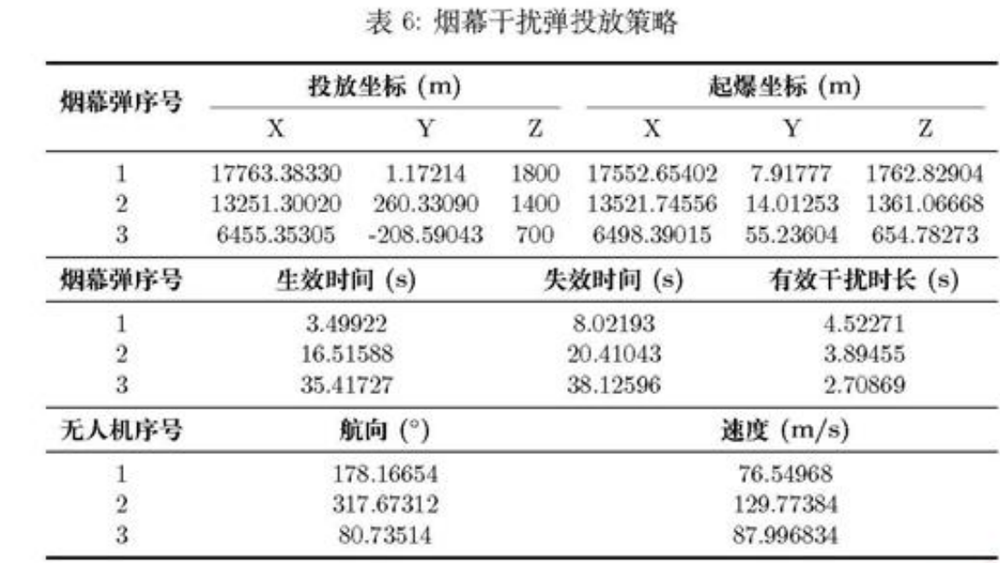

**Original caption:** 表6：多无人机投放策略与遮蔽时段

**中文图注:** 表6：多无人机投放策略与遮蔽时段

**Reading note:** 展示多主体时段衔接的结果。

## 第 29 页

**Source:** p.29 S367

**Original:** 0.3 结 果 的 验 证

**中文:** 0.3 结果的验证

**Source:** p.29 S368

**Original:** 为 验 证 本 文 所 提 出 的 预 测 起 爆 点 和 局 部 网 格 搜 索 进 行 优 化 的 有 效 性 和 解 的 质 量 , 我 们 采 用 差 分 进 化 算 法 对 问 题 四 进 行 独 立 的 对 比 求 解 。 差 分 进 化 算 法 能 够 在 复 杂 的 解 空 间 中 进 行 全 局 揉 索 , 可 以 有 效 避 免 陷 人 局 部 最 优 解 , 因 此 非 常 适 合 用 来 验 证 本 文 选 取 的 求 解 算 法 是 否 合 适 。

**中文:** 为验证本文所提出的预测起爆点和局部网格搜索进行优化的有效性和解的质量 , 我们采用差分进化算法对问题四进行独立的对比求解 。 差分进化算法能够在复杂的解空间中进行全局揉索 , 可以有效避免陷人局部最优解 , 因此非常适合用来验证本文选取的求解算法是否合适 。

**Source:** p.29 S369

**Original:** 最 终 , 用 差 分 进 化 算 法 求 解 得 到 的 总 最 大 有 效 遮 蒲 时 间 是 11.645260s, 相 对 误 差 为 4.46 味 , 说 明 我 们 的 算 法 在 求 解 这 个 问 题 上 误 差 较 小 。 同 时 , 该 方 法 利 用 了 问 题 的 物 理 特 性 , 大 帽 缩 小 了 报 索 空 间 , 避 免 了 全 局 进 化 算 法 的 大 量 迭 代 开 销 , 在 运 算 效 率 上 具 有 显 著 优 势 。

**中文:** 最终 , 用差分进化算法求解得到的总最大有效遮蒲时间是 11.645260s, 相对误差为 4.46 味 , 说明我们的算法在求解这个问题上误差较小 。 同时 , 该方法利用了问题的物理特性 , 大帽缩小了报索空间 , 避免了全局进化算法的大量迭代开销 , 在运算效率上具有显著优势 。

**Source:** p.29 S370

**Original:** 十 、 问 题 五 模 型 建 立 及 求 解

**中文:** 十 、 问题五模型建立及求解

**Source:** p.29 S371

**Original:** 10.1 多 机 多 弹 优 化 模 型 建 立 10.1.1 决 策 变 量 的 定 义

**中文:** 10.1 多机多弹优化模型建立 10.1.1 决策变量的定义

**Source:** p.29 S372

**Original:** 问 题 五 涉 及 多 架 无 人 机 和 多 枚 烟 幕 弹 , 决 策 变 量 的 数 量 能 显 著 增 加 。 对 于 每 架 无 人 机 了 E {1,...,5}, 如 果 它 被 分 配 了 任 务 并 决 定 投 放 4; 枚 烟 幕 弹 (0 < yj < 3), 则 需 要 决 策 该 无 人 机 的 飞 行 航 向 觞 、 速 度 和 烟 幕 干 扰 弹 的 投 放 时 间 和 起 爆 时 间 .

**中文:** 问题五涉及多架无人机和多枚烟幕弹 , 决策变量的数量能显著增加 。 对于每架无人机了 E {1,...,5}, 如果它被分配了任务并决定投放 4; 枚烟幕弹 (0 < yj < 3), 则需要决策该无人机的飞行航向觞 、 速度和烟幕干扰弹的投放时间和起爆时间 .

**Source:** p.29 S373

**Original:** 为 了 简 化 模 型 , 我 们 假 设 每 架 无 人 机 如 果 参 与 任 务 , 都 会 确 定 一 个 飞 行 方 向 和 速 度 , 并 在 该 方 向 和 速 度 下 投 放 所 有 烟 幕 弹 , 而 不 会 在 飞 行 途 中 临 时 改 变 飞 行 参 数 、

**中文:** 为了简化模型 , 我们假设每架无人机如果参与任务 , 都会确定一个飞行方向和速度 , 并在该方向和速度下投放所有烟幕弹 , 而不会在飞行途中临时改变飞行参数 、

**Source:** p.29 S374

**Original:** 因 此 , 决 策 变 量 可 以 定 义 为 :

**中文:** 因此 , 决策变量可以定义为 :

**Source:** p.29 S375

**Original:** 匕 二 {(8j,afyj, 红 技 t | 7=1,....5k=1,...,3} (10.1)

**中文:** 匕二 {(8j,afyj, 红技 t | 7=1,....5k=1,...,3} (10.1)

**Source:** p.29 S376

**Original:** 其 中 ; 7 表 示 无 人 机 编 号 , f 表 示 无 人 机 7 投 放 的 第 * 枚 烟 幕 弹 。 如 果 栋 架 无 人 机 决 定 只 投 放 1 枚 或 2 枚 烟 幕 弹 , 那 么 相 应 的 tazm 和 tjm 将 被 设 为 一 些 无 效 值 或 通 过 其 他 方 式 处 理 。 为 了 方 便 表 示 , 我 们 可 以 在 模 型 中 假 定 每 架 无 人 机 都 考 虑 投 放 3 枚 , 然 后 通 过 约 束 条 件 来 限 制 实 际 投 放 的 数 量 。

**中文:** 其中 ; 7 表示无人机编号 , f 表示无人机 7 投放的第 * 枚烟幕弹 。 如果栋架无人机决定只投放 1 枚或 2 枚烟幕弹 , 那么相应的 tazm 和 tjm 将被设为一些无效值或通过其他方式处理 。 为了方便表示 , 我们可以在模型中假定每架无人机都考虑投放 3 枚 , 然后通过约束条件来限制实际投放的数量 。

**Source:** p.29 S377

**Original:** 10.1.2 目 标 函 数 设 置

**中文:** 10.1.2 目标函数设置

**Source:** p.29 S378

**Original:** 目 标 仍 然 是 最 大 化 对 真 实 目 标 的 怡 有 效 蓝 敲 时 间 。 即 : max I(X)=/®Bool(t)dt, (10.2) 0 但 是 现 在 需 要 同 时 考 虑 3 枚 来 袭 导 弹 。 这 意 味 着 , 我 们 需 要 在 任 何 给 定 时 刻 t, 判

**中文:** 目标仍然是最大化对真实目标的怡有效蓝敲时间 。 即 : max I(X)=/®Bool(t)dt, (10.2) 0 但是现在需要同时考虑 3 枚来袭导弹 。 这意味着 , 我们需要在任何给定时刻 t, 判

**Source:** p.29 S379

**Original:** 断 对 于 所 有 来 袭 导 弹 € {1,2,3} 射 向 真 目 标 的 所 有 视 线 是 否 都 被 所 有 有 效 的 烟 幕 云 团 所 遮 蒲 。

**中文:** 断对于所有来袭导弹 € {1,2,3} 射向真目标的所有视线是否都被所有有效的烟幕云团所遮蒲 。

**Source:** p.29 S380

**Original:** 29

**中文:** 29

## 第 30 页

**Source:** p.30 S381

**Original:** 因 此 , 布 尔 函 数 Bool(t) 的 定 义 需 要 进 一 步 修 改 :

**中文:** 因此 , 布尔函数 Bool(t) 的定义需要进一步修改 :

**Source:** p.30 S382

**Original:** 1, ifvie{1,2,3},YRe, 3je{l,...,5},3ke{l,...,3} Bool(t) = st PniO)PaN C(Pojl(t)) # @ (10.3)

**中文:** 1, ifvie{1,2,3},YRe, 3je{l,...,5},3ke{l,...,3} Bool(t) = st PniO)PaN C(Pojl(t)) # @ (10.3)

**Source:** p.30 S383

**Original:** 0, otherwise

**中文:** 0, otherwise

**Source:** p.30 S384

**Original:** 其 中 ,Pni(4) 是 第 枚 导 弹 在 时 刻 ¢ 的 位 置 ,C(Psx(6)) 是 无 人 机 7 投 放 的 第 枚 烟 幕 弹 在 时 刻 t 形 成 的 云 团 球 体 . 10.1.3 约 束 条 件 分 析

**中文:** 其中 ,Pni(4) 是第枚导弹在时刻 ¢ 的位置 ,C(Psx(6)) 是无人机 7 投放的第枚烟幕弹在时刻 t 形成的云团球体 . 10.1.3 约束条件分析

**Source:** p.30 S385

**Original:** 除 了 问 题 三 和 问 题 四 中 已 有 的 如 物 理 约 束 、 运 动 学 约 丞 的 约 丛 外 , 问 题 五 还 需 考 虑 以 下 约 不 : 任 务 分 配 约 束 : 每 枚 导 弹 至 少 被 一 架 无 人 机 于 扰 , 每 架 无 人 机 最 多 投 放 3 枚 烟 幕 弹 :

**中文:** 除了问题三和问题四中已有的如物理约束 、 运动学约丞的约丛外 , 问题五还需考虑以下约不 : 任务分配约束 : 每枚导弹至少被一架无人机于扰 , 每架无人机最多投放 3 枚烟幕弹 :

**Source:** p.30 S386

**Original:** 5 Ya;>1 vie{1,2,3} Y ba<3 vie{1,...,5 (10.4) j=l k=1

**中文:** 5 Ya;>1 vie{1,2,3} Y ba<3 vie{1,...,5 (10.4) j=l k=1

**Source:** p.30 S387

**Original:** 其 中 ai 为 二 进 制 变 量 , 表 示 无 人 机 7 是 否 干 扰 导 弹 $; bx 表 示 无 人 机 〗 是 告 投 放 第 枚 烟 幕 弹 。 这 两 个 约 束 可 以 来 限 制 实 际 的 投 弹 数 量 。 投 弹 间 隔 约 束 : 根 据 题 惶 同 一 无 人 机 投 放 多 枚 炯 幕 弹 的 时 间 间 隔 至 少 为 1 秒 ;

**中文:** 其中 ai 为二进制变量 , 表示无人机 7 是否干扰导弹 $; bx 表示无人机 〗 是告投放第枚烟幕弹 。 这两个约束可以来限制实际的投弹数量 。 投弹间隔约束 : 根据题惶同一无人机投放多枚炯幕弹的时间间隔至少为 1 秒 ;

**Source:** p.30 S388

**Original:** 绍 技 加 八 妮 交 十 1 E 史 ,E {12} (10.5) 运 动 学 约 束 : 根 据 模 型 准 备 部 分 , 已 经 求 出 了 各 个 物 体 的 位 置 函 数 , 即 :

**中文:** 绍技加八妮交十 1 E 史 ,E {12} (10.5) 运动学约束 : 根据模型准备部分 , 已经求出了各个物体的位置函数 , 即 :

**Source:** p.30 S389

**Original:** Pm( 旦 = Pma(0) 十 Vmul -t P(t) 二 (ftdz,ftdw, d 一 Vaak 代 一 tbdj)) 井 t Pu(9 =PfuJ(taz)+wfuj (t —tag) + 38 (¢ — tay)® ¢ >ty (10.6) Vivs = (vflhi oosojv Vgysinb;, 0) Py i(t) =Py i(0) + vfyz -t 10.1.4 “ 模 型 汇 总 综 上 , 问 题 五 针 对 多 机 多 弹 的 投 放 策 跨 优 化 模 型 可 表 述 为 :

**中文:** Pm( 旦 = Pma(0) 十 Vmul -t P(t) 二 (ftdz,ftdw, d 一 Vaak 代一 tbdj)) 井 t Pu(9 =PfuJ(taz)+wfuj (t —tag) + 38 (¢ — tay)® ¢ >ty (10.6) Vivs = (vflhi oosojv Vgysinb;, 0) Py i(t) =Py i(0) + vfyz -t 10.1.4 “ 模型汇总综上 , 问题五针对多机多弹的投放策跨优化模型可表述为 :

**Source:** p.30 S390

**Original:** max  f(X)= /: Bool(t), dt

**中文:** max f(X)= /: Bool(t), dt

**Source:** p.30 S391

**Original:** 30

**中文:** 30

## 第 31 页

**Source:** p.31 S392

**Original:** 〉_ =Pni(t) = Pmi(0) 十 V t PcJk( 目 二 (Pijkz, Pogkys Jkz 一 Wink ( 一 tojk)) 2 by Psjk(4) = Prya(taih) 十 vyi ( 一 tajk) + 38 (¢ = tag)® 《 二 tajk Viyi 二 (UyyiCOS0t, fyi Sin 仿 , 0) Pryi(t) = Pyya(0) + vy ot

**中文:** 〉_ =Pni(t) = Pmi(0) 十 V t PcJk( 目二 (Pijkz, Pogkys Jkz 一 Wink ( 一 tojk)) 2 by Psjk(4) = Prya(taih) 十 vyi ( 一 tajk) + 38 (¢ = tag)® 《 二 tajk Viyi 二 (UyyiCOS0t, fyi Sin 仿 , 0) Pryi(t) = Pyya(0) + vy ot

**Source:** p.31 S393

**Original:** 70 一 yyj <140, 0<0; <2m, lajetoge 之 0 扬 jk 之 Ldjk

**中文:** 70 一 yyj <140, 0<0; <2m, lajetoge 之 0 扬 jk 之 Ldjk

**Source:** p.31 S394

**Original:** 5 4

**中文:** 5 4

**Source:** p.31 S395

**Original:** Z5_ias 21 Vi ZiLibwe<S3 仁 tajteH0 2 tage+1 Yk

**中文:** Z5_ias 21 Vi ZiLibwe<S3 仁 tajteH0 2 tage+1 Yk

**Source:** p.31 S396

**Original:** 1, ifvie{1.2,3}.VReQ 3je{l....5,3ke{L...,3} Bool(t) = st PPN C(Pajil(l)) # 2

**中文:** 1, ifvie{1.2,3}.VReQ 3je{l....5,3ke{L...,3} Bool(t) = st PPN C(Pajil(l)) # 2

**Source:** p.31 S397

**Original:** 0, otherwise

**中文:** 0, otherwise

**Source:** p.31 S398

**Original:** (10.7) 102 模 型 求 解

**中文:** (10.7) 102 模型求解

**Source:** p.31 S399

**Original:** 由 于 问 题 五 的 决 策 变 量 维 度 非 常 高 ( 最 多 可 达 到 45 维 ), 约 束 复 杂 , 属 于 大 规 模 组 合 优 化 问 题 , 利 用 传 统 的 优 化 算 法 难 以 直 接 求 解 。 所 以 本 文 采 用 分 尾 优 化 策 路 结 合 改 进 的 遗 传 算 法 进 行 求 解 。 分 析 各 无 人 机 与 各 导 弹 的 初 始 位 置 示 意 图 :

**中文:** 由于问题五的决策变量维度非常高 ( 最多可达到 45 维 ), 约束复杂 , 属于大规模组合优化问题 , 利用传统的优化算法难以直接求解 。 所以本文采用分尾优化策路结合改进的遗传算法进行求解 。 分析各无人机与各导弹的初始位置示意图 :

**Source:** p.31 S400

**Original:** 图 12: 各 无 人 机 与 各 导 弹 的 初 始 位 置 示 意 图

**中文:** 图 12: 各无人机与各导弹的初始位置示意图

**Source:** p.31 S401

**Original:** 关 于 这 幅 图 , 很 容 易 产 生 一 个 愁 法 : 无 人 机 应 该 去 拦 截 在 空 间 上 距 离 它 最 近 的 那 枚 导 弹 , 即 FY3 和 FY5 应 该 去 拦 截 M3,FY1 拦 截 M1, FY2 和 FY4 拦 截 M2。 从 算 法 角 度 来 讲 , 如 果 能 够 提 前 确 定 各 无 人 机 应 该 投 放 儿 发 烫 幕 弹 去 分 别 拦 截 晨 枚 导 弹 , 那 么 会 极 大 的 提 升 后 续 的 计 算 效 率 , 以 便 更 快 地 去 确 定 无 人 机 的 航 向 、 速 度 , 始 帝 弹 的 投 放 、 引 爆 时 间 。 下 面 将 对 如 何 确 定 每 架 无 人 机 干 扰 晨 枚 导 弹 , 以 及 每 架 无 人 机 投 放 炽 幕 弹 的 数 量 进 行 说 明 。

**中文:** 关于这幅图 , 很容易产生一个愁法 : 无人机应该去拦截在空间上距离它最近的那枚导弹 , 即 FY3 和 FY5 应该去拦截 M3,FY1 拦截 M1, FY2 和 FY4 拦截 M2。 从算法角度来讲 , 如果能够提前确定各无人机应该投放儿发烫幕弹去分别拦截晨枚导弹 , 那么会极大的提升后续的计算效率 , 以便更快地去确定无人机的航向 、 速度 , 始帝弹的投放 、 引爆时间 。 下面将对如何确定每架无人机干扰晨枚导弹 , 以及每架无人机投放炽幕弹的数量进行说明 。

### 图12：各无人机与各导弹的初始位置

**Placed near:** p.31 S392
**Source:** p.31 C010

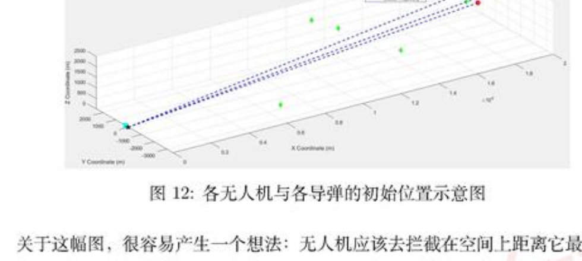

**Original caption:** 图12：各无人机与各导弹的初始位置

**中文图注:** 图12：各无人机与各导弹的初始位置

**Reading note:** 空间位置启发了先任务分配、再参数优化的分层策略。

## 第 32 页

**Source:** p.32 S402

**Original:** 10.2.1 任 务 分 配 说 明

**中文:** 10.2.1 任务分配说明

**Source:** p.32 S403

**Original:** 这 一 步 的 目 的 在 于 确 定 最 优 的 任 务 分 配 方 案 , 即 每 架 无 人 机 〗 干 扰 哪 枚 导 弹 5, 以 及 每 架 无 人 机 投 放 烟 幕 弹 的 数 量 y;。 为 了 定 义 这 个 最 优 , 这 里 假 设 无 人 机 都 以 固 定 的 140m/s 进 行 匀 速 直 线 运 动 , 航 向 沿 着 能 够 截 击 导 弹 的 直 线 飞 到 导 弹 航 迹 正 前 方 的 一 个 参 考 点 , 这 个 参 考 点 记 为 ej, 根 据 以 上 的 假 设 能 够 快 速 计 算 该 烟 幕 弹 理 论 上 最 大 的 有 效 遮 挡 时 长 。 令 这 个 理 论 上 最 大 的 有 效 遮 挡 时 长 为 cxj, 下 面 说 明 cy 的 计 算 方 法 ;

**中文:** 这一步的目的在于确定最优的任务分配方案 , 即每架无人机 〗 干扰哪枚导弹 5, 以及每架无人机投放烟幕弹的数量 y;。 为了定义这个最优 , 这里假设无人机都以固定的 140m/s 进行匀速直线运动 , 航向沿着能够截击导弹的直线飞到导弹航迹正前方的一个参考点 , 这个参考点记为 ej, 根据以上的假设能够快速计算该烟幕弹理论上最大的有效遮挡时长 。 令这个理论上最大的有效遮挡时长为 cxj, 下面说明 cy 的计算方法 ;

**Source:** p.32 S404

**Original:** _ IPes(0 - P 7〉瞰′′′ r l4〔) 7 Taua = 20 (10.8)

**中文:** _ IPes(0 - P 7〉瞰′′′ r l4〔) 7 Taua = 20 (10.8)

**Source:** p.32 S405

**Original:** c 二 max(0, Tuoud — Thy,ij)

**中文:** c 二 max(0, Tuoud — Thy,ij)

**Source:** p.32 S406

**Original:** Pres 可 以 取 导 弹 初 位 置 沿 z 负 方 向 偷 移 5 k, 无 人 机 7 以 最 大 速 度 140 m/s 到 诙 参 考 点 即 刻 释 放 1 枚 弹 并 立 即 起 爆 , 云 团 的 寿 命 为 20s、 之 后 按 3 m/s 匀 速 下 沉 。 如 果 无 人 机 在 导 弹 袭 来 该 点 时 已 经 在 该 点 引 爆 烟 幕 弹 , 那 么 理 论 上 可 用 时 间 窗 口 被 飞 行 时 间 挤 占 的 值 还 未 到 达 20s, 理 论 最 大 有 效 遨 挡 时 间 就 为 79oua — T , 而 如 果 导 弹 比 无 人 机 先 经 过 此 点 , 那 么 烟 幕 弹 就 不 能 提 供 有 效 的 遮 挡 , 则 c = 0.

**中文:** Pres 可以取导弹初位置沿 z 负方向偷移 5 k, 无人机 7 以最大速度 140 m/s 到诙参考点即刻释放 1 枚弹并立即起爆 , 云团的寿命为 20s、 之后按 3 m/s 匀速下沉 。 如果无人机在导弹袭来该点时已经在该点引爆烟幕弹 , 那么理论上可用时间窗口被飞行时间挤占的值还未到达 20s, 理论最大有效遨挡时间就为 79oua — T , 而如果导弹比无人机先经过此点 , 那么烟幕弹就不能提供有效的遮挡 , 则 c = 0.

**Source:** p.32 S407

**Original:** 如 果 把 无 人 机 发 射 向 导 弹 ; 的 炯 幕 弹 数 量 记 为 9j, 显 然 3y 是 一 个 十 五 维 的 变 量 , 也 可 以 写 成 一 个 3 x 5 的 矩 阵 X , 那 么 通 过 改 变 矩 阵 元 紧 的 取 值 , 计 算 无 人 机 群 对 导 弹 群 拦 截 的 理 论 上 的 最 大 有 效 遨 挡 时 间 , 就 可 以 初 步 决 定 出 最 优 的 任 务 分 配 。 寻 找 在 的 步 骤 如 下 :

**中文:** 如果把无人机发射向导弹 ; 的炯幕弹数量记为 9j, 显然 3y 是一个十五维的变量 , 也可以写成一个 3 x 5 的矩阵 X , 那么通过改变矩阵元紧的取值 , 计算无人机群对导弹群拦截的理论上的最大有效遨挡时间 , 就可以初步决定出最优的任务分配 。 寻找在的步骤如下 :

**Source:** p.32 S408

**Original:** 无 人 机 群 对 导 弹 群 拦 截 的 理 论 上 的 有 效 遨 挡 时 间 可 以 记 作 S0, 75_,cy yy

**中文:** 无人机群对导弹群拦截的理论上的有效遨挡时间可以记作 S0, 75_,cy yy

**Source:** p.32 S409

**Original:** 在 滢 足 导 弹 的 拦 截 已 经 无 人 机 发 射 导 弹 数 量 的 前 提 下 , 求 解 最 优 的 分 配 方 案 的 优 化

**中文:** 在滢足导弹的拦截已经无人机发射导弹数量的前提下 , 求解最优的分配方案的优化

**Source:** p.32 S410

**Original:** 模 型 为 : 浩 鉴 max EZC;,- Ui E Y% <3 st.1 二 口 好 么 1 (10.9) 驿 <3 u; €N 这 是 一 个 整 数 线 性 规 划 模 型 , 可 以 利 用 分 支 定 界 法 对 其 进 行 求 解 得 到 Y.

**中文:** 模型为 : 浩鉴 max EZC;,- Ui E Y% <3 st.1 二口好么 1 (10.9) 驿 <3 u; €N 这是一个整数线性规划模型 , 可以利用分支定界法对其进行求解得到 Y.

**Source:** p.32 S411

**Original:** 10.2.2 投 放 策 随 求 解

**中文:** 10.2.2 投放策随求解

**Source:** p.32 S412

**Original:** 有 了 最 优 的 分 配 方 案 之 后 , 最 初 的 优 化 问 题 可 以 分 解 为 3 个 独 立 的 规 模 更 小 的 子 问 题 。 每 个 子 问 题 都 只 对 应 一 枚 来 袭 导 弹 。

**中文:** 有了最优的分配方案之后 , 最初的优化问题可以分解为 3 个独立的规模更小的子问题 。 每个子问题都只对应一枚来袭导弹 。

**Source:** p.32 S413

**Original:** 子 问 题 1: 优 化 导 弹 M1 的 无 人 机 群 的 投 放 策 略 , 目 标 是 最 大 化 对 M1 的 有 效 谨 蒋 时 长 。 子 问 题 2: 优 化 导 弹 M2 的 无 人 机 群 的 投 放 策 略 , 目 标 是 最 大 化 对 M2 的 有 效 遮 蔽

**中文:** 子问题 1: 优化导弹 M1 的无人机群的投放策略 , 目标是最大化对 M1 的有效谨蒋时长 。 子问题 2: 优化导弹 M2 的无人机群的投放策略 , 目标是最大化对 M2 的有效遮蔽

**Source:** p.32 S414

**Original:** 32

**中文:** 32

## 第 33 页

**Source:** p.33 S415

**Original:** 时 长 ,

**中文:** 时长 ,

**Source:** p.33 S416

**Original:** 子 问 题 3: 优 化 导 弹 M3 的 无 人 机 群 的 投 放 策 略 , 目 标 是 最 大 化 对 M3 的 有 效 谨 菲 时 长 。 求 解 出 来 之 后 再 对 这 三 个 子 问 题 得 到 的 三 个 有 效 谨 蒲 时 间 区 间 取 交 集 , 最 终 的 总 有 效 遮 蒙 时 间 为 这 三 个 集 合 交 集 的 总 长 度 。

**中文:** 子问题 3: 优化导弹 M3 的无人机群的投放策略 , 目标是最大化对 M3 的有效谨菲时长 。 求解出来之后再对这三个子问题得到的三个有效谨蒲时间区间取交集 , 最终的总有效遮蒙时间为这三个集合交集的总长度 。

**Source:** p.33 S417

**Original:** 10.2.3 求 解 结 果

**中文:** 10.2.3 求解结果

**Source:** p.33 S418

**Original:** 通 过 上 面 的 策 略 结 合 问 题 三 的 求 解 悍 路 , 求 解 得 到 总 最 长 有 效 遮 蒲 时 间 为 21.0770s。 其 他 的 具 体 数 据 见 附 录 以 及 文 件 result3.xlsx。

**中文:** 通过上面的策略结合问题三的求解悍路 , 求解得到总最长有效遮蒲时间为 21.0770s。 其他的具体数据见附录以及文件 result3.xlsx。

**Source:** p.33 S419

**Original:** 十 一 、 模 型 的 评 价 与 推 广

**中文:** 十一 、 模型的评价与推广

**Source:** p.33 S420

**Original:** 11.1 模 型 的 评 价

**中文:** 11.1 模型的评价

**Source:** p.33 S421

**Original:** 模 型 的 优 点 :

**中文:** 模型的优点 :

**Source:** p.33 S422

**Original:** 1. 本 文 对 导 弹 、 无 人 机 、 云 团 及 烟 幕 弹 的 运 动 情 况 做 了 详 组 分 析 , 绝 出 了 精 骗 的 运 动 转 迹 方 程 , 同 时 没 有 简 单 地 假 设 “ 导 弹 与 云 团 中 心 距 离 小 于 10 米 即 遮 蒲 “, 而 是 敏 锐 地 抓 住 了 问 题 的 核 心 需 要 遣 蒙 的 是 一 个 圆 柱 体 , 而 不 是 一 个 点 , 体 现 了 建 模 过 程 的 数 学 严 谨 性 于 思 考 的 深 度 。

**中文:** 1. 本文对导弹 、 无人机 、 云团及烟幕弹的运动情况做了详组分析 , 绝出了精骗的运动转迹方程 , 同时没有简单地假设 “ 导弹与云团中心距离小于 10 米即遮蒲 “, 而是敏锐地抓住了问题的核心需要遣蒙的是一个圆柱体 , 而不是一个点 , 体现了建模过程的数学严谨性于思考的深度 。

**Source:** p.33 S423

**Original:** 2. 创 新 性 地 引 入 了 布 尔 函 数 来 清 晰 地 定 义 遮 蒋 状 态 , 这 使 得 逻 辑 非 常 清 晰 , 同 时 对 模 型 的 推 导 以 及 算 法 的 实 现 绘 出 了 详 细 的 说 朋 , 文 章 层 级 分 明 、 逻 辑 很 严 谦 、

**中文:** 2. 创新性地引入了布尔函数来清晰地定义遮蒋状态 , 这使得逻辑非常清晰 , 同时对模型的推导以及算法的实现绘出了详细的说朋 , 文章层级分明 、 逻辑很严谦 、

**Source:** p.33 S424

**Original:** 3. 绘 制 了 许 多 可 视 化 图 像 让 论 文 更 加 地 直 观 , 易 于 读 者 的 理 解 。

**中文:** 3. 绘制了许多可视化图像让论文更加地直观 , 易于读者的理解 。

**Source:** p.33 S425

**Original:** 模 型 的 踹 点 :

**中文:** 模型的踹点 :

**Source:** p.33 S426

**Original:** 1. 符 号 系 统 略 显 繁 琐 , 定 义 了 很 多 包 含 大 量 下 标 的 符 号 , 包 含 大 量 下 标 和 字 母 的 符 号 蚺 然 精 确 , 但 严 重 影 响 了 阅 读 的 流 畅 性

**中文:** 1. 符号系统略显繁琐 , 定义了很多包含大量下标的符号 , 包含大量下标和字母的符号蚺然精确 , 但严重影响了阅读的流畅性

**Source:** p.33 S427

**Original:** 2. 算 法 流 程 说 明 太 过 冗 长 , 本 文 对 每 一 个 算 法 的 使 用 都 进 行 了 详 纲 的 诛 朋 , 蚺 然 易 于 读 者 理 解 , 但 是 使 文 章 的 篇 帽 过 于 长 会 引 起 阅 读 的 疮 劳 。

**中文:** 2. 算法流程说明太过冗长 , 本文对每一个算法的使用都进行了详纲的诛朋 , 蚺然易于读者理解 , 但是使文章的篇帽过于长会引起阅读的疮劳 。

**Source:** p.33 S428

**Original:** 11.2 模 型 的 推 广

**中文:** 11.2 模型的推广

**Source:** p.33 S429

**Original:** 本 文 的 模 型 是 在 理 愚 情 况 下 进 行 , 没 有 考 虑 到 空 气 的 阻 力 、 云 团 的 扩 散 , 在 实 际 的 问 题 研 究 中 , 这 些 都 是 不 可 忽 略 的 因 索 。 同 时 可 以 设 计 更 高 效 的 策 略 来 在 更 大 的 范 围 内 找 到 最 优 的 策 路 使 效 益 最 大 。

**中文:** 本文的模型是在理愚情况下进行 , 没有考虑到空气的阻力 、 云团的扩散 , 在实际的问题研究中 , 这些都是不可忽略的因索 。 同时可以设计更高效的策略来在更大的范围内找到最优的策路使效益最大 。

**Source:** p.33 S430

**Original:** 参 考 文 献 门 DeepSeek,DeepSeek-V3.1, 深 度 求 索 (DeepSeek) , 2025.09.05-2025.09.07) ; 2] 王 庆 华 . 防 空 火 箭 烟 幕 弹 干 抢 [ 川 光 电 技 术 应 用 ,2008,23 (6) ; (3] 杨 甲 胃 , 耿 晓 花 , 顾 文 慧 , 等 . 对 烟 幕 遣 蒲 于 扰 投 放 参 数 的 修 正 分 析 []]. 光 电 技 术 应 用 ,2007,22 (1) ; 国 顾 文 慧 , 高 红 杰 , 烟 幕 投 放 控 制 分 析 与 设 计 [ 小 光 电 技 术 应 用 ,2014,29 (2)

**中文:** 参考文献门 DeepSeek,DeepSeek-V3.1, 深度求索 (DeepSeek) , 2025.09.05-2025.09.07) ; 2] 王庆华 . 防空火箭烟幕弹干抢 [ 川光电技术应用 ,2008,23 (6) ; (3] 杨甲胃 , 耿晓花 , 顾文慧 , 等 . 对烟幕遣蒲于扰投放参数的修正分析 []]. 光电技术应用 ,2007,22 (1) ; 国顾文慧 , 高红杰 , 烟幕投放控制分析与设计 [ 小光电技术应用 ,2014,29 (2)

**Source:** p.33 S431

**Original:** 33

**中文:** 33

## 第 34 页

**Source:** p.34 S432

**Original:** 附 录

**中文:** 附录

**Source:** p.34 S433

**Original:** A 支 撑 材 料 目 录

**中文:** A 支撑材料目录

**Source:** p.34 S434

**Original:** 团 Al 使 用 泌 明 DOCX 文 栾 119 KB 万 fifth MATLAB Code 3 KB 刹 first MATLAB Code 2 KB 有 fourth DE MATLAB Code S KB 不 fourth grid MATLAB Code 车 KB 一 Intervallnter MATLAB Code 1 KB 一 IntervalUnion MATLAB Code 1 KB 一 isOverwhem MATLAB Code 1KB 固 | result1 XLSX 工 作 裴 9 KB 8 result2 XLSX 工 作 褐 9 KB 睾 | result3 XLSX 工 作 表 10 KB 一 second greed_sove MATLAB Code 2 KB 万 second2_ pso MATLAB Code 3 KB 万 third MATLAB Code 4 KB

**中文:** 团 Al 使用泌明 DOCX 文栾 119 KB 万 fifth MATLAB Code 3 KB 刹 first MATLAB Code 2 KB 有 fourth DE MATLAB Code S KB 不 fourth grid MATLAB Code 车 KB 一 Intervallnter MATLAB Code 1 KB 一 IntervalUnion MATLAB Code 1 KB 一 isOverwhem MATLAB Code 1KB 固 | result1 XLSX 工作裴 9 KB 8 result2 XLSX 工作褐 9 KB 睾 | result3 XLSX 工作表 10 KB 一 second greed_sove MATLAB Code 2 KB 万 second2_ pso MATLAB Code 3 KB 万 third MATLAB Code 4 KB

**Source:** p.34 S435

**Original:** 图 1: 支 撑 材 料 目 录

**中文:** 图 1: 支撑材料目录

**Source:** p.34 S436

**Original:** u savns I ag T pn

**中文:** u savns I ag T pn

**Source:** p.34 S437

**Original:** ' vn 东 - y - - - - - 9

**中文:** ' vn 东 - y - - - - - 9

**Source:** p.34 S438

**Original:** ~ nsma a 4 racmr e O G GGG a e 匹 Eysma a 王 esmst a e DD s g 。 e 0 wa a ) e O RN LWt Eesicnt LML " 河 E a 4 sma ] a pme RSN I LR A " a 。 an 王 e o e MO e RS iaueet [ 玟 R 2n 王 E 3 " N mEre 1 3 T v m Mies sna 王 s WO ik e 心 a M sna 一 o 24 o e e 心 " sms aem O (L T O tey eor SRe S a sss Resmea 王 un eeae e 。 ewen saeet a ss  somm 3 E J E m l a e e B0 GTRWDW ama apu e '-` i zee t 唐 a WA sn u - jn 。 途 a 3 E 8 e 3piPs4 u

**中文:** ~ nsma a 4 racmr e O G GGG a e 匹 Eysma a 王 esmst a e DD s g 。 e 0 wa a ) e O RN LWt Eesicnt LML " 河 E a 4 sma ] a pme RSN I LR A " a 。 an 王 e o e MO e RS iaueet [ 玟 R 2n 王 E 3 " N mEre 1 3 T v m Mies sna 王 s WO ik e 心 a M sna 一 o 24 o e e 心 " sms aem O (L T O tey eor SRe S a sss Resmea 王 un eeae e 。 ewen saeet a ss somm 3 E J E m l a e e B0 GTRWDW ama apu e '-` i zee t 唐 a WA sn u - jn 。 途 a 3 E 8 e 3piPs4 u

**Source:** p.34 S439

**Original:** 巳 a

**中文:** 巳 a

**Source:** p.34 S440

**Original:** E

**中文:** E

**Source:** p.34 S441

**Original:** E 一

**中文:** E 一

**Source:** p.34 S442

**Original:** .

**中文:** .

**Source:** p.34 S443

**Original:** 图 2: 问 题 五 详 细 数 据

**中文:** 图 2: 问题五详细数据

### 附录图1：支撑材料目录

**Placed near:** p.34 S432
**Source:** p.34 C011

**Original caption:** 附录图1：支撑材料目录

**中文图注:** 附录图1：支撑材料目录

**Reading note:** 列出 MATLAB 代码和结果工作簿。

### 附录图2：问题五详细数据

**Placed near:** p.34 S432
**Source:** p.34 C012

**Original caption:** 附录图2：问题五详细数据

**中文图注:** 附录图2：问题五详细数据

**Reading note:** 扫描分辨率较低，仅保留为来源索引。

---

## 阅读提示与批判性笔记

- 论文的主要贡献是把动态几何判定写成布尔指示函数，再把有效时长写成该函数的时间积分。
- 凸性降维、连续区间二分、多起点搜索、差分进化、预测拦截点和分层任务分配构成了一套由低维到高维的求解链。
- ‘有效区间一定只有一段’依赖特定单调运动和参数，论文给出的论证不足以推广到一般轨迹；实际使用时应先扫描验证连通性。
- 问题四的局部网格结果与差分进化结果相差约 4.46%，不宜简单表述为完全一致；它更像效率较高的近似解。
- 问题三中第三枚资源没有产生效果，提示差分进化的单次最优解可能存在资源冗余、约束处理或收敛质量问题，应进行多随机种子复算。
